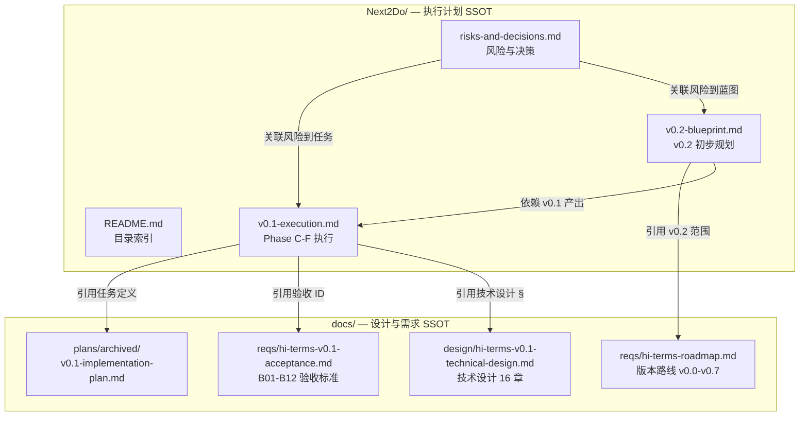

# Next2Do 执行计划目录

**文档类型:** 目录索引
**产品名称:** Hi-Terms
**语言:** 中文
**创建日期:** 2026-04-06
**维护策略:** 每次新增/归档文档时同步更新本索引

---

## 1. 目录定位

### 1.1 职责声明

Next2Do 是 Hi-Terms 项目**执行计划的唯一权威来源（SSOT）**。

- **回答：** 接下来做什么、怎么做、有什么风险、做了什么决策
- **不涉及：** 产品愿景、需求定义、技术设计、验收标准（由 `docs/` 管理）

### 1.2 与 docs/ 的关系

| docs/ 子目录 | 职责 | Next2Do 引用方式 |
|-------------|------|-----------------|
| `docs/reqs/` | 需求、验收标准 SSOT | 通过验收项 ID 引用（如 B01-B12） |
| `docs/design/` | 技术设计 SSOT | 通过章节号引用（如技术设计 §6.1） |
| `docs/decisions/` | 项目级技术决策 | 引用决策文档名称 |
| `docs/plans/archived/` | 已归档实施计划 | 通过任务 ID 引用（如 C1, D2） |
| `docs/SSOT/` | 术语表 | 引用术语链接 |

### 1.3 归档说明

`docs/plans/hi-terms-v0.1-implementation-plan.md` 已于 2026-04-06 归档至 `docs/plans/archived/`。

- 归档原因：Phase A-B 已完成，Phase C-F 执行由本目录下 `v0.1-execution.md` 接管
- 归档文件保留完整任务定义（C1, C2, D1-D4, E1-E4, F1-F6），Next2Do 通过任务 ID 引用

---

## 2. 文档清单

| 文件 | 覆盖范围 | 状态 | 更新频率 |
|------|---------|------|---------|
| [v0.1-execution.md](v0.1-execution.md) | v0.1 Phase C-F 执行 | 活跃 | 每个任务完成时 |
| [v0.2-blueprint.md](v0.2-blueprint.md) | v0.2 日常可用终端初步规划 | 草案 | v0.1 完成前定稿 |
| [risks-and-decisions.md](risks-and-decisions.md) | 跨版本风险与决策 | 活跃 | 持续 |

---

## 3. 文档地图

---

## 4. AI 助手使用指南

### 4.1 快速定位

| 需求 | 入口 |
|------|------|
| "下一步做什么" | [v0.1-execution.md §3.2](v0.1-execution.md#32-任务状态表) — 找 status=pending 且依赖已满足的任务 |
| "有什么风险" | [risks-and-decisions.md §2.2](risks-and-decisions.md#22-风险表) — 查 status=open 的风险 |
| "v0.2 要做什么" | [v0.2-blueprint.md §2](v0.2-blueprint.md#2-技术分解预览) + [Roadmap v0.2 节](../docs/reqs/hi-terms-roadmap.md) |
| "某个任务的详细定义" | [归档实施计划](../docs/plans/archived/hi-terms-v0.1-implementation-plan.md) — 按任务 ID 查找 |
| "验收标准详情" | [V0.1 验收标准](../docs/reqs/hi-terms-v0.1-acceptance.md) — 按 B01-B12 查找 |
| "技术设计详情" | [V0.1 技术设计](../docs/design/hi-terms-v0.1-technical-design.md) — 按 § 章节号查找 |

### 4.2 更新规则

| 事件 | 更新操作 |
|------|---------|
| 任务完成 | 更新 `v0.1-execution.md` 状态表（status → done，填写实际产出） |
| 遇到风险 | 更新 `risks-and-decisions.md` 风险表（新增或修改状态） |
| 做出技术决策 | 更新 `risks-and-decisions.md` 决策日志（新增 DEC-xx 记录） |
| 执行偏离计划 | 更新 `v0.1-execution.md` 偏差记录表 |
| 新增/归档文档 | 更新本 README 文档清单 |

---

## 5. 约定

### 5.1 ID 体系

| 类型 | 格式 | 示例 | 来源 |
|------|------|------|------|
| 任务 ID | 字母+数字 | C1, D2, E1, F3 | 沿用[归档实施计划](../docs/plans/archived/hi-terms-v0.1-implementation-plan.md) |
| 验收项 ID | B+两位数字 | B01, B12 | 沿用[V0.1 验收标准](../docs/reqs/hi-terms-v0.1-acceptance.md) |
| 风险 ID | R-两位数字 | R-01, R-05 | 本目录 `risks-and-decisions.md` 管理 |
| 决策 ID | DEC-两位数字 | DEC-01, DEC-02 | 本目录 `risks-and-decisions.md` 管理 |
| 待决事项 ID | PENDING-两位数字 | PENDING-01 | 本目录 `risks-and-decisions.md` 管理 |

### 5.2 状态标记

| 适用对象 | 可选状态 |
|---------|---------|
| 任务 | `pending` / `in-progress` / `done` / `blocked` / `skipped` |
| 风险 | `open` / `mitigated` / `closed` / `realized` |
| 决策 | `pending` / `decided` / `superseded` |

### 5.3 命名约定

- 文件名：小写英文 + 连字符，`.md` 格式
- 文档语言：中文
- 图表格式：Mermaid
