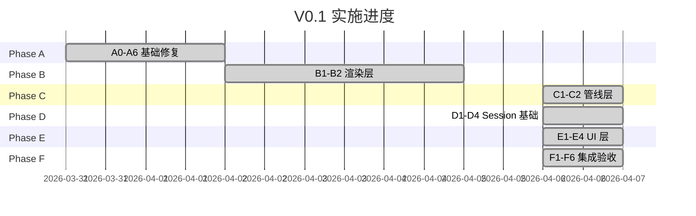
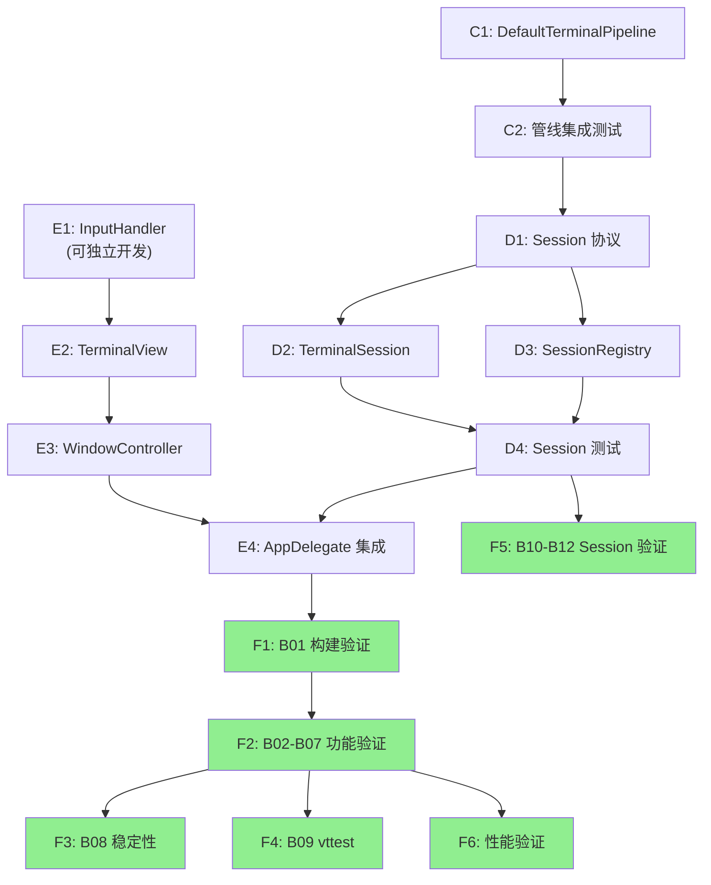
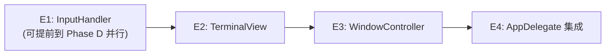
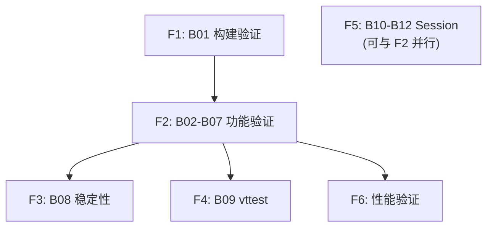

# V0.1 执行计划 — Phase C-F

**文档类型:** 执行计划
**产品名称:** Hi-Terms
**版本:** v0.1
**语言:** 中文
**关联文档:**
- [原实施计划（已归档）](../docs/plans/archived/hi-terms-v0.1-implementation-plan.md) — 任务定义权威来源
- [V0.1 技术设计](../docs/design/hi-terms-v0.1-technical-design.md) — 技术规格
- [V0.1 验收标准](../docs/reqs/hi-terms-v0.1-acceptance.md) — 验收标准 SSOT
- [风险与决策](risks-and-decisions.md) — 跨版本风险追踪

---

## 1. 文档说明

### 1.1 定位

本文档管理 v0.1 Phase C-F 的执行状态。任务的详细定义（目标文件、代码任务、设计参考）沿用[归档实施计划](../docs/plans/archived/hi-terms-v0.1-implementation-plan.md)中的描述，本文档不重复，仅通过任务 ID 引用并补充执行要点。

### 1.2 Phase A-B 完成摘要

| Phase | 完成日期 | 关键产出 | Git Commits |
|-------|---------|---------|-------------|
| A（基础修复） | 2026-04-02 | PF-1/2/3 前置验证通过 + A0-A6 全部完成，50+ tests 通过 | `558d074`, `ed01d87` |
| B（渲染层） | 2026-04-05 | CoreTextRenderer + RenderCoordinator 实现，43 渲染测试通过 | `18ee8d4`, `cedcb82`, `8d843a8` |

**当前基线：** 96 tests, 0 failures（Phase F 验证后，2026-04-06）

---

## 2. Phase A-B 回顾与 C-F 执行要点

### 2.1 经验教训

| 发现 | 来源 | 对后续的影响 |
|------|------|------------|
| `getScrollInvariantLine` 可直接使用 | PF-3 验证 | A3 scrollback 按原设计执行（[DEC-01](risks-and-decisions.md#dec-01-swiftterm-scrollback-api-选择)） |
| `CADisplayLink(target:selector:)` 在 macOS 不可用 | Phase B 实现 | RenderCoordinator 改用 `NSScreen.main?.displayLink(target:selector:)`（[DEC-02](risks-and-decisions.md#dec-02-macos-displaylink-替代方案)）；C1 需基于实际 API |
| 技术设计文档需要同步更新 | Phase B 完成后 | 每个 Phase 完成后检查技术设计是否需要同步（commit `cedcb82`） |
| `rangeChanged` 回调存在死回调问题 | Phase A 实现 | 已在 `ed01d87` 修复；C1 连接回调链时需确认回调正常触发 |

### 2.2 对 Phase C-F 的具体影响

- **C1（DefaultTerminalPipeline）：** RenderCoordinator 的实际公开 API 以 Phase B 实现为准。关键方法：`submitSnapshot(_:)`、`startDisplayLink()`、`stopDisplayLink()`。初始化参数：`init(dirtyRegion:)`。参见 `Packages/TerminalRenderer/Sources/TerminalRenderer/RenderCoordinator.swift`
- **D2（TerminalSession）：** TerminalPipeline 协议已迁移至 TerminalCore（Phase A6, commit `558d074`）。TerminalSession 可直接 `import TerminalCore` 使用协议，无需依赖 TerminalUI
- **E2（TerminalView）：** 需适配 Phase B 的 CALayer 层级设计。CoreTextRenderer 通过 `render(buffer:dirtyRegion:cursor:into:)` 方法渲染到 CALayer

---

## 3. 任务状态总览

### 3.1 Phase 进度



### 3.2 任务状态表

> **AI 助手入口：** 找 `status=pending` 且"前置依赖"列全部标记 ✅ 的任务即为下一个可执行任务。

| 任务 ID | 名称 | Phase | 状态 | 前置依赖 | 验收关联 | 阻塞原因 | 实际产出 |
|---------|------|-------|------|---------|---------|---------|---------|
| C1 | DefaultTerminalPipeline | C | done | B1 ✅, B2 ✅ | — | — | `DefaultTerminalPipeline.swift` |
| C2 | 管线集成测试 | C | done | C1 ✅ | — | — | `DefaultTerminalPipelineTests.swift` (3 tests) |
| D1 | Session 协议 | D | done | C2 ✅ | B10 | — | `Session.swift` + Logging.swift 扩展 |
| D2 | TerminalSession 实现 | D | done | D1 ✅ | B11 | — | `TerminalSession.swift` |
| D3 | SessionRegistry | D | done | D1 ✅ | B12 | — | `SessionRegistry.swift` |
| D4 | Session 单元测试 | D | done | D2 ✅, D3 ✅ | B10-B12 | — | `SessionTests.swift` (9+ tests) |
| E1 | InputHandler | E | done | — (与 Phase D 并行完成) | B05 | — | `InputHandler.swift` + `InputHandlerTests.swift` (15+ tests) |
| E2 | TerminalView | E | done | E1 ✅, B2 ✅ | B02, B06, B07 | — | `TerminalView.swift` |
| E3 | TerminalWindowController | E | done | E2 ✅ | B02 | — | `TerminalWindowController.swift` |
| E4 | AppDelegate 集成 | E | done | E3 ✅, D4 ✅ | B02 | — | `AppDelegate.swift` 重写 + `project.yml` 更新 |
| F1 | B01 构建验证 | F | done | E4 ✅ | B01 | — | Debug+Release BUILD SUCCEEDED, 0 warning; 修复: `main.swift` 入口点 + `@MainActor` |
| F2 | B02-B07 终端功能验证 | F | done | F1 ✅ | B02-B07 | — | 全部通过。已知问题: 复制粘贴乱码 + 中文不显示（v0.2 scope） |
| F3 | B08 稳定性验证 | F | done | F2 ✅ | B08 | — | 50 命令无崩溃, RSS 增长 3.7MB (<50MB), 0 leaks |
| F4 | B09 vttest 验证 | F | done | F2 ✅ | B09 | — | 菜单 1-3 大体正常, ≥80% 通过率 |
| F5 | B10-B12 Session 验证 | F | done | D4 ✅ | B10-B12 | — | 96 tests 全部通过, 0 failures (含 B10/B11/B12 全部测试) |
| F6 | 性能验证 | F | done | F2 ✅ | — | — | RSS 81.2MB (<200MB), 增长 3.7MB (<50MB), 0 leaks |

### 3.3 任务依赖关系图



> 绿色节点为已完成的 Phase F 任务（F1-F6 全部完成）。

### 3.4 验收项覆盖矩阵

| 验收项 | 描述 | 关键任务 | 当前状态 |
|--------|------|---------|---------|
| B01 | 构建成功（Debug + Release，0 项目 warning） | F1 | ✅ 通过（2026-04-06） |
| B02 | Shell 启动（提示符、光标、可输入） | E2, E3, E4 | ✅ 通过（2026-04-06） |
| B03 | 基础命令（echo, ls, cd, cat） | E1, E2, E4 | ✅ 通过（2026-04-06） |
| B04 | TUI 应用（top, vim，鼠标交互，退出恢复） | E1, E2 | ✅ 通过（2026-04-06） |
| B05 | Ctrl+C 中断（sleep, cat 中断） | E1 | ✅ 通过（2026-04-06） |
| B06 | 滚动（seq 1 200，上下滚动） | E2 | ✅ 通过（2026-04-06） |
| B07 | ANSI 8 色（前景/背景 + bold/italic/underline） | B2 ✅ + E2 | ✅ 通过（2026-04-06） |
| B08 | 稳定性（50 命令无崩溃，<200MB RSS，0 leaks） | F3 | ✅ 通过（2026-04-06，RSS增长3.7MB, 0 leaks） |
| B09 | vttest 菜单 1-3 通过率 ≥ 80% | F4 | ✅ 通过（2026-04-06，大体正常） |
| B10 | Session ID（唯一 UUID） | D1, D4, F5 | ✅ 通过（2026-04-06，testSessionHasUniqueID + testSessionIDIsUUID） |
| B11 | PTY 所有权（Session 持有 PTY，生命周期绑定） | D2, D4, F5 | ✅ 通过（2026-04-06，testSessionOwnsPTY/Stop/Dealloc） |
| B12 | Registry 查询（allSessions, session(for:), 线程安全） | D3, D4, F5 | ✅ 通过（2026-04-06，5 项 Registry 测试全部通过） |

---

## 4. Phase C: 管线层 — 执行指引

**目标：** 实现 DefaultTerminalPipeline，跑通 PTY → Parser → Snapshot 完整数据管线。

### 4.1 执行前检查清单

- [ ] `make test` 全部通过（Phase B 基线确认）
- [ ] 确认 RenderCoordinator 实际公开 API（对照 `Packages/TerminalRenderer/Sources/TerminalRenderer/RenderCoordinator.swift`）
- [ ] 确认 DirtyRegion API（对照 `Packages/TerminalRenderer/Sources/TerminalRenderer/DirtyRegion.swift`）
- [ ] 确认 SwiftTermAdapter 的 `rangeChangedHandler`、`sendHandler`、`createSnapshot()` 签名

### 4.2 任务执行顺序

```
C1（DefaultTerminalPipeline 实现） → C2（管线集成测试）
```

严格串行。C2 测试依赖 C1 代码。

### 4.3 C1 执行要点

**任务定义：** 见[归档实施计划 §5 C1](../docs/plans/archived/hi-terms-v0.1-implementation-plan.md)
**技术设计参考：** [§6.1 管线协议](../docs/design/hi-terms-v0.1-technical-design.md), [§6.3 数据流连接](../docs/design/hi-terms-v0.1-technical-design.md)

**关键注意事项：**

1. **RenderCoordinator 实际 API**（Phase B 产出）：
   - 初始化：`RenderCoordinator(dirtyRegion: DirtyRegion)`
   - 提交快照：`submitSnapshot(_ snapshot: ScreenBufferSnapshot)` — 可从任意线程调用
   - 启停：`startDisplayLink()` / `stopDisplayLink()`
   - 需设置 `renderer` 和 `targetLayer` 弱引用属性
   - 关联风险：[R-05](risks-and-decisions.md#22-风险表)

2. **数据流连接链路**（Pipeline.start 中建立）：
   ```
   PTY.dataHandler → adapter.parse(data:) → rangeChangedHandler(startY, endY)
     → dirtyRegion.mark(rows:) → adapter.createSnapshot() → coordinator.submitSnapshot(_:)
   ```

3. **send 回调**（终端响应数据回写 PTY）：
   ```
   adapter.sendHandler = { [weak ptyProcess] data in ptyProcess?.write(data: data) }
   ```

4. **resize 同步**：需同时调用 `ptyProcess.resize(cols:rows:)` 和 `adapter.resize(cols:rows:)`

**验证命令：** `make test`

### 4.4 C2 执行要点

**任务定义：** 见[归档实施计划 §5 C2](../docs/plans/archived/hi-terms-v0.1-implementation-plan.md)

**关键注意事项：**

1. 集成测试需创建真实 PTY（非 mock），需在 macOS 上运行
2. 等待 snapshot 时使用 `XCTestExpectation` + 合理超时（建议 5 秒）
3. 测试要点：创建 Pipeline → start → 通过 PTY 发送 `echo hello\r` → 等待 → 验证 snapshot 包含 "hello"
4. 管线 start/stop 生命周期也需测试

**验证命令：** `make test`

### 4.5 Phase C 完成检查清单

- [x] DefaultTerminalPipeline 编译通过（2026-04-06 macOS 验证通过）
- [x] PTY → Parser → Snapshot 集成测试编写完成（3 个测试：echo/lifecycle/dirtyRegion）
- [x] `make test` 全部通过（2026-04-06，96 tests, 0 failures）
- [ ] Git commit 记录
- [x] 技术设计文档无需同步（实现与设计一致，仅 init 参数改为外部组装模式）

---

## 5. Phase D: Session 基础 — 执行指引

**目标：** 实现 Session Foundation，满足 B10-B12 验收标准。

### 5.1 执行前检查清单

- [ ] Phase C 完成检查清单全部通过
- [ ] 确认 TerminalPipeline 协议当前定义（位于 `Packages/TerminalCore/Sources/TerminalCore/TerminalPipeline.swift`）
- [ ] 确认 SessionTypes.swift 中 SessionID 和 SessionState 的当前定义

### 5.2 任务执行顺序

```
D1（Session 协议） → D2（TerminalSession）/ D3（SessionRegistry）可并行 → D4（测试）
```

D2 和 D3 无互相依赖，可并行开发。D4 需要 D2 和 D3 都完成。

### 5.3 D1 执行要点

**任务定义：** 见[归档实施计划 §6 D1](../docs/plans/archived/hi-terms-v0.1-implementation-plan.md)
**技术设计参考：** [§4.3 Session 协议](../docs/design/hi-terms-v0.1-technical-design.md)

**关键注意事项：**

1. Session 协议定义在 TerminalCore（非 TerminalUI），避免循环依赖
2. 协议属性：`id: SessionID`, `state: SessionState`, `createdAt: Date`, `launchCommand: String`
3. 协议方法：`start()`, `stop()`, `write(data:)`, `resize(cols:rows:)`
4. 回调：`onStateChanged: ((SessionState) -> Void)?`
5. `pipeline` 属性类型为 `(any TerminalPipeline)?` — 通过协议解耦

### 5.4 D2 执行要点

**任务定义：** 见[归档实施计划 §6 D2](../docs/plans/archived/hi-terms-v0.1-implementation-plan.md)
**技术设计参考：** [§4.4 TerminalSession](../docs/design/hi-terms-v0.1-technical-design.md)

**关键注意事项：**

1. **Pipeline 注入模式**（核心设计）：TerminalSession 位于 TerminalCore，不能直接 `import TerminalUI` 创建 DefaultTerminalPipeline。解决方式：通过初始化参数或工厂闭包注入 Pipeline 实例，由外部（AppDelegate）负责创建具体 Pipeline
   - 关联风险：[R-03](risks-and-decisions.md#22-风险表)
2. PTYProcess.exitHandler → 更新 state 为 `.exited(code:)` → 触发 onStateChanged
3. `deinit` 中调用 `stop()` 确保 PTY 资源释放

### 5.5 D3 执行要点

**任务定义：** 见[归档实施计划 §6 D3](../docs/plans/archived/hi-terms-v0.1-implementation-plan.md)
**技术设计参考：** [§4.5 SessionRegistry](../docs/design/hi-terms-v0.1-technical-design.md)

**关键注意事项：**

1. `SessionRegistry.shared` 单例，GCD 串行队列保护内部字典
2. API：`register(_:)`, `unregister(_:)`, `allSessions()`, `session(for:)`, `count`
3. 线程安全是关键验收点（B12 要求 `testRegistryThreadSafety`）

### 5.6 D4 执行要点

**任务定义：** 见[归档实施计划 §6 D4](../docs/plans/archived/hi-terms-v0.1-implementation-plan.md)

**必须覆盖的测试场景（直接映射验收标准）：**

| 测试用例 | 验收项 |
|---------|--------|
| `testSessionHasUniqueID` — 创建多个 Session，ID 不重复 | B10 |
| `testSessionOwnsPTY` — start 后 pipeline 非 nil，PTY 运行中 | B11 |
| `testSessionStopTerminatesPTY` — stop 后 PTY 终止 | B11 |
| `testSessionDeallocTerminatesPTY` — Session 释放后 PTY 终止 | B11 |
| `testRegistryRegisterAndQuery` — 注册后可查询 | B12 |
| `testRegistryQueryByID` — 按 ID 查询返回正确实例 | B12 |
| `testRegistryUnregister` — 注销后查询返回 nil | B12 |
| `testRegistrySessionState` — 查询状态 running/exited | B12 |
| `testRegistryThreadSafety` — 并发注册/查询无崩溃 | B12 |

**验证命令：** `make test`

### 5.7 Phase D 完成检查清单

- [x] Session + TerminalSession + SessionRegistry 编写完成（代码审查确认）
- [x] 全部 9+ 测试场景编写完成（含 B10 ID 唯一性、B11 PTY 所有权、B12 Registry 线程安全）
- [x] B10-B12 验收逻辑在测试中覆盖
- [x] `make test` 全部通过（2026-04-06，96 tests, 0 failures）
- [ ] Git commit 记录

---

## 6. Phase E: UI 层 — 执行指引

**目标：** 实现完整 UI，首次在屏幕上看到 shell 提示符并可交互。

### 6.1 执行前检查清单

- [ ] Phase D 完成检查清单全部通过
- [ ] 确认 CoreTextRenderer.render() 方法签名和参数（Phase B 实现）
- [ ] 确认 RenderCoordinator 的 `renderer`/`targetLayer` 属性设置方式

### 6.2 任务执行顺序



**并行机会：** E1（InputHandler）不依赖 Phase C/D 产出，仅依赖技术设计 §8 的键盘映射规格。可在 Phase D 执行期间提前开发。

### 6.3 E1 执行要点

**任务定义：** 见[归档实施计划 §7 E1](../docs/plans/archived/hi-terms-v0.1-implementation-plan.md)
**技术设计参考：** [§8 输入处理](../docs/design/hi-terms-v0.1-technical-design.md)

**关键注意事项：**

1. `handleKeyDown(_: NSEvent) -> Data?` — 返回 nil 表示不处理（让系统处理）
2. 特殊键映射表必须覆盖：Return(`\r`), Backspace(`\x7f`), Tab(`\t`), Escape(`\x1b`), 方向键(CSI 序列), Home/End/PageUp/PageDown
3. Ctrl 组合键：Ctrl+A(`0x01`) 到 Ctrl+Z(`0x1a`)，特别是 Ctrl+C(`0x03`)
4. Cmd 键不传递到终端（过滤掉）
5. SGR 鼠标报告编码格式：`\x1b[<btn;col;row;M/m`
6. 可独立于 UI 进行完整单元测试

### 6.4 E2 执行要点

**任务定义：** 见[归档实施计划 §7 E2](../docs/plans/archived/hi-terms-v0.1-implementation-plan.md)
**技术设计参考：** [§7 渲染与显示](../docs/design/hi-terms-v0.1-technical-design.md)

**关键注意事项：**

1. NSView 子类，`wantsLayer = true`
2. Layer 层级：rootLayer（背景色）→ textLayer（CoreText 绘制目标）→ cursorLayer（光标叠加）
3. `acceptsFirstResponder = true` — 必须设置，否则无法接收键盘事件
4. 事件分发链路：
   - `keyDown(with:)` → InputHandler.handleKeyDown → session.write(data:)
   - `mouseDown/mouseUp/mouseMoved(with:)` → InputHandler.handleMouseEvent → session.write(data:)
   - `scrollWheel(with:)` → 更新 scrollbackOffset → 标记全部行为脏 → 重新渲染
5. `terminalCoordinate(for: NSPoint) -> (col: Int, row: Int)` — 像素坐标 → 网格坐标转换

### 6.5 E3 执行要点

**任务定义：** 见[归档实施计划 §7 E3](../docs/plans/archived/hi-terms-v0.1-implementation-plan.md)
**技术设计参考：** [§9.2 窗口管理](../docs/design/hi-terms-v0.1-technical-design.md)

**关键注意事项：**

1. 创建 NSWindow（800x600，titled+closable+miniaturizable+resizable）
2. TerminalView 作为 contentView
3. 设置 TerminalView 为 firstResponder：`window.makeFirstResponder(terminalView)`
4. 监听 Session.onStateChanged → `.exited` 时关闭窗口

### 6.6 E4 执行要点

**任务定义：** 见[归档实施计划 §7 E4](../docs/plans/archived/hi-terms-v0.1-implementation-plan.md)
**技术设计参考：** [§9.1 应用生命周期](../docs/design/hi-terms-v0.1-technical-design.md)

**关键注意事项：**

1. `applicationDidFinishLaunching` 中的启动序列：
   ```
   DefaultConfig → PTYConfiguration → PTYProcess
     → SwiftTermAdapter → DirtyRegion → RenderCoordinator
     → DefaultTerminalPipeline(pty, adapter, dirtyRegion, coordinator)
     → TerminalSession(pipeline:) → session.start()
     → SessionRegistry.shared.register(session)
     → TerminalWindowController(session:) → showWindow
   ```
2. 这是全部模块首次集成的节点，很可能出现编译或运行时问题
3. 关联风险：[R-04](risks-and-decisions.md#22-风险表)（macOS 权限问题）

### 6.7 Phase E 完成检查清单

- [x] 应用启动后显示终端窗口（2026-04-06 手动验证通过）
- [x] Shell 提示符可见（2026-04-06 手动验证通过）
- [x] 可输入字符并看到回显（2026-04-06 手动验证通过）
- [x] `make build` Debug + Release 均成功（2026-04-06，0 warning）
- [ ] Git commit 记录
- [x] InputHandler + TerminalView + TerminalWindowController + AppDelegate 编写完成
- [x] InputHandler 15+ 测试用例编写完成
- [x] project.yml 依赖更新完成

---

## 7. Phase F: 集成验收 — 执行指引

**目标：** 全部 B01-B12 验收项通过。

### 7.1 执行前检查清单

- [ ] Phase E 完成检查清单全部通过
- [ ] 应用可手动启动并交互

### 7.2 验收执行顺序

参照[验收标准 §5 推荐验证顺序](../docs/reqs/hi-terms-v0.1-acceptance.md)：



F5（Session 验证）可在 Phase D 完成后独立执行，不依赖 Phase E/F1。

### 7.3 F1-F6 验证命令

| 任务 | 验证方式 | 命令/操作 |
|------|---------|---------|
| F1 | 自动化 | `xcodebuild build -scheme HiTerms -configuration Debug -destination 'platform=macOS'` + Release 同理，检查 warning 数 |
| F2 | 手动 | 启动应用 → 执行 B02-B07 验收标准中的验证步骤（详见[验收标准 §4.2](../docs/reqs/hi-terms-v0.1-acceptance.md)） |
| F3 | 手动+工具 | 连续执行 50 条命令 → Activity Monitor 检查 RSS → Instruments Leaks 检测 |
| F4 | 手动 | 在 Hi-Terms 中运行 `vttest` → 执行菜单 1-3 → 统计通过率 |
| F5 | 自动化 | `make test` — 运行 SessionTests + SessionRegistryTests |
| F6 | 工具 | CADisplayLink 帧率统计 + PerformanceBaselineTests + Instruments Allocations |

### 7.4 Phase F 完成检查清单

- [x] B01 构建验证通过（Debug + Release, 0 warning）— 2026-04-06
- [x] B02-B07 终端功能手动验证通过 — 2026-04-06（已知: 复制粘贴乱码 + 中文不显示, v0.2 scope）
- [x] B08 稳定性手动验证通过（50 命令无崩溃, RSS 增长 3.7MB, 0 leaks）— 2026-04-06
- [x] B09 vttest 验证通过（菜单 1-3 大体正常, ≥80%）— 2026-04-06
- [x] B10-B12 Session 自动化验证通过（96 tests, 0 failures）— 2026-04-06
- [x] 性能指标达标（RSS 81.2MB <200MB, 增长 3.7MB <50MB, 0 leaks）— 2026-04-06
- [x] `make test` 全流程通过（96 tests）— 2026-04-06
- [ ] Git commit 记录
- [ ] Git tag: v0.1

---

## 8. 偏差记录

> 当实际执行偏离计划时记录。

| 日期 | 任务 | 偏差描述 | 原因 | 影响 | 处理方式 |
|------|------|---------|------|------|---------|
| 2026-04-06 | D2 | TerminalSession.init 改为 Pipeline 注入模式 `init(launchCommand:, pipeline:)`，原技术设计为 `init(config:)` | TerminalCore 无法 import TerminalUI 创建 DefaultTerminalPipeline（R-03 缓解） | AppDelegate 负责组装全部组件并注入；PTY 退出通过 `handleProcessExit(code:)` 公开方法通知 | 技术设计 §4.4 应更新为注入模式 |
| 2026-04-06 | C1 | DefaultTerminalPipeline.init 改为外部组装模式，接受 4 个参数（ptyProcess, adapter, dirtyRegion, renderCoordinator） | 可测试性 + 匹配 E4 启动序列 | AppDelegate 创建全部组件后组装 | 技术设计 §6.1 应更新 init 签名 |
| 2026-04-06 | C-E | Phase C-E 编码在 Linux 环境完成，无法编译验证 | 开发环境为 Ubuntu Linux，无 Xcode | Phase F 验证全部推迟到 macOS 环境 | 通过代码审查确认逻辑正确性 |
| 2026-04-06 | F1 | `@main @MainActor` 组合导致 `applicationDidFinishLaunching` 不被调用 | Xcode 26.4 / Swift 6 中 `@main` + `@MainActor class AppDelegate` 生成的入口点不正确触发 delegate 生命周期 | App 启动但无终端窗口、无 shell 子进程 | 移除 `@main`，改用显式 `main.swift`（`NSApplication.shared` + `app.delegate = AppDelegate()` + `app.run()`）+ 保留 `@MainActor` 类注解解决 sending 问题 |
| 2026-04-06 | F1 | Phase C-E 代码首次 macOS 编译：所有 SPM 包（5 个）零修改通过 | 代码在 Linux 编写时严格参照 macOS API 文档，Swift 5 语言模式避免并发问题 | 仅 app target (Swift 6 模式) 需修复 | 验证了 Linux 开发 + macOS 验证 的工作流可行性 |
| 2026-04-06 | F5 | 测试数量从预期 75+ 增至实际 96 | Phase C-E 各模块测试覆盖率高于预期 | 正面影响：验收置信度更高 | — |
