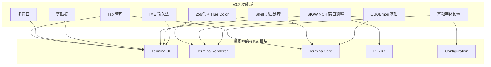
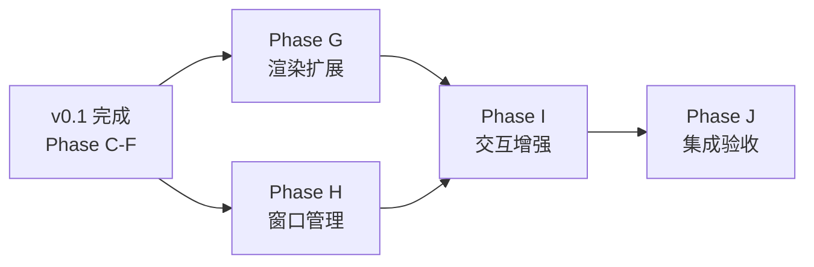

# V0.2 蓝图 — 日常可用终端

**文档类型:** 版本蓝图（初步规划）
**产品名称:** Hi-Terms
**版本:** v0.2
**语言:** 中文
**状态:** 草案（v0.1 完成前定稿）
**关联文档:**
- [Roadmap v0.2 节](../docs/reqs/hi-terms-roadmap.md) — 范围与验收标准 SSOT
- [V0.1 技术设计](../docs/design/hi-terms-v0.1-technical-design.md) — v0.1 架构（v0.2 直接继承）
- [V0.1 执行计划](v0.1-execution.md) — v0.1 产出（v0.2 输入依赖）
- [风险与决策](risks-and-decisions.md) — 跨版本风险与待决事项

---

## 1. 文档说明

### 1.1 定位

本文档是 v0.2 的**初步技术规划**，不替代后续的正式技术设计文档。目的是在 v0.1 执行期间提前识别架构风险和技术决策点，为 v0.2 技术设计提供输入。

### 1.2 范围来源

v0.2 的范围和验收标准定义在 [Roadmap](../docs/reqs/hi-terms-roadmap.md) 中，本文档不重复。以下是 Roadmap 定义的 v0.2 核心交付物摘要（便于上下文理解，权威定义以 Roadmap 为准）：

- Tab 管理（Cmd+T/Cmd+W，独立 PTY）
- 多窗口支持
- 完整 xterm-256color 终端仿真 + True Color (24-bit RGB)
- 剪贴板集成（macOS 系统剪贴板）
- SIGWINCH 窗口大小调整通知
- Shell 退出处理
- 基础字体设置
- 基础 Unicode/CJK/Emoji 渲染与宽度计算

---

## 2. 技术分解预览

### 2.1 功能域与模块映射

### 2.2 初步 Phase 划分

| Phase | 名称 | 核心内容 | 涉及模块 | 预估复杂度 |
|-------|------|---------|---------|-----------|
| G | 渲染扩展 | 256色 + True Color + CJK 宽度 + 基础字体设置 | TerminalRenderer, TerminalCore, Configuration | 中 |
| H | 窗口管理 | Tab + 多窗口 + SIGWINCH + Shell 退出处理 | TerminalUI, TerminalCore, PTYKit | 高 |
| I | 交互增强 | 剪贴板 + IME 输入法 | TerminalUI | 中 |
| J | 集成验收 | v0.2 全部验收项通过 | 全部 | 低 |

### 2.3 Phase 依赖关系

**说明：**
- G 和 H 可并行开发（渲染扩展与窗口管理无强依赖）
- I 依赖 G（剪贴板需要选区渲染）和 H（IME 需要 Tab 上下文）
- J 依赖全部 Phase 完成

---

## 3. 架构分析

### 3.1 v0.1 → v0.2 架构影响分析

| v0.2 功能 | 对 v0.1 架构的影响 | 侵入性 | 评估 |
|----------|-------------------|--------|------|
| Tab 管理 | 需从单 Session 扩展为多 Session；SessionRegistry 已有基础；TerminalWindowController 需重构为管理多个 TerminalView | 中 | v0.1 Session Foundation 已预留扩展点 |
| 多窗口 | WindowController 需支持多实例；AppDelegate 管理窗口列表 | 低 | v0.1 WindowController 已是独立类 |
| 256色/True Color | CoreTextRenderer 颜色映射扩展；TextAttributes.Color 枚举已有 `ansi256`/`trueColor` case | 低 | v0.1 类型系统已支持，仅需扩展映射逻辑 |
| 剪贴板 | TerminalView 新增选区管理（选区数据结构 + 选区渲染 + NSPasteboard） | 中 | 需新增选区子系统 |
| SIGWINCH | PTYProcess 新增 `resize()` 方法调用 `ioctl TIOCSWINSZ`；TerminalView `viewDidResize` 触发 | 低 | v0.1 Pipeline 已有 `resize(cols:rows:)` 接口 |
| Shell 退出处理 | Session `onStateChanged` 回调 → 关闭 Tab/显示提示 | 低 | v0.1 已有 `exitHandler` 和 `.exited(code:)` 状态 |
| CJK/Emoji | FontMetrics 宽度计算修正；CoreTextRenderer 双宽字符处理；SwiftTerm 已有 `isWide` 属性 | 中 | 核心渲染逻辑变更，需仔细测试 |
| IME | NSTextInputClient 协议实现；marked text 渲染；输入法候选窗位置计算 | 高 | 全新子系统，复杂度最高 |
| 基础字体设置 | Configuration 读取字体名称/字号；FontMetrics 动态更新；CoreTextRenderer 字体缓存刷新 | 低 | v0.1 AppConfig 协议已有 `fontName`/`fontSize` |

### 3.2 关键技术决策点

以下决策需在 v0.2 开发前确定，已登记在 [risks-and-decisions.md 待决事项](risks-and-decisions.md#4-待决事项)：

| 决策点 | 选项 | 关键考量 | 待决 ID |
|--------|------|---------|---------|
| Tab UI 方案 | NSTabView / 自定义 TabBar / 系统 Tab 组 | 外观自定义度 vs 原生体验；需兼容 v0.3 分屏嵌套 | PENDING-01 |
| 选区模型 | 字符级 / 行级 / 矩形选区 | 剪贴板和后续搜索（v0.3）功能联合需求 | PENDING-02 |
| IME 方案 | NSTextInputClient 最小实现 / 完整实现 | v0.2 范围控制 vs 输入法兼容性 | PENDING-03 |

### 3.3 架构约束传递

Roadmap 定义的 v0.2 架构约束（以 Roadmap 为准）：

- 终端仿真引擎必须可扩展，预留 bracketed paste mode、alternate screen buffer、OSC 序列等高级特性扩展点
- Tab/窗口管理模型必须支持后续分屏嵌套（v0.3），避免 v0.3 重构视图层级

---

## 4. 对 v0.1 产出的依赖

| 依赖项 | 来源（v0.1 任务） | v0.2 用途 | 风险评估 |
|--------|-----------------|----------|---------|
| Session 协议 + SessionRegistry | D1, D3 | Tab = 多 Session 管理 | 若 Session 协议设计不合理需 v0.2 重构 |
| TerminalView + InputHandler | E1, E2 | 扩展键盘/鼠标处理、选区、IME | 若 NSView 层级设计不合理需重构 |
| CoreTextRenderer | B2（已完成） | 扩展 256 色 / True Color / CJK 渲染 | API 稳定，低风险 |
| DefaultTerminalPipeline | C1 | 扩展 resize/多实例 | 尚未实现，需关注 |
| TerminalWindowController | E3 | 扩展为多 Tab / 多窗口管理 | 尚未实现，需关注 |
| AppConfig（字体/字号） | 已存在 | 字体设置 UI 读写 | 协议已定义，低风险 |

---

## 5. 风险预判

以下为 v0.2 特有的风险预判。跨版本风险见 [risks-and-decisions.md](risks-and-decisions.md)。

| 风险 | 影响 | 概率 | 缓解措施 |
|------|------|------|---------|
| IME 实现复杂度超预期 | v0.2 延期 | 中 | 限定 v0.2 为"基础 IME"（单一输入法兼容），复杂输入法兼容延后 |
| Tab 架构与分屏(v0.3)冲突 | v0.3 大规模重构 | 低 | 参考 iTerm2 Tab/Split 嵌套模型，v0.2 设计时预留分屏容器层级 |
| CJK 宽度计算不准确 | 渲染错位 | 中 | 基于 Unicode East Asian Width 标准 + SwiftTerm `isWide` 属性 + 实际字体度量修正 |
| True Color 大量色值渲染影响性能 | 帧率下降 | 低 | CoreTextRenderer 行级脏区机制已有基础；必要时实施颜色缓存 |

---

## 6. 待定事项

v0.1 执行过程中需要为 v0.2 确认的事项：

- [ ] 确认 SwiftTerm Cell 中 256 色 / True Color 属性的暴露方式（`fg`/`bg` 属性类型）
- [ ] 确认 Tab UI 方案（PENDING-01）— 需在 v0.1 Phase E 完成后评估
- [ ] 确认 IME 方案范围（PENDING-03）
- [ ] 评估 v0.2 是否需要独立的技术设计文档（预计需要）
- [ ] 确认 v0.2 验收标准是否需要像 v0.1 一样创建独立的验收标准文档

---

## 7. 已知 gap（v0.1.x 渲染修复后遗留）

### 7.1 DECTCEM 显示/隐藏光标（CSI ?25 h/l）

**现状**：渲染层支持 `CursorState.visible = false` 隐藏光标，SwiftTerm 也正确解析 DECTCEM 序列并维护 `terminal.cursorHidden` 标志位，但该字段在 SwiftTerm 1.13.0 中是 internal 而非 public，`SwiftTermAdapter` 无法读取，因此应用程序通过 `\e[?25l` 隐藏光标的请求当前会被忽略。

**影响**：
- vim 启动后的命令模式光标始终可见，与系统 Terminal 行为不一致
- less / fzf / 其他全屏 TUI 在等待输入或刷新时不会临时隐藏光标
- 不影响输出正确性，仅视觉上「比预期多一个闪烁块」

**建议处理路径（按工作量从小到大）**：
1. 向 SwiftTerm 上游提 PR：把 `cursorHidden` 改成 `public private(set)`（最干净）
2. fork SwiftTerm 暴露 `cursorHidden` 访问器（妥协方案）
3. 在 Hi-Terms 这一侧通过 ESC 序列拦截自行维护 hidden 状态（重复 SwiftTerm 已有的解析，最不可取）

**关联代码**：`Packages/TerminalCore/Sources/TerminalCore/SwiftTermAdapter.swift` 的 `createSnapshot()`，目前 `visible` 仅根据 `scrollbackOffset` 判断。

**优先级**：v0.2 中段 — 光标样式（DECSCUSR）已支持，DECTCEM 不阻塞主体功能。
