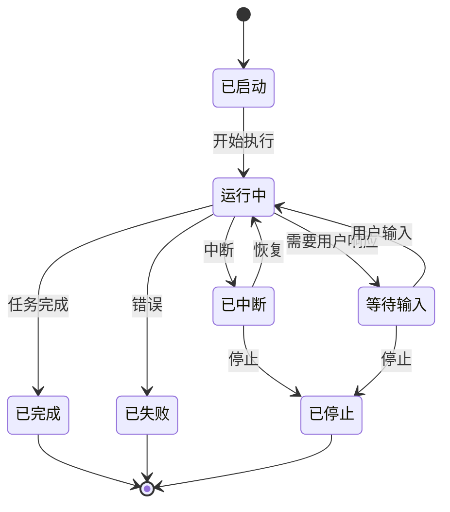
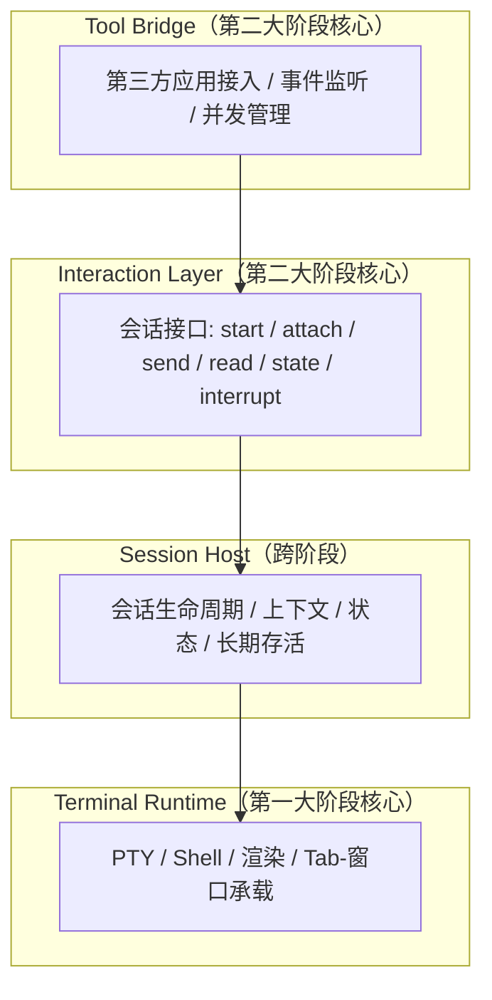

# Hi-Terms 术语表

**文档类型:** 术语表（Single Source of Truth）
**产品名称:** Hi-Terms
**语言:** 中文
**关联文档:**
- [愿景文档](../reqs/hi-terms-vision.md)
- [需求文档](../reqs/hi-terms-requirements.md)
- [Roadmap 文档](../reqs/hi-terms-roadmap.md)
- [产品定位与需求决策](../decisions/hi-terms-product-and-requirements-decisions.md)

> 本文档是 Hi-Terms 项目所有核心术语的权威定义来源。其他文档使用术语时保留简要说明并链接至此，不重复完整定义。

---

## 1. 产品与阶段

### Hi-Terms

**英文名称:** Hi-Terms

**定义:** 一个面向 macOS 的终端产品。它将先通过持续迭代在终端能力与体验上达到甚至超越 macOS Terminal / iTerm，再在此基础上把命令行工具会话做成可被外部应用稳定驱动和协作的一等对象。

**关联术语:** [两大阶段](#两大阶段two-phase-model)、[终端能力](#终端能力terminal-capabilities)、[会话](#会话session)

### 两大阶段（Two-Phase Model）

**英文名称:** Two-Phase Model

**定义:** Hi-Terms 的产品发展模型。两个阶段是递进关系：第一大阶段为第二大阶段奠定产品基础、用户基础和架构基础。

**关联术语:** [第一大阶段](#第一大阶段phase-1)、[第二大阶段](#第二大阶段phase-2)

#### 第一大阶段（Phase 1）

**定义:** 聚焦终端能力和用户体验，通过多个版本持续迭代，逐步做到与 macOS Terminal / iTerm 持平，并在部分场景超越。架构设计应为第二大阶段预留扩展空间。

**核心投入:** [Terminal Runtime](#terminal-runtime)（主要）、[Session Host](#session-host) 基础框架

**关联术语:** [终端能力](#终端能力terminal-capabilities)、[AI CLI](#ai-cli)

#### 第二大阶段（Phase 2）

**定义:** 在终端产品基础上，把命令行工具会话（尤其是 [AI CLI](#ai-cli) 会话）做成可观察、可控制、可协作的[一等对象](#一等对象first-class-object)，提供[会话级开放接口](#会话级开放接口session-level-open-apis)，使[第三方应用](#第三方应用third-party-application)可围绕会话进行稳定的驱动和协作。

**核心投入:** [Session Host](#session-host) 完整能力、[Interaction Layer](#interaction-layer)、[Tool Bridge](#tool-bridge)

**关联术语:** [会话化承载](#会话化承载session-oriented-hosting)、[多角色协作](#多角色协作multi-role-collaboration)

### AI CLI

**英文名称:** AI CLI

**定义:** 具备人工智能能力的命令行工具，如 Claude Code、Codex CLI 等。这类工具本身具有长期会话、多轮协作和状态感知需求，是 Hi-Terms 最重要、最能体现差异化价值的优先场景。

**所属阶段:** 跨阶段——第一大阶段确保稳定运行与基础体验，第二大阶段提供会话级开放接口与外部应用驱动能力。

**关联术语:** [会话](#会话session)、[会话化承载](#会话化承载session-oriented-hosting)

### 终端能力（Terminal Capabilities）

**英文名称:** Terminal Capabilities

**定义:** Hi-Terms 作为终端产品所应具备的基础能力集合，包括但不限于：终端仿真、渲染、分屏、搜索、配置、快捷键、主题、性能和稳定性。终端能力是第一大阶段的核心目标和主线，不是差异化方向的附属品。

**所属阶段:** 第一大阶段（核心）；第二大阶段（持续维护）

**关联术语:** [Terminal Runtime](#terminal-runtime)、[PTY](#ptypseudo-terminal)

---

## 2. 会话模型

### 会话（Session）

**英文名称:** Session

**定义:** 在 Hi-Terms 中，会话是指一个命令行工具的运行实例，包含其身份、状态、上下文和生命周期。会话不只是一个普通终端进程，而是一个可被识别、观察、控制和协作的对象。在第二大阶段，会话被提升为[一等对象](#一等对象first-class-object)。

**所属阶段:** 跨阶段——第一大阶段建立基础进程管理，第二大阶段实现完整会话模型。

**关联术语:** [一等对象](#一等对象first-class-object)、[会话生命周期](#会话生命周期session-lifecycle)、[会话状态](#会话状态session-state)、[Session Host](#session-host)

### 一等对象（First-class Object）

**英文名称:** First-class Object

**定义:** 指会话在系统中具备独立的身份、状态、上下文和生命周期，可被外部应用围绕操作。与之对立的是"匿名终端缓冲区"——一块没有身份、没有状态语义、无法被稳定引用的终端文本区域。

**所属阶段:** 第二大阶段

**关联术语:** [会话](#会话session)、[会话级开放接口](#会话级开放接口session-level-open-apis)

### 会话化承载（Session-oriented Hosting）

**英文名称:** Session-oriented Hosting

**定义:** Hi-Terms 将命令行工具的运行实例作为具备完整语义的会话来承载和管理的能力。不是简单地启动一个进程，而是提供会话的创建、持久化、中断、恢复和停止等全生命周期管理。

**所属阶段:** 跨阶段——第一大阶段建立基础框架，第二大阶段实现完整能力。

**关联术语:** [会话](#会话session)、[Session Host](#session-host)、[会话生命周期](#会话生命周期session-lifecycle)

### 会话生命周期（Session Lifecycle）

**英文名称:** Session Lifecycle

**定义:** 会话从启动到结束的完整过程，包含创建、运行、等待输入、中断、恢复、完成、失败和停止等阶段。[Session Host](#session-host) 负责管理这一全过程。

**所属阶段:** 跨阶段

**关联术语:** [会话状态](#会话状态session-state)、[Session Host](#session-host)

### 会话状态（Session State）

**英文名称:** Session State

**定义:** 会话在其生命周期中所处的离散状态。Hi-Terms 定义了 7 种会话状态，形成完整的状态机模型：

| 状态 | 英文 | 含义 |
|------|------|------|
| 已启动 | Started | 会话已创建并初始化，尚未开始执行 |
| 运行中 | Running | 工具正在执行任务 |
| 等待输入 | Awaiting Input | 工具需要用户或外部应用响应 |
| 已中断 | Interrupted | 会话被主动中断，可恢复 |
| 已完成 | Completed | 任务正常完成 |
| 已失败 | Failed | 执行过程中发生错误 |
| 已停止 | Stopped | 会话被主动终止，不可恢复 |

**所属阶段:** 第二大阶段（完整状态识别）；第一大阶段（基础状态维护）

**关联术语:** [会话生命周期](#会话生命周期session-lifecycle)、[高层交互](#高层交互high-level-interaction)

---

## 3. 系统架构

### 四层架构（Four-Layer Architecture）

**英文名称:** Four-Layer Architecture

**定义:** Hi-Terms 的系统架构模型，按职责分为四层。两个大阶段共享这一架构，但各层的建设重点不同。从底层到上层依次为：[Terminal Runtime](#terminal-runtime) → [Session Host](#session-host) → [Interaction Layer](#interaction-layer) → [Tool Bridge](#tool-bridge)。

**各层阶段投入:**

| 架构层 | 第一大阶段 | 第二大阶段 |
|--------|-----------|-----------|
| Terminal Runtime | ★★★ 核心投入 | 持续维护 |
| Session Host | ★★ 基础框架 | ★★★ 完整能力 |
| Interaction Layer | — | ★★★ 核心投入 |
| Tool Bridge | — | ★★★ 核心投入 |

### Terminal Runtime

**定义:** [四层架构](#四层架构four-layer-architecture)的最底层，负责基础终端承载。是第一大阶段的主要投入层。

**职责:**
- [PTY](#ptypseudo-terminal) 管理
- Shell 和子进程运行
- 基础输入输出
- 终端渲染
- Tab 或窗口承载

**所属阶段:** 第一大阶段（核心）

### Session Host

**定义:** [四层架构](#四层架构four-layer-architecture)中负责命令行工具[会话生命周期](#会话生命周期session-lifecycle)管理的层。跨越两个大阶段：第一大阶段搭建基础框架（进程管理、基础状态维护），第二大阶段实现完整的会话生命周期管理。

**职责:**
- 启动 Shell 或目标工具
- 维持会话长期存活
- 记录上下文与基础状态
- 支持中断、恢复、结束

**所属阶段:** 跨阶段

**关联术语:** [会话化承载](#会话化承载session-oriented-hosting)、[会话生命周期](#会话生命周期session-lifecycle)

### Interaction Layer

**定义:** [四层架构](#四层架构four-layer-architecture)中负责外部应用与[会话](#会话session)交互接口的层。提供两条路径：[高层交互](#高层交互high-level-interaction)为主路径，[底层终端注入](#底层终端注入raw-terminal-injection)为兜底路径。

**基础接口:**
- `start_session` — 启动新会话
- `attach_session` — 连接到已有会话
- `send_input` — 向会话写入输入
- `read_output` — 读取会话输出
- `get_session_state` — 查询会话状态
- `interrupt_session` — 中断会话

**高层接口（对支持该模式的工具）:**
- 提交用户任务
- 继续同一轮澄清
- 等待用户输入

**所属阶段:** 第二大阶段（核心）

**关联术语:** [会话级开放接口](#会话级开放接口session-level-open-apis)、[高层交互](#高层交互high-level-interaction)

### Tool Bridge

**定义:** [四层架构](#四层架构four-layer-architecture)的最上层，负责[第三方应用](#第三方应用third-party-application)对 Hi-Terms 的接入管理。

**职责:**
- 启动会话
- 连接会话
- 发送任务或用户后续消息
- 获取结果与状态变化
- 监听输出、澄清与完成事件
- 管理并发访问和协作边界

**所属阶段:** 第二大阶段（核心）

**关联术语:** [第三方应用](#第三方应用third-party-application)、[多角色协作](#多角色协作multi-role-collaboration)

### PTY（Pseudo Terminal）

**英文名称:** Pseudo Terminal

**定义:** 伪终端，操作系统提供的终端仿真机制。Hi-Terms 通过 PTY 与 Shell 及子进程进行输入输出交互，是 [Terminal Runtime](#terminal-runtime) 层的基础组件。

**所属阶段:** 第一大阶段

---

## 4. 交互模式

### 会话级开放接口（Session-level Open APIs）

**英文名称:** Session-level Open APIs

**定义:** Hi-Terms 第二大阶段对外暴露的接口体系，允许外部应用围绕[会话](#会话session)对象（而非匿名终端缓冲区）进行操作。包括会话的启动、连接、读取、写入、状态查询和生命周期控制。

**所属阶段:** 第二大阶段

**关联术语:** [Interaction Layer](#interaction-layer)、[一等对象](#一等对象first-class-object)、[Tool Bridge](#tool-bridge)

### 高层交互（High-level Interaction）

**英文名称:** High-level Interaction

**定义:** Hi-Terms 第二大阶段中，外部应用与[会话](#会话session)之间基于会话语义的交互方式。高层交互意味着：

- 外部应用知道自己操作的是一个具体的命令行工具会话，而不是一块匿名终端缓冲区
- 系统可以提供稳定的会话启动、连接、输出读取、输入写入和生命周期控制
- 多个角色围绕同一会话协作时，不会互相打断或写乱输入流
- 对具备相应语义的工具，可以进一步提供等待输入、任务进行中、任务完成等更高层状态识别
- 在能使用高层会话接口时，不必退回到原始终端文本注入
- 在必要时仍保留[底层终端注入](#底层终端注入raw-terminal-injection)能力，用于兼容或兜底

**设计原则:** 高层接口为主路径，底层终端注入为兜底路径。

**所属阶段:** 第二大阶段

**关联术语:** [底层终端注入](#底层终端注入raw-terminal-injection)、[Interaction Layer](#interaction-layer)、[会话级开放接口](#会话级开放接口session-level-open-apis)

### 底层终端注入（Raw Terminal Injection）

**英文名称:** Raw Terminal Injection

**定义:** 通过直接向终端写入原始文本的方式与命令行工具交互。作为[高层交互](#高层交互high-level-interaction)的兜底路径，用于兼容不支持高层接口的工具或场景。

**所属阶段:** 第二大阶段

**关联术语:** [高层交互](#高层交互high-level-interaction)

### 多角色协作（Multi-role Collaboration）

**英文名称:** Multi-role Collaboration

**定义:** 人、外部应用以及运行在终端中的命令行工具，能够围绕同一个[会话](#会话session)进行稳定协作的能力。要求多个角色同时参与时输入流不冲突，状态变化可被各方感知。

**所属阶段:** 第二大阶段

**关联术语:** [会话](#会话session)、[Tool Bridge](#tool-bridge)、[第三方应用](#第三方应用third-party-application)

---

## 5. 产品边界

### 产品边界（Product Boundaries）

**英文名称:** Product Boundaries

**定义:** Hi-Terms 明确界定的能力范围，区分产品应做和不应做的事项。

#### In Scope（应做）

**第一大阶段:**
- 在 macOS 上稳定运行各类命令行工具
- 持续迭代[终端能力](#终端能力terminal-capabilities)和用户体验
- 优先优化 [AI CLI](#ai-cli) 的稳定运行与基础体验
- 提供长期存活的终端会话
- 架构设计为第二大阶段预留扩展空间

**第二大阶段:**
- 将命令行工具[会话](#会话session)视为[一等对象](#一等对象first-class-object)
- 让外部应用可以连接、启动、读取、写入和控制会话
- 支持会话基础状态和生命周期的查询
- 支持[高层交互](#高层交互high-level-interaction)与[底层终端注入](#底层终端注入raw-terminal-injection)并存
- 围绕[第三方应用](#第三方应用third-party-application)驱动会话设计接口
- 支持[多角色协作](#多角色协作multi-role-collaboration)

#### Out of Scope（不做）

- **不做 Prompt 优化器** — 不主动优化、改写或增强用户发送给 AI CLI 的提示词
- **不做提示词改写器** — 不替用户决定如何向 AI CLI 下指令
- **不做任务意图增强器** — 自然语言能力属于 AI CLI 工具本身，不属于 Hi-Terms
- 不把产品扩展成完整远程运维平台或大而全自动化平台
- 第一大阶段不追求全面超越 iTerm（但路线必须明确）

> Hi-Terms 的优化对象始终是宿主体验与交互体验，不是 Prompt 内容本身。决策依据参见[产品定位与需求决策 §3](../decisions/hi-terms-product-and-requirements-decisions.md#3-决策二ai-cli-是跨阶段的重要场景但优化边界只在体验层)。

### 第三方应用（Third-party Application）

**英文名称:** Third-party Application

**定义:** 与 Hi-Terms 集成的外部 macOS 应用。在第二大阶段，第三方应用可通过 [Tool Bridge](#tool-bridge) 启动、连接和驱动 [AI CLI](#ai-cli) 会话，是第二大阶段的核心场景参与方。

**主场景示例:** 开发者构建的 macOS 应用（如 Telegram 机器人后端），通过 Hi-Terms 启动并驱动 AI CLI 完成多轮任务。详细场景描述参见[需求文档 §2.2](../reqs/hi-terms-requirements.md#22-第二大阶段主场景第三方应用驱动-ai-cli-会话)。

**所属阶段:** 第二大阶段

**关联术语:** [Tool Bridge](#tool-bridge)、[多角色协作](#多角色协作multi-role-collaboration)、[会话级开放接口](#会话级开放接口session-level-open-apis)
