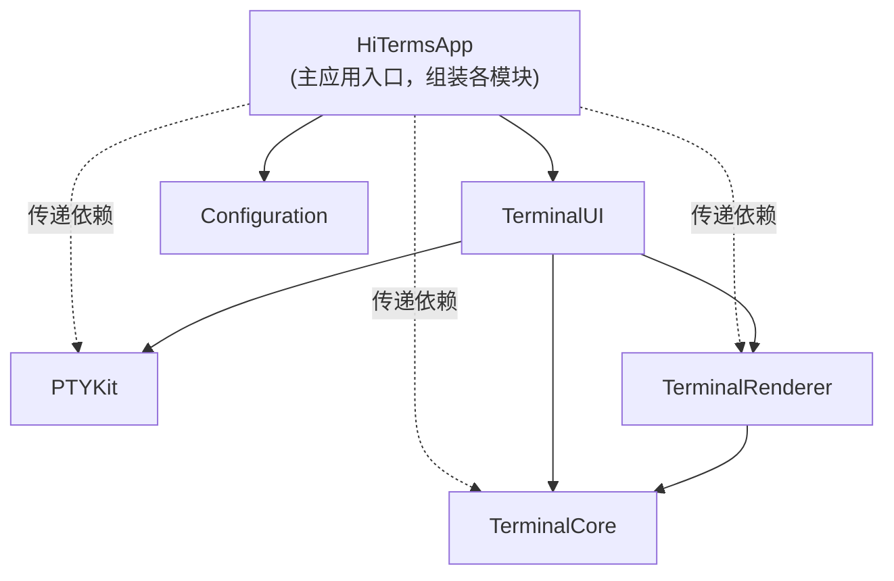
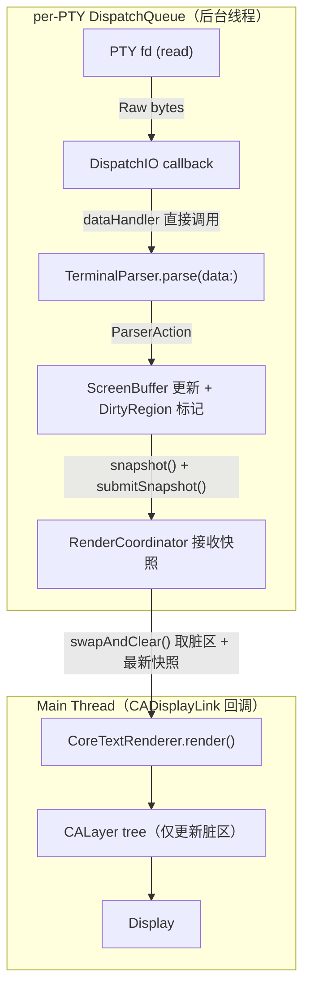
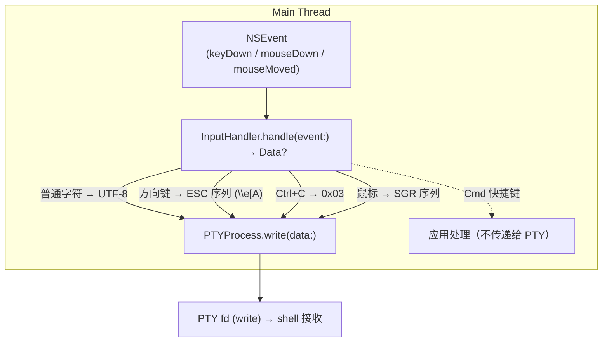
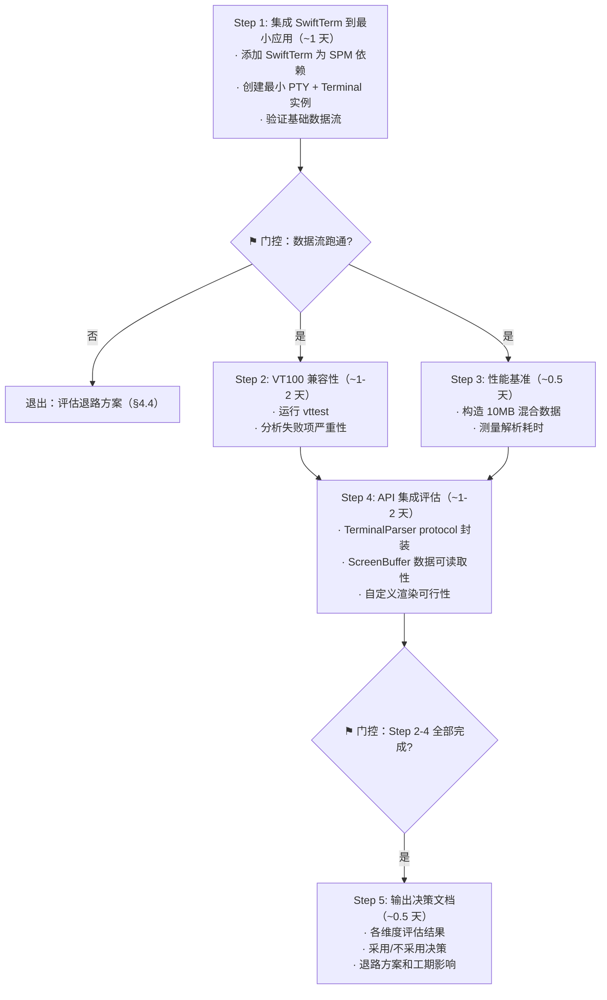
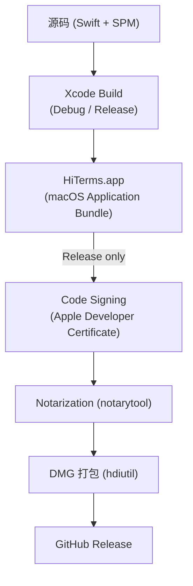

# Hi-Terms V0.0 技术设计文档 — 工程基线与技术验证

**文档类型:** 技术设计
**产品名称:** Hi-Terms
**版本:** v0.0
**语言:** 中文
**关联文档:**
- [Roadmap](../reqs/hi-terms-roadmap.md)（版本定义）
- [技术选型决策](../decisions/hi-terms-technical-decisions.md)（技术选型依据）
- [需求文档](../reqs/hi-terms-requirements.md)（四层架构定义）
- [迭代计划评审](../reviews/iteration-plan-review-2026-03-30.md)（评审建议来源）
- [V0.0 验收标准](../reqs/hi-terms-v0.0-acceptance.md)（V0.0 验收标准权威来源）
- [术语表](../SSOT/glossary.md)（术语权威定义）

---

## 1. 版本目标

V0.0 是工程基线版本，**不交付用户可见功能**，目标是：

1. 搭建可运行的 macOS 应用骨架与构建链路
2. 确定 Swift Package 模块结构与依赖方向
3. 完成 SwiftTerm 系统评估，确定终端仿真引擎路线
4. 建立测试骨架（XCTest + vttest 集成方案）
5. 建立日志与性能采样基础
6. 跑通从代码到可签名 DMG 的完整构建链路

**V0.0 不包含：**
- 任何终端功能交付（PTY、渲染、输入、滚动等归 V0.1）
- CI/CD 流水线搭建（V0.1 期间完成）
- 配置系统完整实现（V0.0 仅建立骨架）

---

## 2. Swift Package 模块结构

### 2.1 模块全景

```
HiTerms/
├── HiTermsApp/                  # 主应用 Target（AppKit 入口）
├── Packages/
│   ├── TerminalCore/            # 终端仿真核心（parser、screen buffer、属性模型）
│   ├── PTYKit/                  # PTY 管理（forkpty、I/O、进程生命周期）
│   ├── TerminalRenderer/        # 渲染抽象层 + CoreText 实现
│   ├── TerminalUI/              # AppKit 视图层（终端视图、窗口管理）
│   └── Configuration/           # 配置存储骨架
├── Tests/
│   ├── TerminalCoreTests/
│   ├── PTYKitTests/
│   ├── TerminalRendererTests/
│   └── IntegrationTests/        # vttest 集成、端到端测试
└── Tools/
    ├── vttest-runner/           # vttest 自动化运行脚本
    └── perf-baseline/           # 性能采样脚本
```

### 2.2 模块职责与依赖



> **依赖说明：** 实线为直接依赖，虚线为传递依赖。HiTermsApp 通过 TerminalUI 间接获得对 PTYKit、TerminalRenderer、TerminalCore 的访问，SPM Package.swift 中仅需声明直接依赖（TerminalUI、Configuration）。如果 HiTermsApp 需要直接使用某个下层模块的类型，须显式添加为直接依赖。

**依赖规则（严格单向）：**

| 模块 | 依赖 | 不可依赖 |
|------|------|----------|
| TerminalCore | 无外部依赖（可能依赖 SwiftTerm） | 不依赖 AppKit、PTYKit、UI |
| PTYKit | 系统框架（Darwin/POSIX） | 不依赖 AppKit、TerminalCore |
| TerminalRenderer | TerminalCore、AppKit/QuartzCore（CoreText 渲染需要） | 不依赖 PTYKit |
| TerminalUI | TerminalCore、TerminalRenderer、PTYKit | — |
| Configuration | 无（Foundation only） | 不依赖其他业务模块 |
| HiTermsApp | TerminalUI、Configuration（直接）；其余为传递依赖 | — |

> **架构层职责分界：** Terminal Runtime（TerminalCore + PTYKit + TerminalRenderer + TerminalUI）负责 PTY 管理、I/O 数据流、终端解析与渲染。Session Host 负责会话身份（SessionID）、生命周期、状态维护、注册表与事件。TerminalUI 中的 `TerminalPipeline` 是 Terminal Runtime 层的数据管线协调器（串联 PTY → Parser → ScreenBuffer → Renderer），**不是** Session Host 层的会话抽象（详见 §2.3 TerminalUI 说明）。

### 2.3 模块详细说明

#### TerminalCore

终端仿真的核心逻辑，**不涉及渲染和 I/O**。

**关键类型：**

| 类型 | 职责 | V0.0 交付 |
|------|------|-----------|
| `TerminalParser` (protocol) | 解析 VT100/xterm 转义序列，输出操作指令 | protocol + SwiftTerm 封装或 stub |
| `ScreenBuffer` | 终端字符网格（cells + attributes），维护 dirty region 标记，提供 `snapshot()` 用于 COW 渲染 | 类型定义 + 基本读写 spike |
| `Cell` | 单个字符单元：character + foreground + background + attributes | 类型定义 |
| `TextAttributes` | 文本属性集（粗体、斜体、下划线、反色、颜色） | 类型定义 |
| `ScrollbackBuffer` | 滚回历史缓冲区 | V0.1 实现 |
| `CursorState` | 光标位置、样式、可见性 | 类型定义 |
| `TerminalState` | 终端状态聚合（screen buffer + cursor + 模式标志） | 类型定义 |

**TerminalParser protocol 骨架：**

```swift
/// 终端仿真解析器协议
/// 实现必须是**有状态的**：VT100/xterm 转义序列可能跨越多次 parse() 调用
///（例如 ESC 序列被拆分到两个 Data 块中），实现需维护内部状态以正确处理
/// 跨调用边界的部分序列。
protocol TerminalParser {
    /// 解析原始终端数据，通过 delegate 回调传递操作指令
    /// - 在 per-PTY DispatchQueue 上由 PTYProcess 的 dataHandler 直接调用
    /// - 每次调用可能产生零到多个操作指令
    func parse(data: Data)

    /// 接收 parser 操作指令的 delegate
    var delegate: TerminalParserDelegate? { get set }
}

/// Parser 操作指令回调
protocol TerminalParserDelegate: AnyObject {
    func parser(_ parser: TerminalParser, didReceiveAction action: ParserAction)
}

/// Parser 产出的操作指令（V0.0 定义骨架，V0.1 补充完整）
enum ParserAction {
    case printText(String)
    case moveCursor(row: Int, col: Int)
    case setAttribute(TextAttributes)
    case scroll(lines: Int)
    case eraseInDisplay(mode: Int)
    case eraseInLine(mode: Int)
    // V0.1+ 补充：alternate screen、mouse mode、bracketed paste 等
}
```

> **Delegate vs Callback 选择：** 使用 delegate 模式而非闭包回调，因为 parser 需要传递多种操作指令，delegate 提供清晰的类型化接口。ScreenBuffer 作为 `TerminalParserDelegate` 的实现者，直接接收操作指令并更新自身状态。

**如果采用 SwiftTerm：** `TerminalParser` 的默认实现封装 SwiftTerm 的 `Terminal` 类，通过 protocol 抽象隔离具体实现。SwiftTerm 内部维护自己的解析状态，封装层负责将 SwiftTerm 的回调转换为 `ParserAction`。

**如果不采用 SwiftTerm：** 需自研 parser，工作量显著增加（参见 §4 评估方案）。

#### PTYKit

PTY 生命周期管理，**不涉及终端仿真逻辑**。

**关键类型：**

| 类型 | 职责 | V0.0 交付 |
|------|------|-----------|
| `PTYProcess` | 单个 PTY 实例：fd 管理、读写、进程 PID | spike 实现（echo hello） |
| `PTYManager` | 管理多个 PTY 实例，支持并发创建/销毁 | V0.1 实现 |
| `PTYConfiguration` | PTY 创建参数：shell 路径、环境变量、初始窗口大小 | 类型定义 |

**关键操作：**
- `create(config:) -> PTYProcess` — forkpty + execve
- `read(from:) -> AsyncStream<Data>` — PTY 输出的**外部公开 API**（供测试、监控等外部消费者使用）。内部数据管线（TerminalPipeline）不通过此 API 消费数据，而是使用 DispatchIO 回调直接驱动 parser（参见 §5.4 双路径说明）
- `setDataHandler(_: @escaping (Data) -> Void)` — PTY 输出的**内部回调接口**，由 TerminalPipeline 设置，在 per-PTY DispatchQueue 的 DispatchIO 回调中直接调用，确保 parser 与 PTY 读取在同一线程执行
- `write(to:data:)` — 写入用户输入到 PTY
- `resize(process:cols:rows:)` — SIGWINCH
- `terminate(process:)` — 优雅关闭

#### TerminalRenderer

渲染抽象 + CoreText 具体实现。依赖 AppKit/QuartzCore（CoreText 渲染需要 NSFont、CALayer 等系统类型）。

> **设计说明：** `TerminalRendering` protocol 使用 AppKit 类型（`CALayer`、`NSFont`），因为该 protocol 的边界在渲染层内部，而非跨层抽象边界。其唯一消费者是 TerminalUI（已依赖 AppKit），不构成跨层依赖问题。注意区分：**TerminalCore** 不依赖 AppKit（参见 §2.2 依赖规则），而 **TerminalRenderer** 明确依赖 AppKit/QuartzCore——两者是不同模块。如 V0.4 引入 Metal 渲染后端（如 `MTKView`），`TerminalRendering` 协议签名预计需要调整，这属于预期内的演进。

**关键类型：**

| 类型 | 职责 | V0.0 交付 |
|------|------|-----------|
| `TerminalRendering` (protocol) | 渲染接口抽象（为 Metal 替换预留） | protocol 定义 |
| `CoreTextRenderer` | CoreText + CALayer 实现 | V0.1 实现 |
| `FontMetrics` | 字体度量：cell 宽高、baseline 偏移、字体回退链 | 类型定义 |
| `DirtyRegion` | 脏区跟踪：需要重绘的行/列范围，`os_unfair_lock` 保护并发访问 | 类型定义 |

**渲染协议核心方法：**
```swift
protocol TerminalRendering {
    func render(
        buffer: ScreenBuffer,
        dirtyRegion: DirtyRegion,
        cursor: CursorState,
        into layer: CALayer
    )
    func measure(font: NSFont) -> FontMetrics
}
```

#### TerminalUI

AppKit 视图层 + 数据管线编排。本模块既包含视图组件，也包含将 PTY、Parser、ScreenBuffer、Renderer 串联为完整数据管线的核心协调器。

**关键类型：**

| 类型 | 职责 | V0.0 交付 |
|------|------|-----------|
| `TerminalPipeline` | **核心协调器**：协调 PTYProcess + TerminalParser + ScreenBuffer + RenderCoordinator，驱动 PTY 输出 → Parser → ScreenBuffer 数据管线，转发 InputHandler → PTY 输入。**PTYProcess 为外部注入依赖**（通过 init 传入），不由 Pipeline 创建/持有——V0.1 的 Session 将持有 PTY 并传递给 Pipeline（参见 [Roadmap v0.1 架构约束](../reqs/hi-terms-roadmap.md)） | protocol + stub |
| `TerminalView` (NSView) | 单个终端视图，处理键盘/鼠标输入，持有渲染层，以 TerminalPipeline 为数据源 | V0.1 实现 |
| `TerminalWindowController` | 窗口管理（V0.0 仅单窗口） | V0.1 实现 |
| `InputHandler` | NSEvent → 终端按键序列转换 | V0.1 实现 |

#### Configuration

配置存储骨架，V0.0 仅建立接口，不实现完整 Profile。

**关键类型：**

| 类型 | 职责 |
|------|------|
| `AppConfig` (protocol) | 配置读取接口 |
| `DefaultConfig` | 默认值提供者（字体、字号、颜色等） |
| `UserDefaultsConfig` | 基于 UserDefaults 的持久化实现 |

### 2.4 前瞻性类型存根

以下类型在 V0.0 阶段仅作为**类型词汇存根**定义在 TerminalCore 模块中（纯值类型，无 AppKit 依赖），与其他模块的 protocol/type 骨架一起建立项目级类型词汇表。

| 类型 | 定义 | 用途 |
|------|------|------|
| `SessionID` | `typealias SessionID = UUID` | 会话唯一标识，V0.1 Session Foundation 的基础类型 |
| `SessionState` | `enum SessionState { case running, exited }` | 会话基础状态枚举，V0.1 供 Session Foundation 使用，V0.7 扩展为完整 7 状态模型（参见[术语表 — 会话状态](../SSOT/glossary.md#会话状态session-state)） |

> **范围限定：** 这些类型存根仅建立词汇，不包含任何 Session Host 逻辑（注册表、生命周期管理、Session-PTY 映射等）。V0.0 不扩展 Session 相关的交付范围。[Roadmap](../reqs/hi-terms-roadmap.md) 中 Session 相关能力的版本分布为：V0.1 引入 Session Foundation（SessionID、Session-PTY 映射、基础生命周期字段、registry 与 query）；V0.7 完成 Session Host 完善（完整 7 状态模型、持久化、Phase 2 接口预留）。V0.1 引入 Session Foundation 时，应评估是否将 Session 相关类型迁移到独立模块（如 `SessionKit`），避免 TerminalCore 长期承载非终端仿真概念。

> **关于 TerminalPipeline（§2.3 TerminalUI）的说明：** TerminalPipeline 是**数据管线协调器**（串联 PTY → Parser → ScreenBuffer → Renderer），属于 Terminal Runtime 层，与 Session Host 层的会话抽象无关。Session Host 的完整会话模型（完整生命周期、持久化、Phase 2 接口）将在 V0.7 设计。

---

## 3. 核心数据流设计

> **范围说明：** 本节描述目标架构设计，V0.0 仅定义相关 protocol 和类型骨架，完整实现归 V0.1+。

### 3.1 输出管线（PTY → 屏幕）

> **策略前提：** 以下管线描述基于策略 A（Hi-Terms 拥有 ScreenBuffer，SwiftTerm 作为解析引擎）。这是 V0.0 评估（§4）需要验证的首选方案。如果评估结论为策略 B（SwiftTerm 拥有状态），管线中 TerminalParser → ScreenBuffer 的环节将调整为直接从 SwiftTerm 读取 cell 数据，具体设计在 V0.1 设计文档中更新。



**关键设计约束：**

- **PTY 读取不在主线程**：使用 DispatchIO 或专用后台线程读取 PTY fd
- **Parser 在后台线程执行**：与 PTY 读取在同一后台线程（per-PTY DispatchQueue），通过 `setDataHandler` 回调直接调用，避免跨线程数据拷贝（参见 §5.4 双路径说明）
- **ScreenBuffer 更新和 dirty region 标记在后台线程**：parser 直接操作 buffer
- **渲染切回主线程**：通过 `DispatchQueue.main.async` 将 dirty region 快照提交给 renderer（GCD 为 V0.0–V0.1 主要并发机制，参见 §5.4；主线程 UI 类型如 TerminalView 可标注 `@MainActor`，但数据管线的主线程切换统一使用 GCD 保持一致）
- **只重绘脏区**：renderer 仅更新 DirtyRegion 标记的行/列，不全屏重绘

### 3.2 输入管线（键盘/鼠标 → PTY）



### 3.3 背压处理

背压存在于两个层面：

**层面一：PTY I/O 线程 vs. 渲染线程**

当 PTY 输出速率超过渲染速率时：

1. PTY 读取和 Parser 在同一后台线程持续执行，不受渲染速率影响
2. Parser 持续更新 ScreenBuffer，dirty region 不断累积
3. 渲染按帧率节流（最高 60fps）：如果上一帧尚未渲染完成，合并多次 buffer 更新的 dirty region
4. 效果：用户看到的是"跳过中间帧"而非卡顿，类似视频快进

**层面二：Parser 处理速率 vs. 子进程输出速率**

Parser 和 PTY 读取同步运行在同一线程。如果 Parser 处理复杂转义序列导致变慢，PTY 读取也随之变慢，内核 PTY 缓冲区（通常 4-16KB）逐渐填满，最终子进程的写操作阻塞。这是操作系统提供的天然背压机制，终端仿真器通常依赖此机制限速，无需额外缓冲队列。

### 3.4 错误传播原则

> **范围说明：** V0.0 仅定义错误类型骨架（`PTYError`、`ParserError`），具体错误处理逻辑归 V0.1+。

数据管线中的错误按以下原则传播：

| 错误来源 | 传播方式 | 处理策略 |
|----------|----------|----------|
| PTY I/O 错误（EOF、读取失败） | 通过回调或 `AsyncStream` 正常结束传递 | TerminalPipeline 负责清理资源，并通知上层（V0.1+ 为 Session 层）更新状态 |
| Parser 错误（未知转义序列、畸形序列） | 不向上传播 | 静默跳过 + OSLog error 记录，不中断数据管线 |
| 渲染错误（CALayer 更新失败） | 不向上传播 | 跳过当前帧 + OSLog error 记录，等待下一帧 |

**设计意图：** PTY 断开是需要上层响应的事件（关闭 tab、提示用户），因此向上传播。Parser 和渲染错误不应中断整个终端会话——跳过一个异常序列或一帧远比崩溃终端好。

---

## 4. SwiftTerm 评估方案

### 4.1 评估目标

确定 [SwiftTerm](https://github.com/migueldeicaza/SwiftTerm) 是否满足 Hi-Terms 终端仿真引擎需求，产出明确的"采用/不采用"决策。

### 4.1.1 评估必须回答的核心架构问题：ScreenBuffer 归属权

评估必须明确回答 **ScreenBuffer 归属权**问题——这是决定 parser、buffer、renderer 接口形态的核心决策：

- **策略 A：Hi-Terms 拥有 ScreenBuffer。** SwiftTerm 仅作为解析引擎，parser 输出操作指令，Hi-Terms 自有 ScreenBuffer 接收更新。优势：最大控制力，数据模型完全自主，引擎可替换。代价：需在 SwiftTerm 解析结果和 Hi-Terms buffer 之间建立映射层。
- **策略 B：SwiftTerm 拥有状态。** Hi-Terms 直接读取 SwiftTerm 内部 Terminal 对象的 cell 数据进行渲染。优势：减少代码重复，直接复用 SwiftTerm 的状态管理。代价：与 SwiftTerm 内部数据结构耦合更紧，引擎替换成本高。

§4.2 中"API 可集成性"和"ScreenBuffer 可访问性"两个评估维度为此决策提供关键信息。§3.1 的输出管线设计基于策略 A 描述；如评估选择策略 B，管线设计将在 V0.1 设计文档中相应调整。

### 4.2 评估维度与通过标准

| 维度 | 评估方法 | 通过标准 | 不通过则 |
|------|----------|----------|----------|
| **VT100/xterm 兼容性** | 运行 vttest 基础测试套件 | 基础项通过率 ≥ 70%（V0.0 spike 标准，V0.1 验收为 ≥ 80%） | 需评估缺失项是否可补齐 |
| **解析性能** | 喂入 10MB 混合终端数据（约 80% 可打印 ASCII + 15% ANSI 颜色/属性序列 + 5% 光标移动序列，或录制的真实终端会话），测量解析耗时 | 解析速率 ≥ 50MB/s | 性能瓶颈是否可绕过 |
| **高级特性** | 逐项验证 | 必须支持：alternate screen buffer、SGR mouse mode。应支持：bracketed paste、True Color | 缺失项是否可扩展补充 |
| **API 可集成性** | 尝试将 SwiftTerm 的 Terminal 类封装在 TerminalParser protocol 后 | 可在不修改 SwiftTerm 源码的前提下完成封装 | 是否需要 fork 并修改 |
| **ScreenBuffer 可访问性** | 检查是否可读取 cell 级别的字符、属性、颜色数据 | 可逐 cell 读取完整数据，用于自定义渲染 | 是否可通过扩展解决 |

### 4.3 评估流程



> **并行说明：** Step 2（VT100 兼容性）和 Step 3（性能基准）可并行执行。

### 4.4 退路方案

如果 SwiftTerm 评估不通过：

| 退路 | 工期影响 | 适用场景 |
|------|----------|----------|
| **Fork SwiftTerm 并修改** | +1-2 周 | SwiftTerm 基本满足但个别 API 需调整 |
| **封装 libvterm (C)** | +2-3 周 | SwiftTerm 兼容性不足，但 libvterm 稳定 |
| **自研 parser** | +6-8 周 | 以上方案均不可行（极端情况） |

### 4.5 评估交付物

- `docs/decisions/hi-terms-swiftterm-evaluation.md` — 评估结果与决策记录，**必须包含 ScreenBuffer 归属权决策**（策略 A/B，参见 §4.1.1）及选择理由
- `Tests/IntegrationTests/SwiftTermSpikeTests.swift` — 评估过程中的测试代码

---

## 5. 线程与并发模型

> **范围说明：** 本节描述目标架构设计，V0.0 仅定义相关 protocol 和类型骨架，完整实现归 V0.1+。

**并发决策总结（均已确定，无保留候选）：**

| 决策项 | 选型 | 关键理由 |
|--------|------|----------|
| ScreenBuffer 并发保护 | copy-on-write 快照 | 避免渲染持读锁阻塞 Parser 线程（详见 §5.2） |
| 帧率同步 | CADisplayLink (macOS 14+) | 回调天然在主线程，无需手动 dispatch（详见 §5.1） |
| PTY I/O 调度 | DispatchIO + 专用 per-PTY DispatchQueue | 内核级 fd 监控，高效 I/O 通知（详见 §5.1） |
| 主线程切换 | DispatchQueue.main.async | GCD 为主要并发机制，保持一致（详见 §5.4） |

### 5.1 线程分配

| 线程 | 职责 | 并发机制 |
|------|------|----------|
| **Main Thread** | UI 事件处理、CALayer 渲染更新、键盘/鼠标事件接收 | MainActor |
| **PTY I/O Thread** | 每个 PTY 实例一个，负责 fd 读取 + parser 执行 + ScreenBuffer 更新 | DispatchIO（回调 dispatch 到专用 per-PTY DispatchQueue） |
| **Renderer Coalesce** | 帧率节流，合并 dirty region，提交渲染 | CADisplayLink callback (Main RunLoop) |

> **关于 CADisplayLink vs CVDisplayLink：** macOS 14+ 提供 `CADisplayLink`，可绑定到 main RunLoop，回调天然在主线程执行。相比 `CVDisplayLink`（回调在私有高优先级线程，需手动 dispatch 到主线程），`CADisplayLink` 更安全且与本文描述的线程模型一致。Hi-Terms 最低支持 macOS 14，因此采用 `CADisplayLink`。

> **线程扩展性说明：** 每个 PTY 一个专用 I/O 线程在 V0.0-V0.1（单终端）和 V0.2（5-20 个 Tab）场景下是合理的。V0.2+ 如果 Tab 数量显著增长，可评估切换到 `DispatchSource` + 共享并发队列的方案以减少线程数。

### 5.2 数据保护

| 共享数据 | 保护方式 | 说明 |
|----------|----------|------|
| ScreenBuffer | copy-on-write 快照 | 后台线程写入 live buffer，主线程通过 `snapshot()` 获取只读副本进行渲染，两者互不阻塞 |
| CursorState | 包含在 ScreenBuffer 快照中 | 始终与 buffer 一致 |
| DirtyRegion | `os_unfair_lock` 保护 merge 和 swap | 后台线程 `merge()` 标记脏行，主线程 `swapAndClear()` 获取并清空 |
| PTY fd | PTYProcess 内部封装，单线程访问 | 每个 PTY 的读写在其专用队列 |

> **为什么不用 pthread_rwlock：** 如果渲染持读锁时间较长（一次 CoreText 全屏渲染可达 5-10ms），Parser 线程获取写锁会阻塞，连带 PTY 读取也阻塞，导致可感知的微卡顿。COW 快照让 Parser 和渲染互不阻塞，是终端仿真器的常见选择。

> **ScreenBuffer COW 实现指导：** ScreenBuffer 采用 class 实现（引用类型），后台线程直接修改 live 实例。`snapshot()` 方法返回轻量级的 `ScreenBufferSnapshot`（struct，包含 cells 数组副本和当前 CursorState）。由于 Swift Array 自带 COW 语义，snapshot 创建时仅复制数组引用（O(1)），仅当 live buffer 后续修改 cells 时才触发实际内存拷贝。DirtyRegion 不包含在 snapshot 中——它有独立的同步机制（见下方 `os_unfair_lock` 说明）。

> **`os_unfair_lock` 使用约束：** (1) 不可递归持锁——`merge()` 和 `swapAndClear()` 内部不得嵌套加锁；(2) 不得在 async/await 上下文中持有——Swift 编译器不保证 async 函数的执行线程，持锁跨 await 会导致未定义行为；(3) 实现时必须使用 `defer { os_unfair_lock_unlock(&lock) }` 模式确保异常安全。

### 5.3 渲染节流

```swift
// 概念示意，非最终代码
class RenderCoordinator {
    private var displayLink: CADisplayLink  // macOS 14+，绑定到 main RunLoop
    private var pendingDirtyRegion: DirtyRegion  // 累积的脏区（os_unfair_lock 保护）

    // PTY I/O 线程调用：标记新的脏区
    func markDirty(_ region: DirtyRegion) {
        os_unfair_lock_lock(&lock)
        defer { os_unfair_lock_unlock(&lock) }
        pendingDirtyRegion.merge(region)
    }

    // PTY I/O 线程调用：提交新的 buffer 快照
    // 注意：snapshot 在 PTY I/O 线程创建（此时该线程独占 live buffer 的写入权），
    // 主线程仅读取已创建的 snapshot，无需额外同步。
    func submitSnapshot(_ snapshot: ScreenBufferSnapshot) {
        os_unfair_lock_lock(&lock)
        defer { os_unfair_lock_unlock(&lock) }
        latestSnapshot = snapshot
    }

    // CADisplayLink 回调（主线程）：执行渲染
    func onDisplayLink() {
        os_unfair_lock_lock(&lock)
        let region = pendingDirtyRegion
        pendingDirtyRegion = DirtyRegion.empty
        let snapshot = latestSnapshot
        os_unfair_lock_unlock(&lock)
        if !region.isEmpty, let snapshot {
            renderer.render(buffer: snapshot, dirtyRegion: region, ...)
        }
    }
}
```

> **线程安全说明：** ScreenBuffer 的 `snapshot()` 由 PTY I/O 线程在更新 buffer 后调用（该线程独占 live buffer 的写入权），snapshot 创建后通过 `submitSnapshot()` 提交给 RenderCoordinator。主线程在 `onDisplayLink()` 中仅读取已创建的 snapshot，不直接访问 live buffer。DirtyRegion 和 latestSnapshot 的读写通过同一把 `os_unfair_lock` 保护。

### 5.4 并发模型选择说明

本设计以 GCD（DispatchQueue、DispatchIO）为主要并发机制。

**双路径数据消费模型：** PTYKit 提供两种 PTY 输出消费路径，服务不同场景：

| 路径 | API | 执行线程 | 使用者 |
|------|-----|---------|--------|
| **内部管线路径** | `setDataHandler(_: (Data) -> Void)` | per-PTY DispatchQueue（DispatchIO 回调线程） | TerminalPipeline |
| **外部公开路径** | `read(from:) -> AsyncStream<Data>` | Task 上下文（任意线程） | 测试、监控、外部消费者 |

**内部管线路径**是性能关键路径：DispatchIO 回调在 per-PTY DispatchQueue 上触发 → 直接调用 `dataHandler` → parser 执行 → ScreenBuffer 更新 → snapshot 提交给 RenderCoordinator。全程在同一线程，无跨线程数据拷贝，天然依赖内核 PTY 缓冲区实现背压（§3.3）。

**外部公开路径**使用 Swift Structured Concurrency 桥接 GCD 数据源，消费端在 async 上下文中使用。此路径适用于不需要同线程保证的场景（如测试中验证 PTY 输出内容）。

V0.0 不要求统一为纯 Swift Concurrency 或纯 GCD，但需确保两条路径的边界清晰：TerminalPipeline 仅使用内部回调路径，不消费 AsyncStream。

---

## 6. 测试基础设施

> **与技术决策文档的版本对应：** [技术选型决策 §6](../decisions/hi-terms-technical-decisions.md#6-决策五测试策略) 描述了三层测试体系的整体策略。该文档中"v0.1 必须搭建基础测试基础设施"已细化为：V0.0 建立 XCTest 骨架 + vttest 本地自动化方案，V0.1 搭建 CI 流水线并将测试集成到 CI。本节是该细化拆分的详细设计。

> **依赖说明：** 终端一致性测试和性能基准测试均依赖可运行的 TerminalParser 实现。V0.0 中这一实现预计来自 SwiftTerm spike（§4）。如果 SwiftTerm 评估产出否定结论，这两项交付物降级为"测试框架就绪，待替代 parser 实现后可运行"，不阻塞 V0.0 验收。

### 6.1 测试层级

| 层级 | 框架 | 覆盖范围 | V0.0 交付 |
|------|------|----------|-----------|
| 单元测试 | XCTest | TerminalCore（parser、buffer）、PTYKit（进程管理）、Configuration | 各模块 ≥ 1 个测试文件，验证核心类型可实例化和基本操作 |
| 终端一致性 | vttest + 自定义脚本 | VT100/xterm 转义序列兼容性 | vttest 运行方案确定，≥ 1 组基础测试可自动执行 |
| 性能基准 | XCTest + 自定义计时 | 解析吞吐量、渲染帧率 | ≥ 1 组解析性能基准可采集 |

### 6.2 vttest 自动化方案

vttest 是交互式 ncurses 程序，不能直接作为 CI 测试。V0.0 需要验证以下方案之一：

**方案 A：PTY 回放驱动**
1. 在真实终端中手动运行 vttest，录制 PTY I/O 序列
2. 将录制的输出序列回放给 Hi-Terms 的 parser
3. 对比 parser 产出的 ScreenBuffer 与预期快照

**方案 B：脚本驱动 vttest**
1. 通过 expect 脚本自动驱动 vttest 的菜单选择
2. 捕获 vttest 输出并解析测试结果
3. 将结果汇总为通过率报告

V0.0 的出口标准是**确定可行方案并至少有 1 组测试可运行**，不要求全部 vttest 项目自动化。

### 6.3 性能基准采集

**基准测试内容：**

| 指标 | 方法 | 单位 | V0.0 可采集性 |
|------|------|------|--------------|
| 解析吞吐量 | 喂入 N MB 原始终端数据，计算 bytes/s | MB/s | 依赖 TerminalParser 实现（参见 §6 依赖说明） |
| 单帧渲染耗时 | 全屏脏区渲染一次的耗时 | ms | V0.1+ 可采集（依赖 CoreTextRenderer 实现，V0.0 如未就绪则跳过） |
| 内存基线 | 空终端启动后的 RSS | MB | 可直接采集 |

**测试数据生成：**

`Tools/perf-baseline/` 目录包含一个数据生成脚本（`generate-test-data.sh` 或等效实现），可按指定比例生成 N MB 混合终端数据。默认参数：10MB、80% 可打印 ASCII + 15% ANSI 颜色/属性序列 + 5% 光标移动序列。脚本输出为原始字节文件，可直接喂入 parser 进行基准测试。V0.0 交付物包含此脚本及首次 10MB 测试数据生成结果。

V0.0 仅建立采集能力和首次基准值，不设定通过阈值。阈值在 V0.1 完成后根据实际数据确定。

---

## 7. 日志与 Crash 基础

### 7.1 日志框架

使用 Apple 的 **os.log (OSLog)** 框架：

| 子系统 | 类别 | 用途 |
|--------|------|------|
| `com.hiterms.pty` | `lifecycle`, `io` | PTY 创建/销毁、I/O 错误 |
| `com.hiterms.terminal` | `parser`, `buffer` | 解析异常、buffer 操作 |
| `com.hiterms.renderer` | `frame`, `perf` | 渲染帧率、脏区大小 |
| `com.hiterms.app` | `general` | 应用生命周期 |

**日志级别使用约定：**
- `fault`：不可恢复的错误（crash 前最后一条）
- `error`：可恢复的错误（PTY 读取失败、解析异常字符序列）
- `info`：关键事件（PTY 创建/销毁、窗口 resize）
- `debug`：调试信息（仅 DEBUG 构建有效）

### 7.2 Crash 收集

V0.0 阶段使用 macOS 内建的 crash reporter（`~/Library/Logs/DiagnosticReports/`）。不引入第三方 crash 上报 SDK。

V0.2+ 评估是否需要集成 Sentry 或类似服务。

---

## 8. 构建与分发链路

### 8.0 构建环境基线

| 项目 | 要求 | 说明 |
|------|------|------|
| macOS 最低部署版本 | macOS 14.0 (Sonoma) | 参见[技术决策 §7](../decisions/hi-terms-technical-decisions.md#7-决策六最低-macos-版本) |
| 推荐开发环境 | macOS 15.x (Sequoia) | 确保最新 Xcode 工具链兼容 |
| Xcode 版本 | Xcode 16.x（当前稳定版） | 随 Apple 年度更新跟进 |
| Swift 版本 | 随 Xcode 16.x 附带版本 | 不单独锁定 Swift 版本 |
| 签名要求 | Apple Developer 证书（Development + Distribution） | Release 构建和公证必需 |
| Scheme 命名 | `HiTerms`（Debug / Release Configuration） | 单 scheme，通过 Configuration 区分 |
| Bundle Identifier | `com.hiterms.app` | 签名和公证的标识 |

> **签名职责边界：** V0.0 验证本地签名 + DMG 打包链路。CI 自动签名和公证集成属于 V0.1 范围。开发者需在本地 Keychain 中配置 Developer ID 证书。

### 8.1 构建链路



### 8.2 DMG 打包工具选择

使用 macOS 内建的 `hdiutil` 进行 DMG 打包。`hdiutil` 零外部依赖，V0.0 的打包需求简单（单应用 bundle），完全胜任。如后续版本需要更丰富的 DMG 定制（如自定义图标布局、背景图），可评估切换到 [create-dmg](https://github.com/create-dmg/create-dmg)。

### 8.3 V0.0 构建出口

- Debug 构建可运行（显示空白窗口即可）
- Release 构建可签名（需要 §8.0 中指定的 Apple Developer 证书）
- `hdiutil` 打包脚本可运行，产出可分发的 DMG 文件

### 8.4 第三方依赖原则

V0.0 遵循**最小依赖**原则。除 SwiftTerm（评估候选，参见 §4）外，不引入其他第三方库。系统框架（Foundation、AppKit、QuartzCore、os.log）不计入第三方依赖。如评估过程中发现需要额外依赖，须在评估文档中说明引入理由和替代方案评估。

### 8.5 代码约定（最小集）

V0.0 建立的 protocol 和类型定义将成为后续版本的参考范式，需遵循以下基础约定：

- 遵循 [Swift API Design Guidelines](https://swift.org/documentation/api-design-guidelines/)
- 类型命名使用 UpperCamelCase，方法/属性命名使用 lowerCamelCase
- 访问控制：模块公开 API 标注 `public`，模块内部实现使用 `internal`（默认）或 `private`
- 格式化工具选型（如 swift-format）可在 V0.1 确定，V0.0 不强制

---

## 9. V0.0 交付物与验收标准

### 9.1 交付物清单

| # | 交付物 | 说明 | 关联验收项 |
|---|--------|------|-----------|
| 1 | Xcode 项目 + SPM 模块结构 | 5 个 Package + 主应用 Target | A01 |
| 2 | 可启动的空白 macOS 应用 | 显示空白窗口，证明构建链路通 | A02 |
| 3 | SwiftTerm 评估报告 | 评估文档 + spike 测试代码 | A04 |
| 4 | 终端仿真引擎路线决策 | 基于评估结果的正式决策记录 | A04 |
| 5 | 各模块核心 protocol/type 定义 | 接口骨架（含 TerminalPipeline 协调器、Session 类型存根），非完整实现 | A05、A06、A07 |
| 6 | XCTest 测试骨架 | 每个模块 ≥ 1 个测试文件 | A08 |
| 7 | vttest 自动化方案 + ≥ 1 组可运行测试 | 证明 vttest 集成方案可行 | A09 ⚑ |
| 8 | 性能基准首次采集结果 | 解析吞吐量、内存基线 | A10 ⚑ |
| 9 | OSLog 日志基础 | 各模块日志子系统已配置 | A11 |
| 10 | DMG 打包脚本 | 可生成可签名的 DMG | A03 |

### 9.2 验收标准

验收标准的权威定义参见 [V0.0 验收标准](../reqs/hi-terms-v0.0-acceptance.md)（SSOT），含 11 个验收项的详细验证步骤、条件性验收规则和失败处理策略。

---

## 10. V0.0 与 V0.1 的边界

| V0.0 做什么 | V0.1 做什么 |
|------------|------------|
| 建立模块骨架和 protocol 定义 | 填充完整实现 |
| SwiftTerm 评估和集成决策 | 基于决策实现完整 parser |
| PTY 最小 spike（echo hello） | 完整 PTY + shell 交互 |
| 渲染 protocol 定义 | CoreText 完整渲染实现 |
| TerminalPipeline protocol + stub | 完整的数据管线编排实现 |
| 空白窗口 | 可交互的终端窗口 |
| 测试骨架 | 覆盖核心功能的完整测试 |
| 性能采样能力 | 性能基准值和阈值 |
| 日志基础 | 关键路径日志完善 |
| Session 类型词汇存根（SessionID、SessionState） | Session Foundation（SessionID、Session-PTY 映射、基础生命周期、registry）；Session Host 完善（完整 7 状态、持久化）归 V0.7 |

**关于 V0.0 实现物的性质：** V0.0 的验收标准要求部分类型具备最小可运行实现（如 ScreenBuffer 可读写 cell、PTYProcess 可启动 echo hello）。这些实现是**验证性 spike**——目的是验证接口设计的可行性，而非提供生产级实现。V0.1 可能基于 V0.0 spike 演进，也可能根据 SwiftTerm 评估结果大幅重写。Protocol 定义力求稳定，具体实现不保证延续。

V0.0 的产出是 V0.1 的**起跑线**。V0.1 开发者拿到 V0.0 后，应能立即在已有模块结构中填充功能代码，而不需要先花时间搭基础设施。
