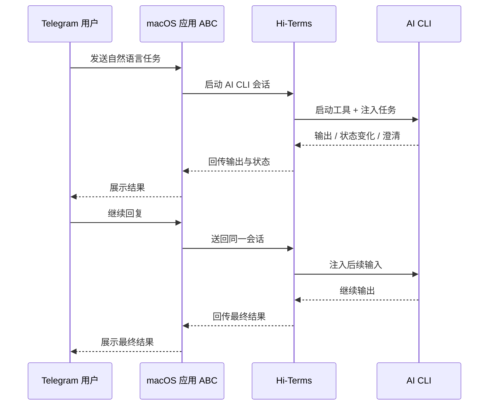
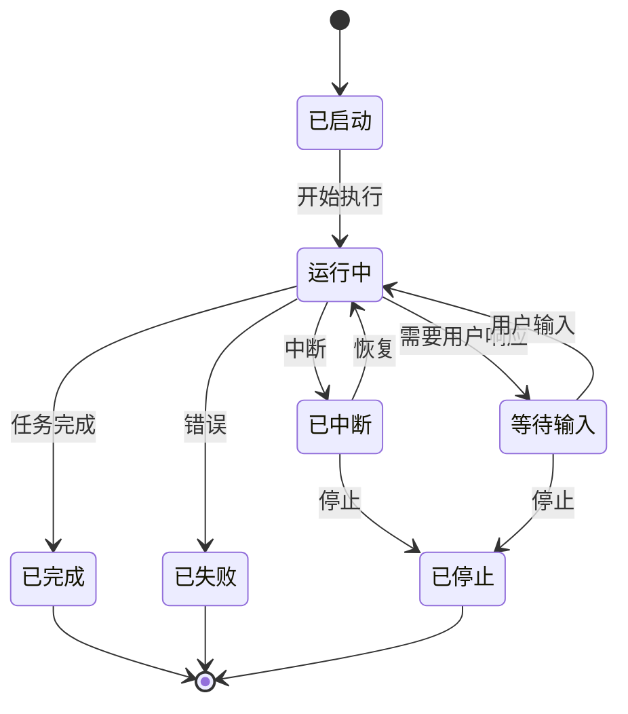
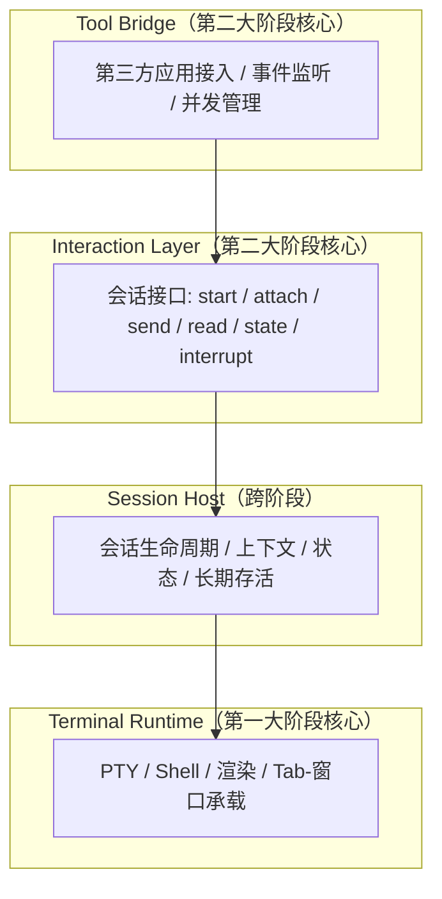

# Hi-Terms 需求文档

**文档类型:** 需求文档
**产品名称:** Hi-Terms
**语言:** 中文
**关联文档:**
- [愿景文档](hi-terms-vision.md)（两大阶段权威定义）
- [Roadmap 文档](hi-terms-roadmap.md)
- [产品定位与需求决策](../decisions/hi-terms-product-and-requirements-decisions.md)
- [技术选型决策](../decisions/hi-terms-technical-decisions.md)
- [术语表](../SSOT/glossary.md)（术语权威定义）

> [两大阶段](../SSOT/glossary.md#两大阶段two-phase-model)的定义与递进关系，参见[愿景文档 §1](hi-terms-vision.md#1-产品愿景)。

## 1. 核心能力

### 1.1 第一大阶段核心能力

#### 终端能力与用户体验持续演进

Hi-Terms 必须是一个真正可用、可信的 macOS 终端产品。

[第一大阶段](../SSOT/glossary.md#第一大阶段phase-1)的首要目标是在[终端能力](../SSOT/glossary.md#终端能力terminal-capabilities)和用户体验上持续迭代，逐步做到与 macOS Terminal / iTerm 持平，并在部分场景超越。这是产品立足的基础，也是第二大阶段能力的前提。

#### AI CLI 的稳定承载与基础体验优化

Hi-Terms 在第一大阶段就应重视 Claude Code、Codex CLI 等 [AI CLI](../SSOT/glossary.md#ai-cli) 的运行体验。

第一大阶段的优化重点是：

- 稳定运行
- 会话长期存活
- 状态可见
- 输出过程清晰
- 多轮交互顺畅
- 与用户澄清时的衔接自然

### 1.2 第二大阶段核心能力

#### 会话级开放接口与第三方应用协作

在第一大阶段终端产品成熟的基础上，[第二大阶段](../SSOT/glossary.md#第二大阶段phase-2)将命令行工具[会话](../SSOT/glossary.md#会话session)提升为[一等对象](../SSOT/glossary.md#一等对象first-class-object)。

Hi-Terms 不只是人直接使用的终端，还应成为其他 macOS 应用调用的本地 AI CLI 会话宿主。

外部应用与 Hi-Terms 的交互对象，不应是一块匿名终端缓冲区，而应是一个具备身份、状态、上下文和生命周期的会话对象。

第二大阶段意味着外部应用应当能够：

- 连接到指定命令行工具会话
- 启动新的会话，并指定目标 AI CLI、运行上下文和初始任务
- 查看会话的当前输出和阶段性结果
- 获取会话的当前状态，例如运行中、等待输入、已中断、已结束
- 在必要时向会话写入输入，或将用户后续消息继续注入同一会话
- 在必要时中断、恢复、继续或停止某个会话
- 围绕同一个会话协作，而不是争抢一个原始终端输入流

第二大阶段在 AI CLI 体验上进一步扩展：

- 结果可回传、可继续、可停止
- 外部应用可驱动会话
- 会话可被多个角色围绕协作

## 2. 主场景

### 2.1 第一大阶段主场景：日常终端使用

Hi-Terms 第一大阶段的主场景是：

- 开发者将 Hi-Terms 作为日常终端使用，替代 macOS Terminal 或 iTerm
- 用户在 Hi-Terms 中运行各类命令行工具，包括 shell、git、编译器、包管理器等
- 用户在 Hi-Terms 中运行 Claude Code、Codex CLI 等 AI CLI，并获得稳定、清晰的运行体验
- Hi-Terms 在终端能力（渲染、分屏、搜索、配置、快捷键等）和用户体验上持续迭代，让用户愿意长期使用

### 2.2 第二大阶段主场景：第三方应用驱动 AI CLI 会话

Hi-Terms 第二大阶段的一个主场景是：

- 开发者 A 开发了一个 macOS 应用 ABC
- ABC 在 Telegram 中提供一个机器人作为用户入口
- 用户在 Telegram 中发送自然语言任务，例如"用 Codex 搜集一下今天有什么科技新闻"或"请用 Claude Code 修复这个 Bug"
- ABC 根据用户消息和本地配置，调用 Hi-Terms，启动对应的 AI CLI 会话
- Hi-Terms 在本地终端中启动 Claude Code、Codex CLI 等工具，并负责[会话化承载](../SSOT/glossary.md#会话化承载session-oriented-hosting)
- AI CLI 执行过程中的输出、状态变化、澄清问题和最终结果，都能被 ABC 稳定读取并回传给 Telegram 用户
- 当用户继续回复时，ABC 能把该回复继续送回同一个会话，而不是重新开一个无关会话
- 整个多轮过程持续到任务完成或用户主动停止

这个场景说明，Hi-Terms 第二大阶段的开放接口不是简单"打开终端并执行一行命令"，而是：

- 启动并识别一个会话
- 围绕该会话进行多轮输入输出
- 持续观察状态变化
- 在必要时处理中断、继续和停止

## 3. 产品边界

> 完整的产品边界定义参见[术语表 — 产品边界](../SSOT/glossary.md#产品边界product-boundaries)。

### 3.1 第一大阶段

#### In Scope

- 在 macOS 上稳定运行各类命令行工具
- 持续迭代终端能力（渲染、分屏、搜索、配置、快捷键、主题等）和用户体验
- 优先优化 Claude Code、Codex CLI 等 AI CLI 的稳定运行与基础体验
- 提供长期存活的 terminal session
- 在架构设计上为第二大阶段的会话能力预留扩展空间

#### Out of Scope

- 不追求第一大阶段就全面超越 iTerm，但路线必须明确
- 不做 Prompt 优化器、提示词改写器或任务意图增强器（详见[术语表 — Out of Scope](../SSOT/glossary.md#out-of-scope不做)）
- 会话级开放接口和第三方应用协作属于第二大阶段目标

### 3.2 第二大阶段

#### In Scope

- 将命令行工具会话视为一等对象，而不只是普通终端进程
- 让外部应用可以连接到指定会话或启动新会话
- 支持查看输出结果、写入输入和继续同一会话
- 支持查询会话的基础状态和生命周期
- 支持必要的中断、恢复、继续和停止能力
- 支持[高层交互](../SSOT/glossary.md#高层交互high-level-interaction)与[底层终端注入](../SSOT/glossary.md#底层终端注入raw-terminal-injection)并存
- 围绕[第三方应用](../SSOT/glossary.md#第三方应用third-party-application)驱动会话这一主场景设计接口和能力
- 支持[多角色协作](../SSOT/glossary.md#多角色协作multi-role-collaboration)

#### Out of Scope

- 不做 Prompt 优化器、提示词改写器或任务意图增强器
- 不替用户决定如何提问 AI CLI
- 不把产品扩展成完整远程运维平台或大而全自动化平台

## 4. 高层交互定义（第二大阶段）

> [高层交互](../SSOT/glossary.md#高层交互high-level-interaction)的完整定义参见术语表。

对于 Hi-Terms 第二大阶段而言，高层交互的核心要点是：外部应用操作的是具体的命令行工具会话而非匿名终端缓冲区，系统提供稳定的会话启动、连接、读取、写入和生命周期控制能力，多个角色围绕同一会话协作时不会互相打断。

会话在生命周期中经历以下状态流转（详见[术语表 — 会话状态](../SSOT/glossary.md#会话状态session-state)）：

Hi-Terms 可以承接用户的自然语言消息，并将其转交给目标 AI CLI，但不负责优化这些消息本身。自然语言能力来自 Claude Code、Codex CLI 等工具本身。Hi-Terms 负责把这类工具的会话托管好，并在可能时暴露更高层的会话接口。产品边界约束参见 [§3](#3-产品边界)。

## 5. 系统架构（四层模型）

> 各层术语定义参见[术语表 — 四层架构](../SSOT/glossary.md#四层架构four-layer-architecture)。

Hi-Terms 按[四层架构](../SSOT/glossary.md#四层架构four-layer-architecture)组织。两个大阶段共享这一架构，但各层的建设重点不同：

### 5.1 Terminal Runtime（第一大阶段核心）

> 术语定义参见[术语表 — Terminal Runtime](../SSOT/glossary.md#terminal-runtime)。

负责基础终端承载，第一大阶段的主要投入集中在这一层，目标是在终端能力和用户体验上达到高质量水准。

### 5.2 Session Host（跨阶段）

> 术语定义参见[术语表 — Session Host](../SSOT/glossary.md#session-host)。

负责命令行工具[会话生命周期](../SSOT/glossary.md#会话生命周期session-lifecycle)管理。第一大阶段搭建基础框架（进程管理、基础状态维护），为第二大阶段的完整会话生命周期管理预留扩展空间。

### 5.3 Interaction Layer（第二大阶段核心）

> 术语定义参见[术语表 — Interaction Layer](../SSOT/glossary.md#interaction-layer)。

负责外部应用与会话的交互接口。建议高层接口在适用时作为主路径，原始终端注入作为兜底路径。

### 5.4 Tool Bridge（第二大阶段核心）

> 术语定义参见[术语表 — Tool Bridge](../SSOT/glossary.md#tool-bridge)。

负责[第三方应用](../SSOT/glossary.md#第三方应用third-party-application)对 Hi-Terms 的接入管理。

## 6. 详细需求

### 6.1 第一大阶段需求

#### 核心需求

- Hi-Terms 必须能够稳定承载命令行工具的运行
- Hi-Terms 必须持续演进终端能力和用户体验，形成与 macOS Terminal / iTerm 持平甚至超越的产品路线
- Hi-Terms 必须优先保障 Claude Code、Codex CLI 等 AI CLI 的稳定运行和基础体验
- Hi-Terms 的架构设计必须为第二大阶段的会话能力预留扩展空间

#### 体验需求

- 终端渲染和交互响应应当流畅
- 用户应当能在 Hi-Terms 中完成日常终端操作，无明显短板
- AI CLI 的长时间运行应当稳定，输出过程清晰
- 多轮交互和用户澄清应当衔接自然

#### 系统需求

- 终端会话必须具备长期存活能力
- 系统必须能够处理中断、恢复和停止
- 架构应当在 [Session Host](../SSOT/glossary.md#session-host) 层预留可扩展的会话管理接口

### 6.2 第二大阶段需求

#### 核心需求

- Hi-Terms 必须将命令行工具会话视为[一等对象](../SSOT/glossary.md#一等对象first-class-object)，而不只是普通终端进程
- Hi-Terms 必须允许外部应用对会话进行启动、连接、读取、写入和控制
- Hi-Terms 必须提供[会话生命周期](../SSOT/glossary.md#会话生命周期session-lifecycle)和基础状态可见性
- Hi-Terms 必须支持输出流的读取与组织
- Hi-Terms 必须支持多角色协作
- Hi-Terms 必须同时支持[高层交互](../SSOT/glossary.md#高层交互high-level-interaction)和[底层终端注入](../SSOT/glossary.md#底层终端注入raw-terminal-injection)能力
- 对具备相应交互语义的工具，Hi-Terms 应支持等待输入、任务推进和结果完成等更高层状态识别

#### 体验需求

- 用户应当能明确看到当前是哪个工具会话
- 用户应当能看到某个会话当前的基础状态
- 对支持该模式的工具，用户和外部应用应当能知道一次任务或一次澄清对应的结果范围
- 外部应用接入后不应破坏用户在终端中的正常使用体验
- 会话在长时间运行后仍应保持稳定和可恢复
- 当会话需要用户继续提供信息时，系统应能让外部应用明确接收到该状态

#### 系统需求

- 会话状态必须可查询
- 输出流必须可读取和组织
- 并发访问必须有清晰边界
- 系统需要能够在通用会话能力之上扩展工具相关的增强能力
- 系统需要能够支撑第三方应用驱动的多轮会话交互模型
