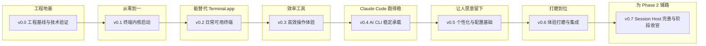
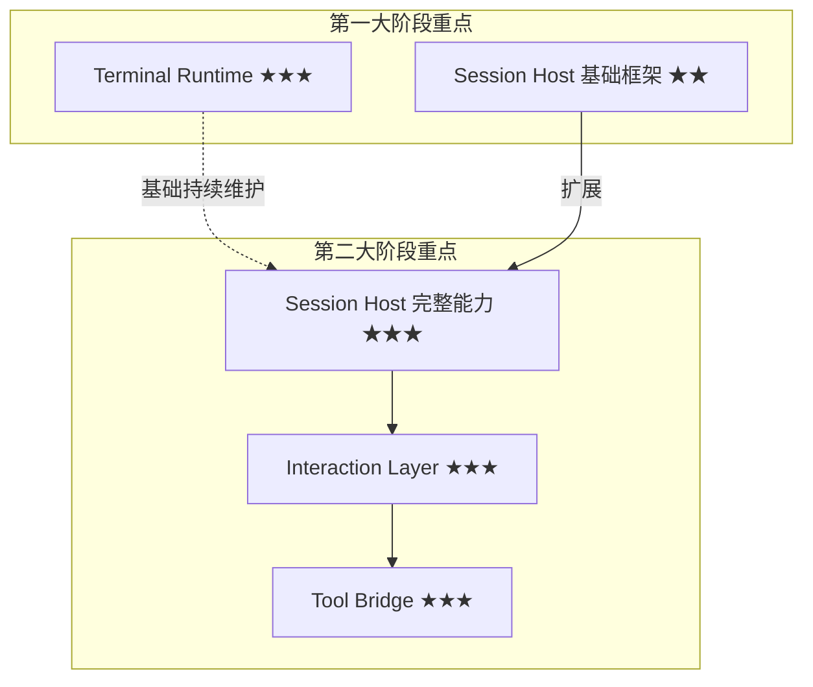

# Hi-Terms Roadmap

**文档类型:** Roadmap
**产品名称:** Hi-Terms
**语言:** 中文
**关联文档:**
- [愿景文档](hi-terms-vision.md)（两大阶段权威定义）
- [需求文档](hi-terms-requirements.md)
- [产品定位与需求决策](../decisions/hi-terms-product-and-requirements-decisions.md)
- [技术选型决策](../decisions/hi-terms-technical-decisions.md)
- [V0.0 技术设计](../design/hi-terms-v0.0-technical-design.md)（工程基线技术设计）
- [V0.0 验收标准](hi-terms-v0.0-acceptance.md)（V0.0 验收标准权威来源）
- [术语表](../SSOT/glossary.md)（术语权威定义）

> [两大阶段](../SSOT/glossary.md#两大阶段two-phase-model)的定义与递进关系，参见[愿景文档 §1](hi-terms-vision.md#1-产品愿景)。
> 第一大阶段按 v0.0–v0.7 划分版本。v0.0 为工程基线版本（不交付用户可见功能），v0.1–v0.7 每个版本包含明确的交付物、验收标准和架构约束。第二大阶段保持里程碑粒度。

## 1. Roadmap 概览

Hi-Terms 的产品演进分为两个递进的大阶段。第一大阶段为第二大阶段奠定产品基础、用户基础和架构基础。

```mermaid
graph LR
    subgraph 第一大阶段
        direction TB
        V0["v0.0 工程基线与技术验证"]
        V1["v0.1 终端内核启动"]
        V2["v0.2 日常可用终端"]
        V3["v0.3 高效操作体验"]
        V4["v0.4 AI CLI 稳定承载"]
        V5["v0.5 个性化与配置基础"]
        V6["v0.6 体验打磨与集成"]
        V7["v0.7 Session Host 完善与阶段收官"]
        V0 --> V1 --> V2 --> V3 --> V4 --> V5 --> V6 --> V7
    end
    subgraph 第二大阶段
        direction TB
        M1["① 会话一等对象模型建立"]
        M2["② Interaction Layer 基础接口可用"]
        M3["③ Tool Bridge 第三方应用接入"]
        M4["④ 多角色协作能力验证"]
        M5["⑤ 开发者文档与 SDK 发布"]
        M1 --> M2 --> M3 --> M4 --> M5
    end
    V7 -->|阶段递进| M1
```

## 2. 第一大阶段：高质量 macOS 终端产品

### 2.1 阶段目标

在[终端能力](../SSOT/glossary.md#终端能力terminal-capabilities)和用户体验上持续迭代，逐步做到与 macOS Terminal / iTerm 持平，并在部分场景超越，使 Hi-Terms 成为用户愿意日常使用的终端产品。同时在架构上为第二大阶段预留扩展空间。

详细能力与需求参见[需求文档 §1.1](hi-terms-requirements.md#11-第一大阶段核心能力) 和 [§6.1](hi-terms-requirements.md#61-第一大阶段需求)。

#### 版本全景

| 版本 | 名称 | 核心主题 | 架构层重点 |
|------|------|----------|-----------|
| v0.0 | 工程基线与技术验证 | 应用骨架、模块结构、SwiftTerm 评估、测试骨架 | 工程基础设施 |
| v0.1 | 终端内核启动 | PTY + Shell + 基础渲染 + 鼠标事件 + Session Foundation | Terminal Runtime + Session Host 基础 |
| v0.2 | 日常可用终端 | Tab、多窗口、完整仿真（含 True Color）、剪贴板 | Terminal Runtime |
| v0.3 | 高效操作体验 | 分屏、搜索、快捷键体系、CJK/Emoji 边界修正 | Terminal Runtime |
| v0.4 | AI CLI 稳定承载 | 长会话、性能、流式输出、多轮交互 | Terminal Runtime |
| v0.5 | 个性化与配置基础 | 主题、配色、偏好、Profile、连字 | Terminal Runtime |
| v0.6 | 体验打磨与集成 | Shell 集成、URL 识别、通知、可访问性、性能终优化 | Terminal Runtime |
| v0.7 | Session Host 完善与阶段收官 | Session 持久化、Phase 2 接口预留、全量回归、收尾 | Session Host + Terminal Runtime |

### 2.2 版本定义

#### v0.0 — 工程基线与技术验证

**版本定位：** 打地基。搭建可运行的 macOS 应用骨架与完整构建链路，完成关键技术验证（SwiftTerm 评估），建立测试、日志和性能采样基础。本版本**不交付用户可见功能**。

**架构层重点：** 工程基础设施（构建、测试、日志、性能采样）

> 详细技术设计参见 [V0.0 技术设计文档](../design/hi-terms-v0.0-technical-design.md)。

**具体交付物：**

- macOS 应用骨架：Xcode 项目 + Swift Package Manager 模块结构（5 个 Package）
- SwiftTerm 系统评估：VT100 兼容性、解析性能、API 可集成性、高级特性支持
- 终端仿真引擎路线决策：基于评估结果的正式"采用/不采用"决策记录
- 各模块核心 protocol/type 定义：TerminalParser、ScreenBuffer、PTYProcess、TerminalRendering 等接口骨架
- XCTest 测试骨架：每个模块至少 1 个测试文件
- vttest 自动化集成方案：至少 1 组基础测试可自动执行
- 性能基准首次采集：解析吞吐量、内存基线
- OSLog 日志基础：各模块日志子系统配置
- 构建与打包链路：从代码到可签名 DMG 的完整流程

**验收标准：** 参见 [V0.0 验收标准](hi-terms-v0.0-acceptance.md)（权威来源，含 11 个验收项的详细验证步骤、条件性验收规则和失败处理策略）。

#### v0.1 — 终端内核启动

**版本定位：** 从零到一，搭建最小可运行的终端内核，跑通 [PTY](../SSOT/glossary.md#ptypseudo-terminal) + Shell + 渲染管线。

**架构层重点：** [Terminal Runtime](../SSOT/glossary.md#terminal-runtime)（PTY、Shell/子进程、基础渲染）+ [Session Host](../SSOT/glossary.md#session-host) 基础（Session Foundation）

**前置依赖：** v0.0 已完成工程骨架、模块结构、SwiftTerm 评估和测试基础设施。

**具体交付物：**

- PTY 创建与管理：fork PTY、启动用户默认 shell、多实例并发
- 基础 I/O 管线：stdin → PTY → stdout → 渲染层
- 终端仿真器核心：VT100/xterm 基础转义序列解析（光标移动、文本属性、基础颜色）
- 单窗口终端渲染：等宽字体网格、光标显示与闪烁
- 基础键盘输入：普通字符、回车、退格、方向键、Ctrl+C/D 等信号键
- 基础滚动：输出超出可视区域时可回滚查看
- 鼠标事件转发：支持鼠标报告模式（SGR mouse mode），使 TUI 应用（vim、top、htop 等）可正确接收鼠标事件
- Session Foundation 基础：SessionID 类型定义、Session 与 PTY 的映射关系、基础生命周期字段（创建时间、启动命令）、基础状态枚举子集（running/exited）、内部 Session registry 与 query 能力

> **Session Foundation 前移说明：** 迭代评审（2026-03-30，P0-2）识别了 Session Host 基础抽象放在 v0.7 与 v0.4 AI CLI 稳定承载目标之间的依赖倒置问题。将 Session Foundation 前移到 v0.1，使后续版本（v0.2 Tab、v0.4 进程管理）可基于统一的 Session 抽象构建，避免 v0.7 集中重构。

**架构约束：**

- 渲染管线必须采用增量/脏区更新设计（非全屏重绘），为 v0.4 的高吞吐量性能目标铺路
- PTY 管理必须支持多实例并发，为 v0.2 Tab 和 v0.3 分屏铺路
- 配置值（如字体、字号）必须通过设置存储读取，不可硬编码，为 v0.5 Profile 铺路
- 渲染后端（CoreText）必须隔离在独立模块中，为后续切换到 Metal 加速保留路径
- Session 模型必须采用 protocol 模式设计，为后续版本渐进扩展 Session 能力和第二大阶段 Interaction Layer 预留扩展点
- PTY 实例必须通过 Session 持有和管理（而非直接由视图层持有），确保 Session 作为 PTY 生命周期的唯一管理者

**验收标准：**

- [ ] 启动后自动进入用户默认 shell，显示正常提示符
- [ ] 可执行 `ls`、`cd`、`echo`、`cat` 等基础命令并看到正确输出
- [ ] 可运行 `top`，界面刷新正常，鼠标点击可交互，退出后终端状态恢复
- [ ] 可运行 `vim`，能进入编辑、输入、保存退出，鼠标选择文本正常，终端状态正确恢复
- [ ] Ctrl+C 能中断正在运行的前台进程
- [ ] 输出超出屏幕时可滚动查看历史内容
- [ ] 基础 ANSI 颜色（前景/背景 8 色）正确渲染
- [ ] 连续执行 50 条命令后不崩溃，Instruments Leaks 检测无泄漏
- [ ] vttest 基础测试项通过率 ≥ 80%
- [ ] 每个终端窗口对应一个 Session 实例，Session 具有唯一 ID
- [ ] Session 正确持有并管理其关联的 PTY 实例
- [ ] 通过内部 registry 可查询当前所有活跃 Session 及其基础状态（running/exited）

#### v0.2 — 日常可用终端

**版本定位：** 从"能跑"到"能用"，补齐日常终端基本功能集，使 Hi-Terms 可以替代 macOS Terminal 完成简单日常工作。

**架构层重点：** [Terminal Runtime](../SSOT/glossary.md#terminal-runtime)（Tab/窗口管理、完整终端仿真、剪贴板）

**具体交付物：**

- Tab 管理：新建、关闭、切换 tab，每个 tab 独立 PTY 实例
- 多窗口支持：可打开多个独立窗口
- 完整 xterm-256color 终端仿真：256 色、粗体/斜体/下划线/反色等文本属性
- True Color (24-bit RGB) 支持：现代终端主题和开发工具的标准需求
- 剪贴板集成：macOS 系统剪贴板的复制/粘贴
- 窗口大小调整与 SIGWINCH：调整窗口大小时正确通知 PTY
- Shell 退出处理：shell 退出时关闭对应 tab 或显示提示
- 基础字体设置：可选择等宽字体、调整字号
- 基础 Unicode/CJK/Emoji 渲染与宽度计算：常见中文字符、常见 Emoji（非组合序列）的正确显示与列宽（复杂边界情况如组合 Emoji 序列、罕见 CJK 扩展区字符在 v0.3 处理）

**架构约束：**

- 终端仿真引擎必须可扩展，预留 bracketed paste mode、alternate screen buffer、OSC 序列等高级特性的扩展点，为 v0.4 AI CLI 兼容性铺路
- Tab/窗口管理模型必须支持后续分屏嵌套（v0.3），避免 v0.3 重构视图层级

**验收标准：**

- [ ] Cmd+T 新建 tab，各 tab 独立 shell 互不干扰
- [ ] Cmd+W 关闭当前 tab，其他 tab 不受影响
- [ ] 可打开多个窗口，各窗口独立运行
- [ ] `echo $TERM` 输出 `xterm-256color`，256 色测试脚本正确显示
- [ ] True Color (24-bit) 测试脚本正确显示渐变色带，无色阶断裂
- [ ] 终端中选择文本 Cmd+C 复制，其他应用可粘贴，反之亦然
- [ ] 调整窗口大小后 `top`/`vim` 正确重绘
- [ ] 中文字符正确显示并占据正确列宽（如"你好"占 4 列）
- [ ] `git log --oneline --graph` 带颜色和特殊字符的输出正确渲染
- [ ] 可在 Hi-Terms 中完成以下工作流无需切换到其他终端：git clone → git branch → vim 编辑 → git commit → git push、npm install → npm run

**外部测试节点：** v0.2 完成后发布 alpha 版本给 3–5 名外部测试者，收集真实终端使用反馈。

#### v0.3 — 高效操作体验

**版本定位：** 从"能用"到"好用"。补齐影响日常效率的关键终端能力：分屏、搜索、快捷键体系。这些是 iTerm 用户迁移时最先感知的功能差距，也是后续 AI CLI 长时间使用验证的前提。

**架构层重点：** [Terminal Runtime](../SSOT/glossary.md#terminal-runtime)（分屏、搜索、快捷键框架）

**具体交付物：**

- 分屏（Split Pane）：水平分屏、垂直分屏、分屏导航
- 分屏大小调整：拖拽调整各面板比例
- 终端内搜索：文本搜索、高亮匹配、上下导航
- 搜索增强：正则表达式搜索、大小写敏感切换
- 快捷键体系：覆盖 tab 管理、分屏、搜索、字号调整等常用操作
- 快捷键与终端按键隔离：Cmd 系快捷键归应用、Ctrl 系按键传递给终端
- 滚动增强：Page Up/Down、Cmd+Home/End 跳转
- 选择增强：双击选词、三击选行
- Unicode/CJK/Emoji 复杂边界情况：组合 Emoji 序列（如肤色修饰符、ZWJ 序列）宽度正确、罕见 CJK 扩展区字符渲染、混合宽度文本的光标定位精确性

**架构约束：**

- 快捷键框架必须支持用户自定义绑定，为 v0.5 偏好设置铺路
- 搜索功能的文本匹配引擎应可复用于后续的 Shell 集成特性（v0.6）

**验收标准：**

- [ ] Cmd+D 水平分屏，两面板各有独立 shell 互不干扰
- [ ] Cmd+Shift+D 垂直分屏，可与水平分屏嵌套
- [ ] 分屏面板间可通过快捷键切换焦点
- [ ] 拖拽分屏边界可调整面板大小比例
- [ ] Cmd+F 打开搜索栏，所有匹配项高亮，可上下跳转
- [ ] 正则搜索可用（如搜索 `error.*failed`）
- [ ] 在 vim 中 Ctrl+W 正确传递给 vim，不被应用截获
- [ ] 双击终端中一个单词，该词被完整选中
- [ ] 组合 Emoji（如 👨‍👩‍👧‍👦）显示为单个字形并占据正确列宽
- [ ] CJK 扩展 B 区字符（如 𠀀）正确渲染，不显示为豆腐块
- [ ] 在中英文混合行中，光标位置始终与字符边界对齐

#### v0.4 — AI CLI 稳定承载

**版本定位：** 第一大阶段的差异化关键版本。确保 Claude Code、Codex CLI 等 [AI CLI](../SSOT/glossary.md#ai-cli) 可在 Hi-Terms 中稳定运行。重点不是新增终端功能，而是深挖稳定性、性能和长会话存活能力。此时用户已具备分屏、搜索和快捷键，可以在一个"好用"的终端里进行长时间稳定性验证。

**架构层重点：** [Terminal Runtime](../SSOT/glossary.md#terminal-runtime)（性能优化、大量输出处理、优质 PTY 管理）

**具体交付物：**

- 大量输出性能优化：AI CLI 生成大段代码/文本时渲染不卡顿、不丢数据
- 长会话稳定性：终端会话运行数小时不崩溃、不内存膨胀
- 流式输出平滑渲染：AI CLI 流式输出 token 时的逐字/逐行渲染优化
- 交互式终端行为稳定承载：正确传递多轮 I/O、识别可观察的进程阻塞与等待输入状态、保障输出连续性
- 优质 PTY 管理：正确追踪 shell 子进程树，避免孤儿进程，进程退出检测与异常处理
- 信号传递完整性：Ctrl+C 正确传递到 AI CLI 进程，支持优雅中断
- 环境变量与 PATH 兼容：nvm、pyenv、conda 等版本管理器的 PATH 兼容
- 退出码与错误处理：进程异常退出时清晰提示

**架构约束：**

- 性能优化不得破坏 v0.1 的增量渲染架构；如需 Metal 加速，通过渲染后端替换实现
- PTY 进程管理应基于 v0.1 建立的 Session Foundation 构建，扩展 Session 的进程树追踪和异常处理能力

> **第一/二阶段边界说明：** v0.4 关注 AI CLI 作为终端进程的稳定性——PTY 管线可靠、信号正确、长时间运行不崩溃。AI CLI 的任务语义识别（如阶段性结果判断、任务推进状态、会话高层状态识别）属于第二大阶段 Session Host 和 Interaction Layer 的职责，不在 v0.4 验收范围内。

**时间盒策略：** 本版本设定最长 N 周时间盒。超时未达标的性能指标降级为已知问题，在 v0.6 体验打磨阶段回收处理，不阻塞后续版本推进。

**验收标准：**

核心验收标准（使用可控脚本验证，不依赖特定 AI CLI 版本）：

- [ ] 模拟脚本进行 10 轮交互式 I/O，Hi-Terms 保持 PTY 稳定、信号转发正确
- [ ] 压力测试脚本连续运行 4 小时以上，会话不中断、不崩溃
- [ ] 高吞吐量输出（模拟脚本输出 > 500 行/秒）时，渲染帧率 ≥ 30fps，无明显卡顿
- [ ] 流式输出中 Ctrl+C 可中断，终端恢复正常状态
- [ ] 交互式脚本进入等待输入状态后，用户输入回车，脚本正确接收并继续
- [ ] `nvm use` 切换 Node 版本后启动子进程，版本正确
- [ ] 4 小时长会话后内存使用不超过初始值 3 倍
- [ ] 子进程意外退出时显示清晰退出码和状态信息
- [ ] 无孤儿进程残留（进程树完全清理）

补充集成验证（不作为版本验收门控）：

- [ ] Claude Code 在 Hi-Terms 中完成至少 10 轮连续多轮对话
- [ ] Claude Code 连续运行 4 小时以上，会话不中断

#### v0.5 — 个性化与配置基础

**版本定位：** 从"好用"到"愿意留下"。主题、外观配置、偏好设置是用户长期使用的关键。本版本聚焦配置基础设施建设。

**架构层重点：** [Terminal Runtime](../SSOT/glossary.md#terminal-runtime)（主题、配置持久化）

**具体交付物：**

- 主题系统：内置多套配色方案（Solarized Dark/Light、Dracula、One Dark、Monokai 等），可切换
- 自定义配色：前景色、背景色、ANSI 16 色、选中色、光标色
- 偏好设置面板：字体、字号、光标样式、光标闪烁、窗口透明度、滚动缓冲区大小等
- Profile 支持：可创建多个 Profile（不同的 shell、字体、主题组合），tab 可指定 Profile
- 启动配置：默认 shell、启动时执行的命令、默认窗口大小和位置
- 字体连字（Ligatures）支持：Fira Code、JetBrains Mono 等开发者常用连字字体的正确渲染

**架构约束：**

- 配置系统必须支持导入/导出，为后续用户迁移和备份铺路
- Profile 数据结构应可扩展，为 v0.7 Session 模型中的 Session 关联 Profile 预留字段

**验收标准：**

- [ ] 切换主题后终端实时预览新配色，关闭重启后配色保留
- [ ] 可创建 ≥ 2 个不同 Profile，新建 tab 时可选择使用哪个 Profile
- [ ] 偏好设置调整字体/字号/光标样式，更改即时生效
- [ ] 使用 Fira Code 字体时，`=>` `!=` `>=` 等组合正确渲染为连字
- [ ] 配置可导出为文件，在另一台 Mac 上导入后恢复完整偏好

#### v0.6 — 体验打磨与集成

**版本定位：** 从"愿意留下"到"离不开"。对已有能力进行体验打磨，补齐 Shell 集成、URL 识别等提升长期使用体验的功能，并建立可访问性基础。本版本完成后，Hi-Terms 在[终端能力](../SSOT/glossary.md#终端能力terminal-capabilities)上应无明显短板。

**架构层重点：** [Terminal Runtime](../SSOT/glossary.md#terminal-runtime)（Shell 集成、体验打磨、可访问性）

**具体交付物：**

- Shell 集成增强：当前目录追踪（tab 标题显示当前路径）
- URL 识别与点击：终端输出中的 URL 可 Cmd+Click 打开
- 长命令完成通知：长时间运行命令完成时的 macOS 通知
- 可访问性基础：VoiceOver 支持、键盘完整导航、高对比度模式兼容
- 性能最终优化：大量 tab + 分屏场景下不卡顿；回收 v0.4 时间盒中降级的性能指标
- 已知问题清理：v0.1–v0.5 积累的已知问题集中清理

**架构约束：**

- 可访问性实现应遵循 macOS Accessibility API 标准模式，为后续增强（如屏幕阅读器完整支持）铺路
- Shell 集成功能（目录追踪）应通过 OSC 序列或 shell hook 实现，不依赖进程特定的 hack

**验收标准：**

- [ ] Tab 标题自动显示当前工作目录
- [ ] 终端中的 URL 可通过 Cmd+Click 在浏览器中打开
- [ ] `sleep 60` 完成后收到 macOS 通知
- [ ] VoiceOver 可读取终端当前行内容，可通过键盘在 tab 间导航
- [ ] 同时打开 10 个 tab + 4 个分屏面板，所有面板输入响应延迟 < 50ms
- [ ] v0.4 中降级的性能指标（如有）全部达标

**过程性要求（dogfooding gate，不作为版本验收硬性标准）：** 团队成员日常使用一周，记录需切回 iTerm/Terminal 的场景并评估严重性。

#### v0.7 — Session Host 完善与阶段收官

**版本定位：** 第一大阶段收官版本。在 v0.1 建立的 Session Foundation 和 v0.2–v0.6 逐步扩展的 Session 能力基础上，完善 Session Host 框架，补齐持久化、完整状态模型和 Phase 2 接口预留。同时完成全量回归和稳定性强化。本版本完成后，第一大阶段全部完成。

> **与 Session Foundation 的关系：** Session 基础模型（SessionID、Session-PTY 映射、基础状态）在 v0.1 建立，v0.2–v0.4 逐步扩展（Tab/Session 映射、进程树追踪、长会话管理）。v0.7 的职责是在已有实现经验基础上完善 Session Host 框架，而非首次建立。

**架构层重点：** [Session Host](../SSOT/glossary.md#session-host)（完善框架、持久化、Phase 2 接口预留）+ [Terminal Runtime](../SSOT/glossary.md#terminal-runtime)（稳定性收尾）

**具体交付物：**

- Session 完整状态模型：将基础状态（running/exited）扩展为完整 7 状态模型（参见[术语表 — 会话状态](../SSOT/glossary.md#会话状态session-state)），为第二大阶段预留
- Session 持久化基础：Session 元数据的本地存储，应用重启后可恢复
- 内部 Session 管理接口完善：完善内部 API（create、destroy、list、getState），调用约定与未来外部 API 保持一致，为第二大阶段的 [Interaction Layer](../SSOT/glossary.md#interaction-layer) 提供底层支撑
- Session 的创建、销毁事件日志：结构化记录，支持问题定位
- 全量回归测试：v0.1–v0.6 所有功能回归 + 性能回归
- 稳定性强化：崩溃上报、日志体系完善

**架构约束：**

- 内部 Session API 的调用约定应与未来外部 API 保持一致（相同的参数语义和错误模型），降低第二大阶段的适配成本
- Session 完整状态模型扩展不得破坏 v0.1–v0.6 已有的 Session 使用方式（向后兼容）

**验收标准：**

- [ ] Session 状态模型已从基础 running/exited 扩展为完整 7 状态模型，状态转换有测试覆盖
- [ ] Session 元数据可被持久化到本地存储，应用重启后可读取上次的 Session 记录
- [ ] Session 的创建、销毁事件被结构化记录（日志可查）
- [ ] 内部 Session API 添加 `start_session`、`attach_session` 等方法只需在现有协议上实现新方法，无需重构 Session 内部结构（代码审查确认）
- [ ] v0.1–v0.6 全部验收标准回归通过
- [ ] 连续 7 天按固定 dogfooding 任务清单使用无 crash（任务清单覆盖：多 tab 操作、分屏、vim/top 长时间运行、AI CLI 多轮交互、大量输出场景）

### 2.3 关键挑战

- 如何在有限资源下按版本节奏高效迭代终端基础能力，逐步追平 macOS Terminal / iTerm
- 如何在第一大阶段就设计好架构，为第二大阶段的会话能力预留扩展空间
- 如何让 [AI CLI](../SSOT/glossary.md#ai-cli) 在 Hi-Terms 中获得稳定、流畅的运行体验
- 如何在 v0.4 验证 AI CLI 差异化价值的同时，不阻塞后续终端能力的演进

#### 2.3.1 风险缓解

| 风险 | 缓解措施 |
|------|---------|
| v0.4 AI CLI 性能优化成为无底洞 | 设定最长 N 周时间盒；超时未达标指标降级为已知问题，在 v0.6 打磨阶段回收 |
| 缺乏外部用户真实反馈 | v0.2 完成后发布 alpha 版本给 3–5 名外部测试者 |
| AI CLI 工具自身快速迭代导致兼容性问题 | 验收测试使用行为模式脚本（模拟流式输出、多轮交互、信号中断），不绑定特定 AI CLI 版本 |
| 早期架构决策限制后续扩展 | 每个版本定义明确的架构约束，确保关键扩展点从一开始就被预留 |
| macOS 系统 API 变化（年度 WWDC 更新） | 明确最低 macOS 版本（参见[技术选型决策](../decisions/hi-terms-technical-decisions.md)）；隔离 macOS API 依赖 |

### 2.4 阶段完成标志

- 用户可以将 Hi-Terms 作为日常终端替代 macOS Terminal 或 iTerm——以 macOS Terminal 核心功能对照表为基准，覆盖率 ≥ 95%
- AI CLI 长时间运行稳定，交互式终端行为（多轮 I/O、信号传递、等待输入检测）可靠
- Session Host 基础框架已搭建，接口设计可向第二大阶段扩展

## 3. 第二大阶段：命令行工具会话宿主层

### 3.1 阶段目标

在第一大阶段终端产品成熟的基础上，将命令行工具[会话](../SSOT/glossary.md#会话session)提升为[一等对象](../SSOT/glossary.md#一等对象first-class-object)，提供[会话级开放接口](../SSOT/glossary.md#会话级开放接口session-level-open-apis)，使[第三方应用](../SSOT/glossary.md#第三方应用third-party-application)可以围绕会话进行稳定的驱动和协作。

详细能力与需求参见[需求文档 §1.2](hi-terms-requirements.md#12-第二大阶段核心能力) 和 [§6.2](hi-terms-requirements.md#62-第二大阶段需求)。

### 3.2 关键里程碑

以下里程碑按能力达成排序，反映递进依赖关系：

1. **会话一等对象模型建立** — 会话具备身份、状态、上下文和生命周期，不再是匿名终端进程
2. **[Interaction Layer](../SSOT/glossary.md#interaction-layer) 基础接口可用** — `start_session`、`attach_session`、`send_input`、`read_output`、`get_session_state`、`interrupt_session` 等基础接口可用
3. **[Tool Bridge](../SSOT/glossary.md#tool-bridge) 第三方应用接入可用** — 外部 macOS 应用可通过 Tool Bridge 启动、连接和驱动 AI CLI 会话
4. **[多角色协作](../SSOT/glossary.md#多角色协作multi-role-collaboration)能力验证** — 多个角色围绕同一会话协作，输入流不冲突，状态变化可被各方感知
5. **开发者文档与 SDK 发布** — API 参考文档、接入指南、示例应用、SDK 包（如适用），使第三方开发者可独立完成接入

> 每个第二大阶段里程碑将在第一大阶段 v0.6–v0.7 期间分解为带有明确交付物和验收标准的版本化发布，届时团队已具备足够的实现经验来准确评估第二大阶段的工作量。

### 3.3 关键挑战

- 如何为不同类型的命令行工具提供统一的会话宿主模型
- 如何准确识别特定工具，尤其是 AI CLI 的[会话状态](../SSOT/glossary.md#会话状态session-state)
- 如何划分具备对话语义的工具的一次任务、一轮澄清和结果边界
- 如何支持第三方应用围绕同一会话进行多轮协作
- 如何避免多个角色同时写入时的冲突
- 如何在通用会话接口和工具相关[高层接口](../SSOT/glossary.md#高层交互high-level-interaction)之间保持平衡
- 当 Claude Code、Codex CLI 等工具的交互形式变化时，系统如何保持稳健

### 3.4 阶段完成标志

- 第三方 macOS 应用可以通过 Hi-Terms 驱动 AI CLI 完成多轮任务（如[需求文档 §2.2](hi-terms-requirements.md#22-第二大阶段主场景第三方应用驱动-ai-cli-会话) 的 Telegram bot 场景端到端可用）
- 高层会话接口和[底层终端注入](../SSOT/glossary.md#底层终端注入raw-terminal-injection)两条路径均可用
- 多角色协作场景下会话稳定，输入输出边界清晰
- 第三方开发者可通过文档和 SDK 独立完成接入

## 4. 阶段递进关系与架构连续性

两个大阶段共享同一[四层架构](../SSOT/glossary.md#四层架构four-layer-architecture)（详见[需求文档 §5](hi-terms-requirements.md#5-系统架构四层模型)），但各阶段的建设重点不同：

第一大阶段的架构决策直接影响第二大阶段的扩展成本。[Terminal Runtime](../SSOT/glossary.md#terminal-runtime) 和 Session Host 的基础设计，必须在第一大阶段就考虑第二大阶段的会话接入需求。各版本的架构约束段落（见 §2.2）明确了这些跨版本的架构承诺。
