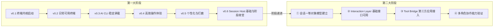
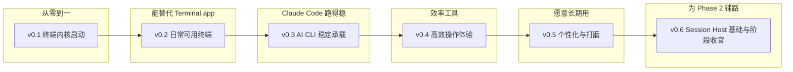
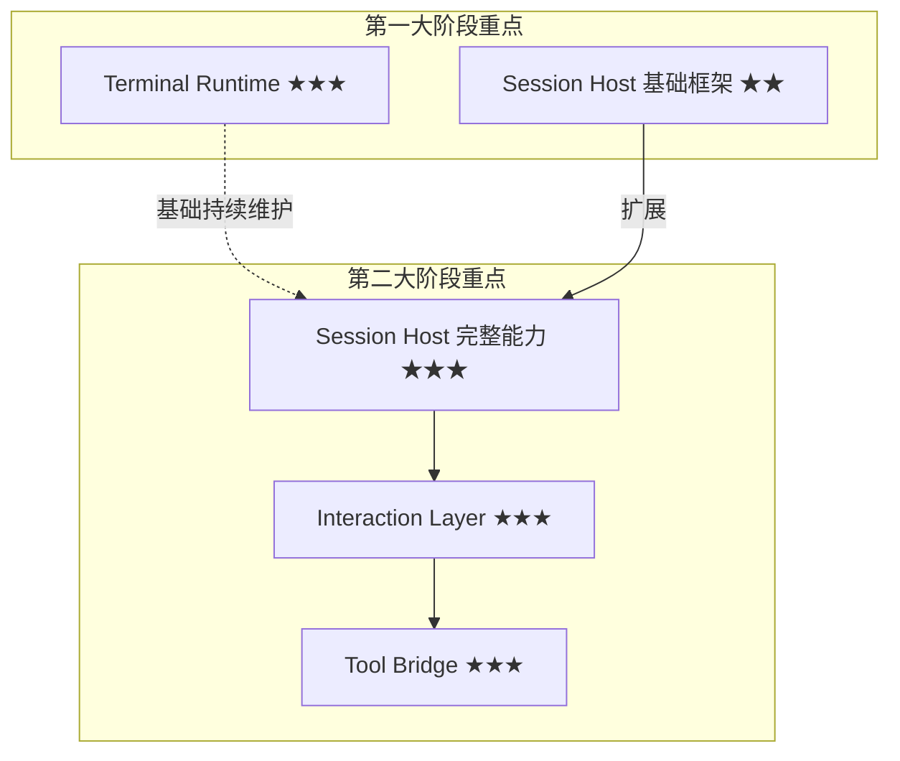

# Hi-Terms Roadmap

**文档类型:** Roadmap
**产品名称:** Hi-Terms
**语言:** 中文
**关联文档:**
- [愿景文档](hi-terms-vision.md)（两大阶段权威定义）
- [需求文档](hi-terms-requirements.md)
- [产品定位与需求决策](../decisions/hi-terms-product-and-requirements-decisions.md)
- [术语表](../SSOT/glossary.md)（术语权威定义）

> [两大阶段](../SSOT/glossary.md#两大阶段two-phase-model)的定义与递进关系，参见[愿景文档 §1](hi-terms-vision.md#1-产品愿景)。
> 第一大阶段按 v0.1–v0.6 划分版本，每个版本包含明确的交付物和验收标准。第二大阶段保持里程碑粒度。

## 1. Roadmap 概览

Hi-Terms 的产品演进分为两个递进的大阶段。第一大阶段为第二大阶段奠定产品基础、用户基础和架构基础。

## 2. 第一大阶段：高质量 macOS 终端产品

### 2.1 阶段目标

在[终端能力](../SSOT/glossary.md#终端能力terminal-capabilities)和用户体验上持续迭代，逐步做到与 macOS Terminal / iTerm 持平，并在部分场景超越，使 Hi-Terms 成为用户愿意日常使用的终端产品。同时在架构上为第二大阶段预留扩展空间。

详细能力与需求参见[需求文档 §1.1](hi-terms-requirements.md#11-第一大阶段核心能力) 和 [§6.1](hi-terms-requirements.md#61-第一大阶段需求)。

#### 版本全景

| 版本 | 名称 | 核心主题 | 架构层重点 |
|------|------|----------|-----------|
| v0.1 | 终端内核启动 | PTY + Shell + 基础渲染 | Terminal Runtime |
| v0.2 | 日常可用终端 | Tab、多窗口、完整仿真、剪贴板 | Terminal Runtime |
| v0.3 | AI CLI 稳定承载 | 长会话、性能、流式输出、多轮交互 | Terminal Runtime + Session Host 雏形 |
| v0.4 | 高效操作体验 | 分屏、搜索、快捷键体系 | Terminal Runtime |
| v0.5 | 个性化与打磨 | 主题、配置、Profile、体验打磨 | Terminal Runtime |
| v0.6 | Session Host 基础与阶段收官 | Session 模型、进程管理、状态维护、收尾 | Session Host + Terminal Runtime |

### 2.2 版本定义

#### v0.1 — 终端内核启动

**版本定位：** 从零到一，搭建最小可运行的终端内核，跑通 [PTY](../SSOT/glossary.md#ptypseudo-terminal) + Shell + 渲染管线。

**架构层重点：** [Terminal Runtime](../SSOT/glossary.md#terminal-runtime)（PTY、Shell/子进程、基础渲染）

**具体交付物：**

- macOS 原生应用骨架
- PTY 创建与管理：fork PTY、启动用户默认 shell
- 基础 I/O 管线：stdin → PTY → stdout → 渲染层
- 终端仿真器核心：VT100/xterm 基础转义序列解析（光标移动、文本属性、基础颜色）
- 单窗口终端渲染：等宽字体网格、光标显示与闪烁
- 基础键盘输入：普通字符、回车、退格、方向键、Ctrl+C/D 等信号键
- 基础滚动：输出超出可视区域时可回滚查看

**验收标准：**

- [ ] 启动后自动进入用户默认 shell，显示正常提示符
- [ ] 可执行 `ls`、`cd`、`echo`、`cat` 等基础命令并看到正确输出
- [ ] 可运行 `top`，界面刷新正常，退出后终端状态恢复
- [ ] 可运行 `vim`，能进入编辑、输入、保存退出，终端状态正确恢复
- [ ] Ctrl+C 能中断正在运行的前台进程
- [ ] 输出超出屏幕时可滚动查看历史内容
- [ ] 基础 ANSI 颜色（前景/背景 8 色）正确渲染
- [ ] 连续执行 50 条命令后不崩溃、不内存泄漏

#### v0.2 — 日常可用终端

**版本定位：** 从"能跑"到"能用"，补齐日常终端基本功能集，使 Hi-Terms 可以替代 macOS Terminal 完成简单日常工作。

**架构层重点：** [Terminal Runtime](../SSOT/glossary.md#terminal-runtime)（Tab/窗口管理、完整终端仿真、剪贴板）

**具体交付物：**

- Tab 管理：新建、关闭、切换 tab，每个 tab 独立 PTY 实例
- 多窗口支持：可打开多个独立窗口
- 完整 xterm-256color 终端仿真：256 色、粗体/斜体/下划线/反色等文本属性
- 剪贴板集成：macOS 系统剪贴板的复制/粘贴
- 窗口大小调整与 SIGWINCH：调整窗口大小时正确通知 PTY
- Shell 退出处理：shell 退出时关闭对应 tab 或显示提示
- 基础字体设置：可选择等宽字体、调整字号
- Unicode/CJK/Emoji 正确渲染与宽度计算

**验收标准：**

- [ ] Cmd+T 新建 tab，各 tab 独立 shell 互不干扰
- [ ] Cmd+W 关闭当前 tab，其他 tab 不受影响
- [ ] 可打开多个窗口，各窗口独立运行
- [ ] `echo $TERM` 输出 `xterm-256color`，256 色测试脚本正确显示
- [ ] 终端中选择文本 Cmd+C 复制，其他应用可粘贴，反之亦然
- [ ] 调整窗口大小后 `top`/`vim` 正确重绘
- [ ] 中文字符正确显示并占据正确列宽（如"你好"占 4 列）
- [ ] `git log --oneline --graph` 带颜色和特殊字符的输出正确渲染
- [ ] 可作为默认终端完成一天常规开发工作（主观评估）

#### v0.3 — AI CLI 稳定承载

**版本定位：** 第一大阶段的差异化关键版本。确保 Claude Code、Codex CLI 等 [AI CLI](../SSOT/glossary.md#ai-cli) 可在 Hi-Terms 中稳定运行。重点不是新增终端功能，而是深挖稳定性、性能和长会话存活能力。

**架构层重点：** [Terminal Runtime](../SSOT/glossary.md#terminal-runtime)（性能优化、大量输出处理）+ [Session Host](../SSOT/glossary.md#session-host)（基础进程管理雏形）

**具体交付物：**

- 大量输出性能优化：AI CLI 生成大段代码/文本时渲染不卡顿、不丢数据
- 长会话稳定性：终端会话运行数小时不崩溃、不内存膨胀
- 流式输出平滑渲染：AI CLI 流式输出 token 时的逐字/逐行渲染优化
- 多轮交互支持：AI CLI 问答轮次切换、等待输入、用户澄清后继续
- 进程树管理基础：正确追踪 shell 子进程，避免孤儿进程
- 信号传递完整性：Ctrl+C 正确传递到 AI CLI 进程，支持优雅中断
- 环境变量与 PATH 兼容：nvm、pyenv、conda 等版本管理器的 PATH 兼容
- 退出码与错误处理：进程异常退出时清晰提示

**验收标准：**

- [ ] Claude Code 完成至少 10 轮连续多轮对话
- [ ] Claude Code 连续运行 4 小时以上，会话不中断、不崩溃
- [ ] AI CLI 输出 > 500 行代码时，渲染帧率 ≥ 30fps，无明显卡顿
- [ ] 流式输出中 Ctrl+C 可中断，终端恢复正常状态
- [ ] AI CLI 进入等待输入状态后，用户输入回车，AI CLI 正确接收并继续
- [ ] `nvm use` 切换 Node 版本后启动 Claude Code，版本正确
- [ ] 4 小时长会话后内存使用不超过初始值 3 倍
- [ ] AI CLI 进程意外退出时显示清晰退出码和状态信息

#### v0.4 — 高效操作体验

**版本定位：** 从"能用"到"好用"。补齐影响日常效率的关键终端能力：分屏、搜索、快捷键体系。这些是 iTerm 用户迁移时最先感知的功能差距。

**架构层重点：** [Terminal Runtime](../SSOT/glossary.md#terminal-runtime)（分屏、搜索、快捷键框架）

**具体交付物：**

- 分屏（Split Pane）：水平分屏、垂直分屏、分屏导航
- 分屏大小调整：拖拽调整各面板比例
- 终端内搜索：文本搜索、高亮匹配、上下导航
- 搜索增强：正则表达式搜索、大小写敏感切换
- 快捷键体系：覆盖 tab 管理、分屏、搜索、字号调整等常用操作
- 快捷键与终端按键隔离：Cmd 系快捷键归应用、Ctrl 系按键传递给终端
- 滚动增强：Page Up/Down、Cmd+Home/End 跳转
- 选择增强：双击选词、三击选行

**验收标准：**

- [ ] Cmd+D 水平分屏，两面板各有独立 shell 互不干扰
- [ ] Cmd+Shift+D 垂直分屏，可与水平分屏嵌套
- [ ] 分屏面板间可通过快捷键切换焦点
- [ ] 拖拽分屏边界可调整面板大小比例
- [ ] Cmd+F 打开搜索栏，所有匹配项高亮，可上下跳转
- [ ] 正则搜索可用（如搜索 `error.*failed`）
- [ ] 在 vim 中 Ctrl+W 正确传递给 vim，不被应用截获
- [ ] 双击终端中一个单词，该词被完整选中

#### v0.5 — 个性化与打磨

**版本定位：** 从"好用"到"愿意用"。主题、外观配置、偏好设置是用户长期使用的关键。同时对已有能力进行体验打磨，消除粗糙边缘。本版本完成后，Hi-Terms 在[终端能力](../SSOT/glossary.md#终端能力terminal-capabilities)上应无明显短板。

**架构层重点：** [Terminal Runtime](../SSOT/glossary.md#terminal-runtime)（主题、配置持久化、体验打磨）

**具体交付物：**

- 主题系统：内置多套配色方案（Solarized Dark/Light、Dracula、One Dark、Monokai 等），可切换
- 自定义配色：前景色、背景色、ANSI 16 色、选中色、光标色
- 偏好设置面板：字体、字号、光标样式、光标闪烁、窗口透明度、滚动缓冲区大小等
- Profile 支持：可创建多个 Profile（不同的 shell、字体、主题组合），tab 可指定 Profile
- 启动配置：默认 shell、启动时执行的命令、默认窗口大小和位置
- Shell 集成增强：当前目录追踪（tab 标题显示当前路径）
- URL 识别与点击：终端输出中的 URL 可 Cmd+Click 打开
- 长命令完成通知：长时间运行命令完成时的 macOS 通知
- 性能最终优化：大量 tab + 分屏场景下不卡顿

**验收标准：**

- [ ] 切换主题后终端实时预览新配色，关闭重启后配色保留
- [ ] 可创建 ≥ 2 个不同 Profile，新建 tab 时可选择使用哪个 Profile
- [ ] 偏好设置调整字体/字号/光标样式，更改即时生效
- [ ] Tab 标题自动显示当前工作目录
- [ ] 终端中的 URL 可通过 Cmd+Click 在浏览器中打开
- [ ] `sleep 60` 完成后收到 macOS 通知
- [ ] 同时打开 10 个 tab + 4 个分屏面板，所有面板输入响应延迟 < 50ms
- [ ] 日常使用一周无功能缺失导致必须切回 iTerm/Terminal（团队内部测试）

#### v0.6 — Session Host 基础与阶段收官

**版本定位：** 为第二大阶段铺路。搭建 [Session Host](../SSOT/glossary.md#session-host) 基础框架，建立进程管理和状态维护的核心抽象。同时完成第一大阶段的收尾工作：稳定性强化、全量回归、已知问题清理。本版本完成后，第一大阶段全部完成。

**架构层重点：** [Session Host](../SSOT/glossary.md#session-host)（基础框架、进程管理、状态维护）+ [Terminal Runtime](../SSOT/glossary.md#terminal-runtime)（稳定性收尾）

**具体交付物：**

- Session 抽象模型：定义 Session 数据结构（ID、关联 PTY、启动命令、创建时间、基础状态）
- 进程管理框架：Session 与其下进程树的关联追踪、进程退出检测、异常处理
- 基础状态维护：每个 Session 维护"运行中/已退出"等基础状态，为第二大阶段完整 7 状态模型（参见[术语表 — 会话状态](../SSOT/glossary.md#会话状态session-state)）预留扩展点
- Session 持久化基础：Session 元数据的本地存储
- 内部 Session 管理接口：定义内部 API（create、destroy、list、getState），不对外暴露，为第二大阶段的 [Interaction Layer](../SSOT/glossary.md#interaction-layer) 提供底层支撑
- 全量回归测试：v0.1–v0.5 所有功能回归 + 性能回归
- 稳定性强化：崩溃上报、日志体系完善

**验收标准：**

- [ ] 代码中存在明确的 Session 模型定义，包含 ID、关联 PTY、状态等字段
- [ ] 每个 tab/面板对应一个 Session 实例，Session 可被唯一标识
- [ ] 通过内部 API 可列出所有活跃 Session 及其基础状态
- [ ] Session 的创建、销毁事件被正确记录（日志可查）
- [ ] Session 元数据可被持久化到本地存储，应用重启后可读取上次的 Session 记录
- [ ] 内部 Session API 的设计可自然扩展为[需求文档 §5.3](hi-terms-requirements.md#53-interaction-layer第二大阶段核心) 定义的 `start_session`、`attach_session` 等外部接口（设计评审确认）
- [ ] v0.1–v0.5 全部验收标准回归通过
- [ ] 连续 7 天日常使用无 crash（团队内部 dogfooding）

### 2.3 关键挑战

- 如何在有限资源下按版本节奏高效迭代终端基础能力，逐步追平 macOS Terminal / iTerm
- 如何在第一大阶段就设计好架构，为第二大阶段的会话能力预留扩展空间
- 如何让 [AI CLI](../SSOT/glossary.md#ai-cli) 在 Hi-Terms 中获得稳定、流畅的运行体验
- 如何在 v0.3 优先验证 AI CLI 差异化价值的同时，不阻塞后续终端能力的演进

### 2.4 阶段完成标志

- 用户可以将 Hi-Terms 作为日常终端替代 macOS Terminal 或 iTerm，无明显功能缺失
- AI CLI 长时间运行稳定，多轮交互和用户澄清衔接自然
- Session Host 基础框架已搭建，接口设计可向第二大阶段扩展

## 3. 第二大阶段：命令行工具会话宿主层

### 3.1 阶段目标

在第一大阶段终端产品成熟的基础上，将命令行工具[会话](../SSOT/glossary.md#会话session)提升为[一等对象](../SSOT/glossary.md#一等对象first-class-object)，提供[会话级开放接口](../SSOT/glossary.md#会话级开放接口session-level-open-apis)，使[第三方应用](../SSOT/glossary.md#第三方应用third-party-application)可以围绕会话进行稳定的驱动和协作。

详细能力与需求参见[需求文档 §1.2](hi-terms-requirements.md#12-第二大阶段核心能力) 和 [§6.2](hi-terms-requirements.md#62-第二大阶段需求)。

### 3.2 关键里程碑

以下里程碑按能力达成排序，反映递进依赖关系：

1. **会话一等对象模型建立** — 会话具备身份、状态、上下文和生命周期，不再是匿名终端进程
2. **[Interaction Layer](../SSOT/glossary.md#interaction-layer) 基础接口可用** — `start_session`、`attach_session`、`send_input`、`read_output`、`get_session_state`、`interrupt_session` 等基础接口可用
3. **[Tool Bridge](../SSOT/glossary.md#tool-bridge) 第三方应用接入可用** — 外部 macOS 应用可通过 Tool Bridge 启动、连接和驱动 AI CLI 会话
4. **[多角色协作](../SSOT/glossary.md#多角色协作multi-role-collaboration)能力验证** — 多个角色围绕同一会话协作，输入流不冲突，状态变化可被各方感知

### 3.3 关键挑战

- 如何为不同类型的命令行工具提供统一的会话宿主模型
- 如何准确识别特定工具，尤其是 AI CLI 的[会话状态](../SSOT/glossary.md#会话状态session-state)
- 如何划分具备对话语义的工具的一次任务、一轮澄清和结果边界
- 如何支持第三方应用围绕同一会话进行多轮协作
- 如何避免多个角色同时写入时的冲突
- 如何在通用会话接口和工具相关[高层接口](../SSOT/glossary.md#高层交互high-level-interaction)之间保持平衡
- 当 Claude Code、Codex CLI 等工具的交互形式变化时，系统如何保持稳健

### 3.4 阶段完成标志

- 第三方 macOS 应用可以通过 Hi-Terms 驱动 AI CLI 完成多轮任务（如[需求文档 §2.2](hi-terms-requirements.md#22-第二大阶段主场景第三方应用驱动-ai-cli-会话) 的 Telegram bot 场景端到端可用）
- 高层会话接口和[底层终端注入](../SSOT/glossary.md#底层终端注入raw-terminal-injection)两条路径均可用
- 多角色协作场景下会话稳定，输入输出边界清晰

## 4. 阶段递进关系与架构连续性

两个大阶段共享同一[四层架构](../SSOT/glossary.md#四层架构four-layer-architecture)（详见[需求文档 §5](hi-terms-requirements.md#5-系统架构四层模型)），但各阶段的建设重点不同：

第一大阶段的架构决策直接影响第二大阶段的扩展成本。[Terminal Runtime](../SSOT/glossary.md#terminal-runtime) 和 Session Host 的基础设计，必须在第一大阶段就考虑第二大阶段的会话接入需求。
