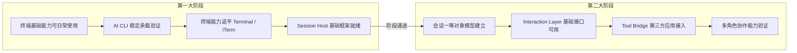
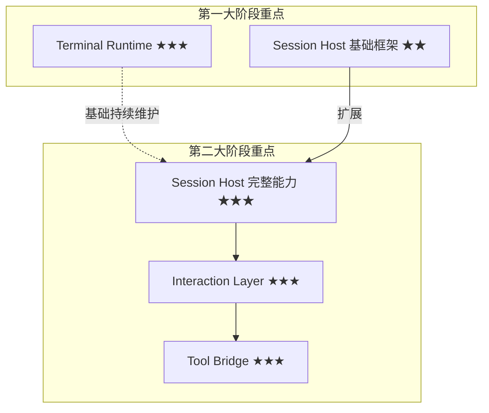

# Hi-Terms Roadmap

**文档类型:** Roadmap
**产品名称:** Hi-Terms
**语言:** 中文
**关联文档:**
- [愿景文档](hi-terms-vision.md)（两大阶段权威定义）
- [需求文档](hi-terms-requirements.md)
- [产品定位与需求决策](../decisions/hi-terms-product-and-requirements-decisions.md)
- [术语表](../SSOT/glossary.md)（术语权威定义）

> [两大阶段](../SSOT/glossary.md#两大阶段two-phase-model)的定义与递进关系，参见[愿景文档 §1](hi-terms-vision.md#1-产品愿景)。
> 本文档保持"两大阶段"粒度，里程碑以能力达成描述，不引入版本号。

## 1. Roadmap 概览

Hi-Terms 的产品演进分为两个递进的大阶段。第一大阶段为第二大阶段奠定产品基础、用户基础和架构基础。

## 2. 第一大阶段：高质量 macOS 终端产品

### 2.1 阶段目标

在[终端能力](../SSOT/glossary.md#终端能力terminal-capabilities)和用户体验上持续迭代，逐步做到与 macOS Terminal / iTerm 持平，并在部分场景超越，使 Hi-Terms 成为用户愿意日常使用的终端产品。同时在架构上为第二大阶段预留扩展空间。

详细能力与需求参见[需求文档 §1.1](hi-terms-requirements.md#11-第一大阶段核心能力) 和 [§6.1](hi-terms-requirements.md#61-第一大阶段需求)。

### 2.2 关键里程碑

以下里程碑按能力达成排序，反映递进依赖关系：

1. **终端基础能力可日常使用** — [PTY](../SSOT/glossary.md#ptypseudo-terminal)、shell 运行、基础渲染、tab 管理等核心终端能力达到可日常使用水准
2. **[AI CLI](../SSOT/glossary.md#ai-cli) 稳定承载验证** — Claude Code、Codex CLI 等 AI CLI 在 Hi-Terms 中稳定运行，长时间会话不中断，输出过程清晰
3. **终端能力持续演进，追平 Terminal / iTerm** — 分屏、搜索、快捷键、主题、配置等终端能力逐步补齐，用户体验无明显短板
4. **[Session Host](../SSOT/glossary.md#session-host) 基础框架就绪** — 基础进程管理和状态维护框架搭建完成，为第二大阶段的完整[会话生命周期](../SSOT/glossary.md#会话生命周期session-lifecycle)管理预留扩展空间

### 2.3 关键挑战

- 如何在有限资源下高效迭代终端基础能力，逐步追平 macOS Terminal / iTerm
- 如何在第一大阶段就设计好架构，为第二大阶段的会话能力预留扩展空间
- 如何让 AI CLI 在 Hi-Terms 中获得稳定、流畅的运行体验

### 2.4 阶段完成标志

- 用户可以将 Hi-Terms 作为日常终端替代 macOS Terminal 或 iTerm，无明显功能缺失
- AI CLI 长时间运行稳定，多轮交互和用户澄清衔接自然
- Session Host 基础框架已搭建，接口设计可向第二大阶段扩展

## 3. 第二大阶段：命令行工具会话宿主层

### 3.1 阶段目标

在第一大阶段终端产品成熟的基础上，将命令行工具[会话](../SSOT/glossary.md#会话session)提升为[一等对象](../SSOT/glossary.md#一等对象first-class-object)，提供[会话级开放接口](../SSOT/glossary.md#会话级开放接口session-level-open-apis)，使[第三方应用](../SSOT/glossary.md#第三方应用third-party-application)可以围绕会话进行稳定的驱动和协作。

详细能力与需求参见[需求文档 §1.2](hi-terms-requirements.md#12-第二大阶段核心能力) 和 [§6.2](hi-terms-requirements.md#62-第二大阶段需求)。

### 3.2 关键里程碑

以下里程碑按能力达成排序，反映递进依赖关系：

1. **会话一等对象模型建立** — 会话具备身份、状态、上下文和生命周期，不再是匿名终端进程
2. **[Interaction Layer](../SSOT/glossary.md#interaction-layer) 基础接口可用** — `start_session`、`attach_session`、`send_input`、`read_output`、`get_session_state`、`interrupt_session` 等基础接口可用
3. **[Tool Bridge](../SSOT/glossary.md#tool-bridge) 第三方应用接入可用** — 外部 macOS 应用可通过 Tool Bridge 启动、连接和驱动 AI CLI 会话
4. **[多角色协作](../SSOT/glossary.md#多角色协作multi-role-collaboration)能力验证** — 多个角色围绕同一会话协作，输入流不冲突，状态变化可被各方感知

### 3.3 关键挑战

- 如何为不同类型的命令行工具提供统一的会话宿主模型
- 如何准确识别特定工具，尤其是 AI CLI 的[会话状态](../SSOT/glossary.md#会话状态session-state)
- 如何划分具备对话语义的工具的一次任务、一轮澄清和结果边界
- 如何支持第三方应用围绕同一会话进行多轮协作
- 如何避免多个角色同时写入时的冲突
- 如何在通用会话接口和工具相关[高层接口](../SSOT/glossary.md#高层交互high-level-interaction)之间保持平衡
- 当 Claude Code、Codex CLI 等工具的交互形式变化时，系统如何保持稳健

### 3.4 阶段完成标志

- 第三方 macOS 应用可以通过 Hi-Terms 驱动 AI CLI 完成多轮任务（如[需求文档 §2.2](hi-terms-requirements.md#22-第二大阶段主场景第三方应用驱动-ai-cli-会话) 的 Telegram bot 场景端到端可用）
- 高层会话接口和[底层终端注入](../SSOT/glossary.md#底层终端注入raw-terminal-injection)两条路径均可用
- 多角色协作场景下会话稳定，输入输出边界清晰

## 4. 阶段递进关系与架构连续性

两个大阶段共享同一[四层架构](../SSOT/glossary.md#四层架构four-layer-architecture)（详见[需求文档 §5](hi-terms-requirements.md#5-系统架构四层模型)），但各阶段的建设重点不同：

第一大阶段的架构决策直接影响第二大阶段的扩展成本。[Terminal Runtime](../SSOT/glossary.md#terminal-runtime) 和 Session Host 的基础设计，必须在第一大阶段就考虑第二大阶段的会话接入需求。
