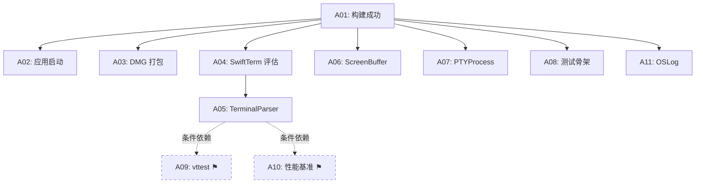
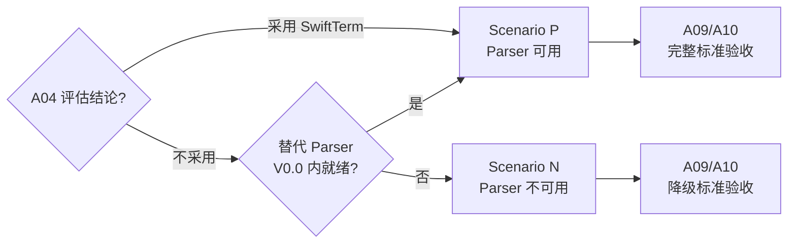
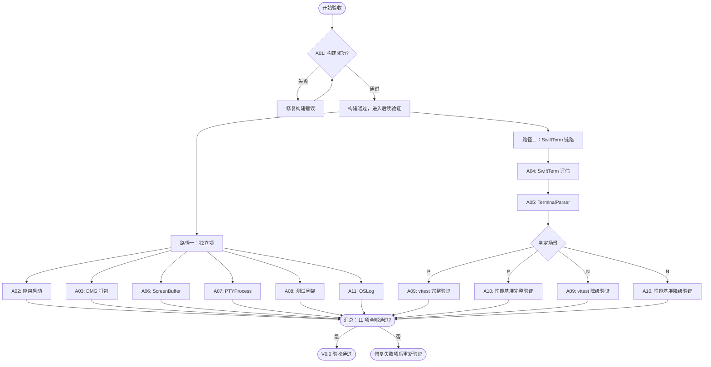

# Hi-Terms V0.0 验收标准

**文档类型:** 验收标准（SSOT）
**产品名称:** Hi-Terms
**版本:** v0.0
**语言:** 中文
**关联文档:**
- [Roadmap](hi-terms-roadmap.md)（版本定义与交付物）
- [V0.0 技术设计](../design/hi-terms-v0.0-technical-design.md)（技术实现细节）
- [技术选型决策](../decisions/hi-terms-technical-decisions.md)（技术选型依据）
- [术语表](../SSOT/glossary.md)（术语权威定义）

> **本文档是 V0.0 验收标准的唯一权威来源（SSOT）。** [Roadmap](hi-terms-roadmap.md) 和 [V0.0 技术设计](../design/hi-terms-v0.0-technical-design.md)中的验收标准列表已替换为对本文档的引用。如有歧义，以本文档为准。

---

## 1. 文档说明

**定位：** 开发自验文档，面向开发者和 AI 编程助手。

本文档合并了 [Roadmap](hi-terms-roadmap.md) 和 [V0.0 技术设计](../design/hi-terms-v0.0-technical-design.md)中原有的验收标准，消除两处定义之间的细节差异，提供统一的验收依据。

V0.0 共 **11 个验收项**，按领域分为三组。每个验收项包含：

- **唯一 ID**（A01–A11）— 跨文档引用标识
- **验收标准** — 通过条件的精确描述
- **验证步骤** — 可执行的命令或操作，以及预期输出
- **失败处理** — 该项不通过时的修复指引

其中 2 个验收项为**条件性验收项**（标注 ⚑），其通过标准取决于 SwiftTerm 评估结果，详见 [§5 条件性验收规则](#5-条件性验收规则)。

---

## 2. 验收前置条件

构建环境要求参见 [V0.0 技术设计 §8.0](../design/hi-terms-v0.0-technical-design.md#80-构建环境基线)，此处不重复。摘要如下：

| 项目 | 要求 |
|------|------|
| macOS 部署目标 | macOS 14.0 (Sonoma) |
| 推荐开发环境 | macOS 15.x (Sequoia) |
| Xcode | 16.x（当前稳定版） |
| 签名证书 | Apple Developer Certificate（Release 构建和 DMG 打包需要） |
| Bundle Identifier | `com.hiterms.app` |

**额外工具依赖：**

| 工具 | 用途 | 安装方式 |
|------|------|---------|
| vttest | 终端一致性测试 | `brew install vttest` 或[源码编译](https://invisible-island.net/vttest/) |
| hdiutil | DMG 打包 | macOS 内建，无需安装 |

---

## 3. 验收项依赖关系

**读图说明：**

- 实线箭头：前置依赖（箭头指向项需在被指向项通过后才可验证）
- 虚线箭头（⚑）：条件依赖 — A09（vttest）和 A10（性能基准）依赖可运行的 `TerminalParser` 实现；如果 SwiftTerm 评估为否定结论且无替代 parser，这两项按降级标准验收（详见 [§5](#5-条件性验收规则)）
- 未画出箭头的项在 A01 通过后即可独立验证（A06、A07、A08、A11）

---

## 4. 验收标准详表

### 4.1 构建与应用基础

#### A01: 构建成功

**依赖:** 无
**条件性:** 否

**验收标准：**
`xcodebuild build -scheme HiTerms` 在 Debug 和 Release 两种配置下均成功，项目自身代码无 warning（允许第三方依赖产生的 warning）。

**验证步骤：**

| 步骤 | 命令 / 操作 | 预期输出 |
|------|------------|---------|
| 1 | `xcodebuild build -scheme HiTerms -configuration Debug -destination 'platform=macOS'` | 退出码 0，输出包含 `BUILD SUCCEEDED` |
| 2 | `xcodebuild build -scheme HiTerms -configuration Release -destination 'platform=macOS'` | 退出码 0，输出包含 `BUILD SUCCEEDED` |
| 3 | 检查项目 warning：在步骤 1/2 的输出中搜索 `warning:`，排除第三方依赖路径（如 `/SourcePackages/`、`SwiftTerm` 等） | 项目自身代码 warning 数为 0 |

**失败处理：**
- 编译错误：根据错误信息修复源码，从步骤 1 重新验证
- 项目 warning：逐条修复，不可豁免

**关联设计：** [V0.0 技术设计 §8.0–§8.1](../design/hi-terms-v0.0-technical-design.md#80-构建环境基线)

---

#### A02: 应用启动

**依赖:** A01
**条件性:** 否

**验收标准：**
运行构建产物，应用显示空白 `NSWindow`，5 秒内无 crash。

**验证步骤：**

| 步骤 | 命令 / 操作 | 预期输出 |
|------|------------|---------|
| 1 | 从 Xcode 运行或命令行启动：`open` 构建产物目录中的 `HiTerms.app` | 应用启动，屏幕上出现空白窗口 |
| 2 | 等待 5 秒，观察应用状态 | 窗口持续显示，无 crash 弹窗 |
| 3 | 检查系统 crash 报告：`ls ~/Library/Logs/DiagnosticReports/HiTerms* 2>/dev/null` | 无新增 crash 报告 |

**失败处理：**
- crash：查看 crash 报告定位问题，修复后从 A01 开始重新验证（需重新构建）

**关联设计：** [V0.0 技术设计 §2.3 TerminalUI](../design/hi-terms-v0.0-technical-design.md#23-模块详细说明)

---

#### A03: DMG 打包

**依赖:** A01
**条件性:** 否

**验收标准：**
打包脚本基于 `hdiutil` 生成 DMG 文件，且 DMG 可正常挂载。

**验证步骤：**

| 步骤 | 命令 / 操作 | 预期输出 |
|------|------------|---------|
| 1 | 运行打包脚本（如 `./Tools/package-dmg/package.sh`，具体路径以实现为准） | 退出码 0，输出 DMG 文件路径 |
| 2 | 验证 DMG 文件存在：`ls -lh <输出路径>.dmg` | 文件存在，大小合理（> 1MB） |
| 3 | 挂载验证：`hdiutil attach <输出路径>.dmg` | 挂载成功，可在 Finder 中看到 `HiTerms.app` |
| 4 | 清理：`hdiutil detach /Volumes/HiTerms` | 卸载成功 |

**失败处理：**
- 脚本不存在：创建基于 `hdiutil` 的打包脚本
- DMG 无法挂载：检查 `hdiutil create` 参数和签名配置

**关联设计：** [V0.0 技术设计 §8.2–§8.3](../design/hi-terms-v0.0-technical-design.md#82-dmg-打包工具选择)

---

### 4.2 技术验证

#### A04: SwiftTerm 评估

**依赖:** A01
**条件性:** 否

**验收标准：**
SwiftTerm 评估文档存在，包含全部评估维度的结果、明确的采用/不采用决策、以及 ScreenBuffer 归属权决策（策略 A/B）。

**验证步骤：**

| 步骤 | 命令 / 操作 | 预期输出 |
|------|------------|---------|
| 1 | 确认文件存在：`ls docs/decisions/hi-terms-swiftterm-evaluation.md` | 文件存在 |
| 2 | 检查评估维度覆盖：文档包含以下五个维度的评估结果 | 每个维度均有评估数据和结论 |
| 3 | 检查决策结论：文档包含明确的"采用"或"不采用" | 决策明确，非模糊表述 |
| 4 | 检查 ScreenBuffer 归属权：文档包含策略 A（Hi-Terms 拥有）/ B（SwiftTerm 拥有）的选择及理由 | 决策明确，含选择理由 |

**评估维度清单**（参见 [V0.0 技术设计 §4.2](../design/hi-terms-v0.0-technical-design.md#42-评估维度与通过标准)）：

| 维度 | 评估内容 |
|------|---------|
| VT100/xterm 兼容性 | vttest 基础项通过率 |
| 解析性能 | 10MB 混合数据解析速率 |
| 高级特性 | alternate screen buffer、SGR mouse mode、bracketed paste、True Color |
| API 可集成性 | 能否封装在 `TerminalParser` protocol 后 |
| ScreenBuffer 可访问性 | 能否逐 cell 读取字符、属性、颜色数据 |

**失败处理：**
- 文档不存在或不完整：补充评估并产出文档
- 评估结果无法支撑决策：记录不确定性和后续验证计划

**关联设计：** [V0.0 技术设计 §4](../design/hi-terms-v0.0-technical-design.md#4-swiftterm-评估方案)

---

#### A05: TerminalParser protocol

**依赖:** A04（实现方式取决于评估结果）
**条件性:** 否

**验收标准：**
`TerminalParser` protocol 已在 TerminalCore 模块中定义，并存在至少一个实现（SwiftTerm 封装或 stub）。

**验证步骤：**

| 步骤 | 命令 / 操作 | 预期输出 |
|------|------------|---------|
| 1 | 搜索 protocol 定义：在 `Packages/TerminalCore/` 中查找 `protocol TerminalParser` | 找到定义，位于 TerminalCore 模块内 |
| 2 | 搜索 conformance：查找 `: TerminalParser` 或相关实现 | 至少找到一个实现类型 |
| 3 | 验证 spike 测试代码存在：`ls Tests/IntegrationTests/SwiftTermSpikeTests.swift` | 文件存在（如采用 SwiftTerm） |

**失败处理：**
- protocol 未定义：根据 [V0.0 技术设计 §2.3](../design/hi-terms-v0.0-technical-design.md#23-模块详细说明) 创建 protocol
- 无实现：若 SwiftTerm 已采用，创建封装实现；若未采用，创建 stub 实现

**关联设计：** [V0.0 技术设计 §2.3 TerminalCore](../design/hi-terms-v0.0-technical-design.md#23-模块详细说明)

---

#### A06: ScreenBuffer 类型

**依赖:** A01
**条件性:** 否

**验收标准：**
`ScreenBuffer` 类型已在 TerminalCore 模块中定义，可创建实例并读写 cell 数据，有测试验证。

**验证步骤：**

| 步骤 | 命令 / 操作 | 预期输出 |
|------|------------|---------|
| 1 | 搜索类型定义：在 `Packages/TerminalCore/` 中查找 `ScreenBuffer` | 找到类型定义，包含 cell 读写方法 |
| 2 | 运行相关测试：`xcodebuild test -scheme HiTerms -only-testing TerminalCoreTests` | 测试通过，包含 ScreenBuffer 实例化和 cell 读写验证 |

**失败处理：**
- 类型未定义：根据 [V0.0 技术设计 §2.3](../design/hi-terms-v0.0-technical-design.md#23-模块详细说明) 创建类型骨架
- 测试失败：检查 cell 数据结构和读写逻辑

**关联设计：** [V0.0 技术设计 §2.3 TerminalCore](../design/hi-terms-v0.0-technical-design.md#23-模块详细说明)、[§5.2 数据保护](../design/hi-terms-v0.0-technical-design.md#52-数据保护)

---

#### A07: PTYProcess spike

**依赖:** A01
**条件性:** 否

**验收标准：**
`PTYProcess` 可创建 PTY 实例并启动 `/bin/echo hello`，读取输出并包含 `hello`，有测试验证。

**验证步骤：**

| 步骤 | 命令 / 操作 | 预期输出 |
|------|------------|---------|
| 1 | 搜索类型定义：在 `Packages/PTYKit/` 中查找 `PTYProcess` | 找到类型定义，包含 create/read/write 方法 |
| 2 | 运行相关测试：`xcodebuild test -scheme HiTerms -only-testing PTYKitTests` | 测试通过，包含 PTY 创建、`/bin/echo hello` 启动和输出读取验证 |

**失败处理：**
- PTY 创建失败：检查 `forkpty` 调用和权限（App Sandbox 不兼容 `forkpty`，Debug 构建不应启用 sandbox）
- 输出读取失败：检查 fd 读取逻辑和 async 数据流

**关联设计：** [V0.0 技术设计 §2.3 PTYKit](../design/hi-terms-v0.0-technical-design.md#23-模块详细说明)

---

### 4.3 测试与质量基础

#### A08: 测试骨架

**依赖:** A01
**条件性:** 否

**验收标准：**
`xcodebuild test` 通过，**每个**测试 target 至少有 1 个 passing test。

**验证步骤：**

| 步骤 | 命令 / 操作 | 预期输出 |
|------|------------|---------|
| 1 | `xcodebuild test -scheme HiTerms -destination 'platform=macOS'` | 退出码 0，输出包含 `TEST SUCCEEDED` |
| 2 | 在输出中确认各 test target 均有通过的测试 | 以下 target 各有 ≥ 1 个 passed test：`TerminalCoreTests`、`PTYKitTests`、`TerminalRendererTests` |

**失败处理：**
- 某个 target 无测试：在对应 `Tests/` 目录下添加至少一个基础测试用例
- 测试运行失败：根据错误信息定位具体测试问题

**关联设计：** [V0.0 技术设计 §6.1](../design/hi-terms-v0.0-technical-design.md#61-测试层级)

---

#### A09: vttest 自动化 ⚑

**依赖:** A05（条件依赖，详见 [§5](#5-条件性验收规则)）
**条件性:** 是

**完整验收标准（Scenario P — parser 可用）：**

vttest 至少 1 组基础测试可通过自动化脚本运行并产出结果；方案 A（PTY 回放驱动）/ B（脚本驱动 vttest）的选择决策已记录，含选择理由和放弃方案的评估结论。

**完整验证步骤：**

| 步骤 | 命令 / 操作 | 预期输出 |
|------|------------|---------|
| 1 | 确认自动化脚本存在：`ls Tools/vttest-runner/` | 目录存在，包含运行脚本 |
| 2 | 运行自动化脚本（如 `./Tools/vttest-runner/run.sh`） | 退出码 0，输出包含至少 1 组 vttest 测试结果 |
| 3 | 确认方案决策已记录 | 脚本目录下或评估文档中包含方案 A/B 选择决策、理由和放弃方案的评估结论 |

**降级验收标准（Scenario N — parser 不可用）：**

vttest 自动化框架就绪（目录结构、脚本骨架、方案决策文档），待替代 parser 实现后可运行。

**降级验证步骤：**

| 步骤 | 命令 / 操作 | 预期输出 |
|------|------------|---------|
| 1 | 确认框架目录存在：`ls Tools/vttest-runner/` | 目录存在，包含脚本骨架或 README |
| 2 | 确认方案决策已记录 | 方案 A/B 选择决策、理由和放弃方案的评估结论已记录 |

**失败处理：**
- 自动化脚本不存在：根据 [V0.0 技术设计 §6.2](../design/hi-terms-v0.0-technical-design.md#62-vttest-自动化方案) 创建
- vttest 未安装：`brew install vttest`
- 方案决策未记录：补充决策文档

**关联设计：** [V0.0 技术设计 §6.2](../design/hi-terms-v0.0-technical-design.md#62-vttest-自动化方案)

---

#### A10: 性能基准 ⚑

**依赖:** A05（条件依赖，详见 [§5](#5-条件性验收规则)）
**条件性:** 是

**完整验收标准（Scenario P — parser 可用）：**

存在 ≥ 1 组性能基准测试，可执行并输出数值。测试数据由 `Tools/perf-baseline/` 生成脚本产出。

**完整验证步骤：**

| 步骤 | 命令 / 操作 | 预期输出 |
|------|------------|---------|
| 1 | 运行数据生成脚本（如 `./Tools/perf-baseline/generate-test-data.sh`） | 退出码 0，生成测试数据文件（默认 10MB） |
| 2 | 运行性能基准测试：`xcodebuild test -scheme HiTerms -only-testing IntegrationTests` | 测试通过，输出包含解析吞吐量（MB/s）等数值 |

**降级验收标准（Scenario N — parser 不可用）：**

测试数据生成脚本可运行，性能测试代码已编写但标记为 skip（或等效机制），待 parser 就绪后启用。

**降级验证步骤：**

| 步骤 | 命令 / 操作 | 预期输出 |
|------|------------|---------|
| 1 | 运行数据生成脚本 | 退出码 0，生成测试数据文件 |
| 2 | 确认性能测试代码存在 | 测试文件存在，包含性能测试用例（标记为 skip 或 disabled） |

**失败处理：**
- 生成脚本不存在：根据 [V0.0 技术设计 §6.3](../design/hi-terms-v0.0-technical-design.md#63-性能基准采集) 创建
- 测试无法执行：检查 parser 实现和测试数据路径

**关联设计：** [V0.0 技术设计 §6.3](../design/hi-terms-v0.0-technical-design.md#63-性能基准采集)

---

#### A11: OSLog 日志

**依赖:** A01
**条件性:** 否

**验收标准：**
各模块 OSLog 子系统已配置，日志在 Console.app 中可按子系统（`com.hiterms.*`）过滤查看，且存在至少 1 个 XCTest 用例验证 OSLog 写入可被 `OSLogStore` 查询读取。

**验证步骤：**

| 步骤 | 命令 / 操作 | 预期输出 |
|------|------------|---------|
| 1 | 启动应用，打开 Console.app | 应用启动正常 |
| 2 | 在 Console.app 中按子系统 `com.hiterms` 过滤 | 可看到来自应用的日志条目 |
| 3 | 运行 OSLog 测试：`xcodebuild test -scheme HiTerms -only-testing IntegrationTests` | 包含 OSLogStore 查询验证的测试通过 |

**OSLog 子系统清单**（参见 [V0.0 技术设计 §7.1](../design/hi-terms-v0.0-technical-design.md#71-日志框架)）：

| 子系统 | 类别 |
|--------|------|
| `com.hiterms.pty` | `lifecycle`, `io` |
| `com.hiterms.terminal` | `parser`, `buffer` |
| `com.hiterms.renderer` | `frame`, `perf` |
| `com.hiterms.app` | `general` |

**失败处理：**
- Console.app 无日志：检查 OSLog 子系统初始化代码
- OSLogStore 测试失败：注意 `OSLogStore` 查询可能有短暂延迟，测试中需在写入后等待适当时间再查询

**关联设计：** [V0.0 技术设计 §7](../design/hi-terms-v0.0-technical-design.md#7-日志与-crash-基础)

---

## 5. 条件性验收规则

A09（vttest 自动化）和 A10（性能基准）依赖可运行的 `TerminalParser` 实现。V0.0 中该实现预计来自 SwiftTerm spike。

> **来源：** [V0.0 技术设计 §6](../design/hi-terms-v0.0-technical-design.md#6-测试基础设施) — "终端一致性测试和性能基准测试均依赖可运行的 TerminalParser 实现。如果 SwiftTerm 评估产出否定结论，这两项交付物降级为'测试框架就绪，待替代 parser 实现后可运行'，不阻塞 V0.0 验收。"

### 场景判定

### 完整 vs 降级标准对照

| 验收项 | Scenario P（完整标准） | Scenario N（降级标准） |
|--------|----------------------|----------------------|
| A09 vttest | 自动化脚本运行并产出至少 1 组结果 | 框架就绪，方案已选定并记录，待 parser 可用后运行 |
| A10 性能基准 | 测试执行并输出数值 | 数据生成脚本可运行，测试代码已编写但标记 skip |

**Scenario N 不阻塞 V0.0 验收。** 降级标准仍然是必须满足的验收标准。

---

## 6. 验收流程

### 推荐验证顺序

**执行说明：**

1. **A01 是门控项** — 构建不通过则无法验证任何后续项
2. **路径一和路径二可并行执行** — 独立项（A02、A03、A06、A07、A08、A11）不依赖 SwiftTerm 评估结果
3. **路径一内各项可并行验证** — 它们之间无相互依赖
4. **路径二必须按序执行** — A04 → A05 → A09/A10

---

## 7. 失败处理策略

### 严重性分类

| 分类 | 定义 | 处理策略 |
|------|------|---------|
| **阻断** | 后续验收项无法执行 | 必须修复后从阻断项重新验证 |
| **独立失败** | 不影响其他验收项的执行和结果 | 记录问题，可继续验证其他项；修复后仅重新验证该项 |
| **降级** | 条件性验收项因依赖未满足而适用降级标准 | 按降级标准验收，不视为失败 |

### 各验收项严重性

| ID | 验收项 | 失败严重性 | 说明 |
|----|--------|-----------|------|
| A01 | 构建成功 | **阻断** | 唯一的阻断项，所有后续验证均依赖构建成功 |
| A02 | 应用启动 | 独立失败 | 不影响测试和其他验证项 |
| A03 | DMG 打包 | 独立失败 | 打包链路独立于功能验证 |
| A04 | SwiftTerm 评估 | 独立失败 | 影响 A05 的实现方式，但 A05 可先用 stub 通过 |
| A05 | TerminalParser | 独立失败 | 影响 A09/A10 场景判定，但不阻断降级验收 |
| A06 | ScreenBuffer | 独立失败 | — |
| A07 | PTYProcess | 独立失败 | — |
| A08 | 测试骨架 | 独立失败 | — |
| A09 | vttest | 降级 | 适用条件性验收规则 |
| A10 | 性能基准 | 降级 | 适用条件性验收规则 |
| A11 | OSLog | 独立失败 | — |

### 重新验证规则

1. **单项修复：** 修复后仅重新执行该验收项的验证步骤
2. **基础设施修复：** 如果修复涉及模块结构、依赖关系或构建配置变更，需先重新验证 A01 + A08，再验证原失败项
3. **重新验证范围：** 不要求全部重新验证，除非修复影响了共享基础设施

### 整体通过条件

**V0.0 验收通过 = 全部 11 项通过**（按完整标准或降级标准，视场景而定）。

不支持"部分验收通过"——但允许逐项验证、逐项签收，以渐进方式完成验收。
