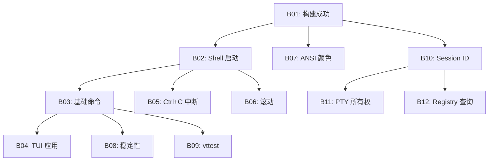
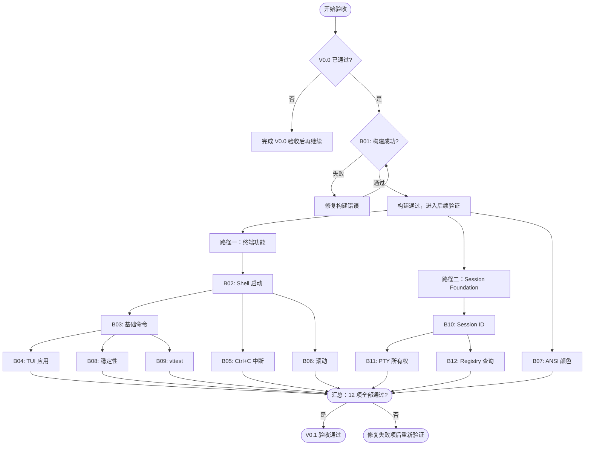

# Hi-Terms V0.1 验收标准

**文档类型:** 验收标准（SSOT）
**产品名称:** Hi-Terms
**版本:** v0.1
**语言:** 中文
**关联文档:**
- [Roadmap](hi-terms-roadmap.md)（版本定义与交付物）
- [V0.1 技术设计](../design/hi-terms-v0.1-technical-design.md)（技术实现细节）
- [V0.0 验收标准](hi-terms-v0.0-acceptance.md)（前置版本验收标准）
- [技术选型决策](../decisions/hi-terms-technical-decisions.md)（技术选型依据）
- [SwiftTerm 评估报告](../decisions/hi-terms-swiftterm-evaluation.md)（SwiftTerm 评估结论）
- [术语表](../SSOT/glossary.md)（术语权威定义）

> **本文档是 V0.1 验收标准的唯一权威来源（SSOT）。** [Roadmap](hi-terms-roadmap.md) 中的 V0.1 验收标准列表应引用本文档。如有歧义，以本文档为准。

---

## 1. 文档说明

**定位：** 开发自验文档，面向开发者和 AI 编程助手。

V0.1 共 **12 个验收项**，按领域分为四组。每个验收项包含：

- **唯一 ID**（B01–B12）— 跨文档引用标识
- **验收标准** — 通过条件的精确描述
- **验证步骤** — 可执行的命令或操作，以及预期输出
- **失败处理** — 该项不通过时的修复指引

---

## 2. 验收前置条件

### 2.1 V0.0 验收必须已通过

V0.1 验收的前提是 V0.0 全部 11 个验收项已通过（含条件性验收项 A09、A10 的完整标准或降级标准）。V0.0 验收详见 [V0.0 验收标准](hi-terms-v0.0-acceptance.md)。

### 2.2 构建环境

| 项目 | 要求 |
|------|------|
| macOS 部署目标 | macOS 14.0 (Sonoma) |
| 推荐开发环境 | macOS 15.x (Sequoia) |
| Xcode | 16.x（当前稳定版） |
| 签名证书 | Apple Developer Certificate（Release 构建和 DMG 打包需要） |
| Bundle Identifier | `com.hiterms.app` |

**额外工具依赖：**

| 工具 | 用途 | 安装方式 |
|------|------|---------|
| vttest | 终端一致性测试 | `brew install vttest` 或[源码编译](https://invisible-island.net/vttest/) |
| Instruments | 内存泄漏检测 | Xcode 内建 |

---

## 3. 验收项依赖关系



**读图说明：**

- 箭头方向表示前置依赖（箭头指向项需在被指向项通过后才可验证）
- B01（构建成功）是门控项，不通过则无法验证任何后续项
- B02（Shell 启动）是功能验证的前置条件
- B10（Session ID）是 Session Foundation 验证的起点
- 路径一（B02→B03→B04/B08/B09）和路径二（B10→B11/B12）可并行验证

---

## 4. 验收标准详表

### 4.1 构建基础

#### B01: 构建成功

**依赖:** 无（V0.0 已通过为前提）
**领域:** 构建

**验收标准：**
`xcodebuild build -scheme HiTerms` 在 Debug 和 Release 两种配置下均成功，项目自身代码无 warning（允许第三方依赖产生的 warning）。V0.1 新增的全部源文件正确编译。

**验证步骤：**

| 步骤 | 命令 / 操作 | 预期输出 |
|------|------------|---------|
| 1 | `xcodebuild build -scheme HiTerms -configuration Debug -destination 'platform=macOS'` | 退出码 0，输出包含 `BUILD SUCCEEDED` |
| 2 | `xcodebuild build -scheme HiTerms -configuration Release -destination 'platform=macOS'` | 退出码 0，输出包含 `BUILD SUCCEEDED` |
| 3 | 检查项目 warning：在步骤 1/2 的输出中搜索 `warning:`，排除第三方依赖路径 | 项目自身代码 warning 数为 0 |
| 4 | 确认 V0.1 新增文件已编译：在构建产物中确认 CoreTextRenderer、TerminalView、InputHandler、Session 相关类型已链接 | V0.1 新增类型均可被实例化 |

**失败处理：**
- 编译错误：根据错误信息修复源码，从步骤 1 重新验证
- 项目 warning：逐条修复，不可豁免

**关联设计：** [V0.1 技术设计 §13](../design/hi-terms-v0.1-technical-design.md#13-模块文件清单)

---

### 4.2 终端功能

#### B02: Shell 启动

**依赖:** B01
**领域:** 终端功能

**验收标准：**
应用启动后自动进入用户默认 shell（通过 `$SHELL` 环境变量或 `/bin/zsh`），窗口中显示正常的 shell 提示符（prompt），用户可在光标处输入字符。

**验证步骤：**

| 步骤 | 命令 / 操作 | 预期输出 |
|------|------------|---------|
| 1 | 从 Xcode 运行或命令行启动 `HiTerms.app` | 应用启动，显示终端窗口 |
| 2 | 观察窗口内容 | 显示 shell 提示符（如 `$`、`%`、或包含用户名/路径的提示符） |
| 3 | 在终端中输入几个字符（不按回车） | 输入的字符在光标位置正确显示 |
| 4 | 光标在输入字符后的位置闪烁 | 光标可见且位置正确 |

**失败处理：**
- 无提示符：检查 PTYProcess 是否成功 fork 并启动 shell；检查 SwiftTermAdapter 是否正确解析输出；检查 CoreTextRenderer 是否正确渲染
- 无法输入：检查 TerminalView 是否成为 firstResponder；检查 InputHandler 是否正确将 NSEvent 转换为字节并写入 PTY
- 光标不显示：检查光标层的位置计算和可见性

**关联设计：** [V0.1 技术设计 §3.1, §7, §9](../design/hi-terms-v0.1-technical-design.md#31-输出管线pty--屏幕)

---

#### B03: 基础命令

**依赖:** B02
**领域:** 终端功能

**验收标准：**
可执行 `ls`、`cd`、`echo`、`cat` 等基础命令并看到正确输出。

**验证步骤：**

| 步骤 | 命令 / 操作 | 预期输出 |
|------|------------|---------|
| 1 | 在终端输入 `echo hello world` 并按回车 | 输出 `hello world`，随后显示新的提示符 |
| 2 | 输入 `ls /` 并按回车 | 输出根目录的文件/目录列表（如 `Applications`、`Users`、`bin` 等） |
| 3 | 输入 `cd /tmp && pwd` 并按回车 | 输出 `/tmp` 或 `/private/tmp` |
| 4 | 输入 `echo "test content" > /tmp/hiterm-test.txt && cat /tmp/hiterm-test.txt` | 输出 `test content` |
| 5 | 输入 `rm /tmp/hiterm-test.txt` | 无错误输出，命令正常执行 |

**失败处理：**
- 命令无输出：检查 PTY 输出管线（DispatchIO → SwiftTermAdapter → RenderCoordinator → CoreTextRenderer）
- 输出乱码：检查 SwiftTermAdapter 的解析和 CoreTextRenderer 的字符渲染
- 回车无响应：检查 InputHandler 对 Return 键的映射（应为 `\r`）

**关联设计：** [V0.1 技术设计 §3, §6](../design/hi-terms-v0.1-technical-design.md#3-核心数据流设计)

---

#### B04: TUI 应用

**依赖:** B03
**领域:** 终端功能

**验收标准：**
可运行 `top` 和 `vim`，界面刷新正常，鼠标可交互，退出后终端状态正确恢复。

**验证步骤：**

| 步骤 | 命令 / 操作 | 预期输出 |
|------|------------|---------|
| **top 测试** | | |
| 1 | 输入 `top` 并按回车 | 进入 top 界面，显示进程列表，界面定期刷新（约每秒一次） |
| 2 | 按 `q` 退出 top | 回到 shell 提示符，终端状态正常（非 alternate screen 残留） |
| 3 | 输入 `echo "after top"` | 输出 `after top`（确认终端状态恢复） |
| **vim 测试** | | |
| 4 | 输入 `vim /tmp/hiterm-vim-test.txt` | 进入 vim 编辑器界面 |
| 5 | 按 `i` 进入插入模式 | 左下角显示 `-- INSERT --` |
| 6 | 输入文本 `Hello from Hi-Terms` | 文本在编辑区域正确显示 |
| 7 | 按 `Esc`，输入 `:wq` 并按回车 | 文件保存，退回 shell 提示符 |
| 8 | 输入 `cat /tmp/hiterm-vim-test.txt` | 输出 `Hello from Hi-Terms` |
| 9 | 清理：`rm /tmp/hiterm-vim-test.txt` | 文件删除成功 |
| **鼠标交互测试** | | |
| 10 | 输入 `vim` 并按回车进入 vim | vim 界面显示 |
| 11 | 在 vim 界面中用鼠标点击某个位置 | 光标移动到鼠标点击位置（前提：vim 默认启用了鼠标支持） |
| 12 | 按 `:q!` 退出 vim | 回到 shell 提示符 |

**失败处理：**
- top 界面不刷新：检查 alternate screen buffer 支持；检查 SwiftTerm 的 DECSTBM / ED 序列处理
- vim 显示异常：检查 cursor movement (CUP)、erase (ED/EL)、text attributes (SGR) 的解析
- 退出后终端状态异常：检查 alternate screen buffer 的恢复（DECSC/DECRC、DECSSET/DECRST）
- 鼠标点击无反应：检查 InputHandler 的 SGR 鼠标报告编码；确认 vim 开启了鼠标支持（`:set mouse=a`）

**关联设计：** [V0.1 技术设计 §7.4, §8.5](../design/hi-terms-v0.1-technical-design.md#74-鼠标事件处理)

---

#### B05: Ctrl+C 中断

**依赖:** B02
**领域:** 终端功能

**验收标准：**
Ctrl+C 能中断正在运行的前台进程。

**验证步骤：**

| 步骤 | 命令 / 操作 | 预期输出 |
|------|------------|---------|
| 1 | 输入 `sleep 60` 并按回车 | Shell 进入等待状态，无新提示符 |
| 2 | 按 Ctrl+C | `sleep` 进程被中断，显示 `^C` 并出现新的 shell 提示符 |
| 3 | 输入 `cat` 并按回车（cat 等待 stdin 输入） | cat 进入等待状态 |
| 4 | 按 Ctrl+C | cat 被中断，回到 shell 提示符 |
| 5 | 输入 `echo "still alive"` | 输出 `still alive`（确认 shell 仍然正常） |

**失败处理：**
- Ctrl+C 无效果：检查 InputHandler 对 Ctrl+C 的映射（应为 `0x03` 即 ETX）
- Shell 也被终止：检查是否错误发送了 SIGKILL 而非让 PTY 处理信号

**关联设计：** [V0.1 技术设计 §8.4](../design/hi-terms-v0.1-technical-design.md#84-ctrl-组合键映射)

---

#### B06: 滚动

**依赖:** B02
**领域:** 终端功能

**验收标准：**
输出超出屏幕时可滚动查看历史内容。

**验证步骤：**

| 步骤 | 命令 / 操作 | 预期输出 |
|------|------------|---------|
| 1 | 输入 `seq 1 200` 并按回车 | 输出数字 1 到 200（超出可视区域） |
| 2 | 确认当前可见区域显示接近尾部的数字 | 可见区域包含 200 附近的数字和新的提示符 |
| 3 | 使用触控板/鼠标滚轮向上滚动 | 可看到之前输出的数字（如 1、2、3...） |
| 4 | 滚动到最顶部 | 可看到命令 `seq 1 200` 和数字 `1` |
| 5 | 滚动回到底部 | 回到最新输出位置，显示提示符 |

**失败处理：**
- 无法滚动：检查 TerminalView 的 scrollWheel 事件处理；检查 scrollbackOffset 逻辑
- 滚动内容不正确：检查 SwiftTerm 的 scrollback buffer 读取逻辑
- 滚动到顶部后看不到最早输出：检查 scrollbackLines 配置（默认 10,000 行）

**关联设计：** [V0.1 技术设计 §7.5](../design/hi-terms-v0.1-technical-design.md#75-滚动实现)

---

#### B07: ANSI 颜色

**依赖:** B01
**领域:** 终端功能

**验收标准：**
基础 ANSI 颜色（前景/背景 8 色）正确渲染。

**验证步骤：**

| 步骤 | 命令 / 操作 | 预期输出 |
|------|------------|---------|
| 1 | 输入以下命令测试前景色：`for i in {30..37}; do echo -e "\033[${i}mColor $i\033[0m"; done` | 显示 8 行文字，每行颜色不同（黑、红、绿、黄、蓝、品红、青、白） |
| 2 | 输入以下命令测试背景色：`for i in {40..47}; do echo -e "\033[${i}mBG $i\033[0m"; done` | 显示 8 行文字，每行背景色不同 |
| 3 | 输入测试文本属性：`echo -e "\033[1mBold\033[0m \033[3mItalic\033[0m \033[4mUnderline\033[0m"` | 显示粗体、斜体、下划线三种样式的文本 |
| 4 | 运行 `ls --color=auto /` 或 `ls -G /` | 目录和文件名以不同颜色显示（取决于 LSCOLORS 设置） |

**失败处理：**
- 所有文字同色：检查 CoreTextRenderer 的 `nsColor(from:)` 颜色映射
- 部分颜色错误：检查 ANSI 8 色映射表中的具体 RGB 值
- 属性不生效：检查 TextAttributes 到 CTFont traits 的映射（bold → kCTFontBoldTrait 等）

**关联设计：** [V0.1 技术设计 §5.4](../design/hi-terms-v0.1-technical-design.md#54-颜色映射)

---

### 4.3 稳定性与兼容性

#### B08: 稳定性 — 50 条命令无崩溃无泄漏

**依赖:** B03
**领域:** 稳定性

**验收标准：**
连续执行 50 条命令后不崩溃，Instruments Leaks 检测无泄漏。

**验证步骤：**

| 步骤 | 命令 / 操作 | 预期输出 |
|------|------------|---------|
| 1 | 启动 Hi-Terms 应用 | 应用正常启动，显示 shell 提示符 |
| 2 | 执行以下脚本（或手动依次执行 50 条不同命令）：`for i in $(seq 1 50); do echo "Command $i: $(date)"; ls /tmp > /dev/null; done` | 全部 50 条命令执行完成，无崩溃 |
| 3 | 在 50 条命令执行后，输入 `echo "final test"` | 输出 `final test`，终端仍然响应 |
| 4 | 使用 Instruments Leaks 工具附加到 HiTerms 进程 | Instruments 成功附加 |
| 5 | 在 Instruments 中执行 Leaks 检测 | 报告无内存泄漏（0 leaks），或仅有系统框架的已知误报 |
| 6 | 检查内存使用：在 Activity Monitor 中查看 HiTerms 进程的 RSS | RSS 在合理范围内（< 200 MB） |

**失败处理：**
- 崩溃：查看 crash 报告（`~/Library/Logs/DiagnosticReports/HiTerms*`），定位崩溃位置并修复
- 内存泄漏：使用 Instruments Allocations 追踪泄漏对象的分配栈，检查是否存在循环引用或未释放的资源
- RSS 异常增长：检查 ScreenBuffer 快照是否正确释放；检查 SwiftTerm Terminal 对象的 scrollback buffer 增长

**关联设计：** [V0.1 技术设计 §14.4](../design/hi-terms-v0.1-technical-design.md#144-性能验证)

---

#### B09: vttest 兼容性

**依赖:** B03
**领域:** 兼容性

**验收标准：**
vttest 基础测试项通过率 ≥ 80%。

**验证步骤：**

| 步骤 | 命令 / 操作 | 预期输出 |
|------|------------|---------|
| 1 | 确认 vttest 已安装：`which vttest` | 输出 vttest 路径（如 `/opt/homebrew/bin/vttest`） |
| 2 | 在 Hi-Terms 终端中运行 `vttest` | vttest 主菜单显示正常 |
| 3 | 执行菜单 1 — Test of cursor movements | 观察测试输出，记录通过/失败项 |
| 4 | 执行菜单 2 — Test of screen features | 观察测试输出，记录通过/失败项 |
| 5 | 执行菜单 3 — Test of character sets | 观察测试输出，记录通过/失败项 |
| 6 | 执行菜单 11 — Test of VT52 mode（如适用） | 观察测试输出（VT52 非必须） |
| 7 | 统计通过率：通过项数 ÷ 总测试项数 | ≥ 80% |

**通过率计算方法：**
- 仅统计菜单 1-3 的基础测试项（VT52 和高级特性不计入基础通过率）
- 每个测试项的判定标准：测试画面与 vttest 预期描述一致（如对齐的行、正确的颜色、正确的光标位置）
- 如果某项无法自动判断，以人工视觉检查为准

**失败处理：**
- 通过率 < 80%：逐项分析失败原因，优先修复影响面最大的转义序列处理
- vttest 无法启动：检查 TERM 环境变量（应为 `xterm` 或 `xterm-256color`）

**关联设计：** [V0.1 技术设计 §14.3](../design/hi-terms-v0.1-technical-design.md#143-vttest-验证)

---

### 4.4 Session Foundation

#### B10: Session ID

**依赖:** B01
**领域:** Session Foundation

**验收标准：**
每个终端窗口对应一个 Session 实例，Session 具有唯一 ID（UUID 类型）。

**验证步骤：**

| 步骤 | 命令 / 操作 | 预期输出 |
|------|------------|---------|
| 1 | 运行 SessionTests 单元测试：`xcodebuild test -scheme HiTerms -only-testing TerminalCoreTests` | 包含以下测试用例并全部通过 |
| 2 | 测试用例 `testSessionHasUniqueID`：创建两个 TerminalSession，验证 `id` 不相等 | `session1.id != session2.id` |
| 3 | 测试用例 `testSessionIDIsUUID`：验证 SessionID 类型为 UUID | SessionID 是 UUID typealias |
| 4 | 在运行的 Hi-Terms 应用中，通过 OSLog 观察：在 Console.app 中过滤 `com.hiterms` | 启动时日志包含 Session ID 信息（如 `Session created: <UUID>`） |

**失败处理：**
- Session ID 不唯一：检查 SessionID 生成逻辑（应为 `UUID()` 每次生成新值）
- 类型不匹配：确认 `SessionTypes.swift` 中 `typealias SessionID = UUID`

**关联设计：** [V0.1 技术设计 §4.2, §4.3](../design/hi-terms-v0.1-technical-design.md#42-核心类型)

---

#### B11: PTY 所有权

**依赖:** B10
**领域:** Session Foundation

**验收标准：**
Session 正确持有并管理其关联的 PTY 实例。PTY 的生命周期由 Session 管理，而非视图层直接持有。

**验证步骤：**

| 步骤 | 命令 / 操作 | 预期输出 |
|------|------------|---------|
| 1 | 代码审查：确认 `TerminalSession` 持有 `PTYProcess` 引用 | `TerminalSession` 有 `private let ptyProcess: PTYProcess` 属性 |
| 2 | 代码审查：确认 `TerminalView` 不直接持有 `PTYProcess` | `TerminalView` 仅通过 `session` 属性间接访问 PTY |
| 3 | 测试用例 `testSessionOwnsPTY`：创建 Session 并 start()，验证 PTY 进程正在运行 | `session.pipeline` 中的 PTYProcess `isRunning == true` |
| 4 | 测试用例 `testSessionStopTerminatesPTY`：调用 `session.stop()` 后，验证 PTY 进程已终止 | PTYProcess `isRunning == false` |
| 5 | 测试用例 `testSessionDeallocTerminatesPTY`：Session 被释放后，PTY 进程自动终止 | 无 PTY 进程残留（通过检查 PID 存活状态验证） |

**失败处理：**
- TerminalView 直接持有 PTYProcess：重构为通过 Session 间接访问
- Session 释放后 PTY 未终止：在 `TerminalSession.deinit` 中调用 `stop()`
- PTY 进程泄漏：检查 DispatchIO source 和 fd 是否正确关闭

**关联设计：** [V0.1 技术设计 §4.4](../design/hi-terms-v0.1-technical-design.md#44-terminalsession-具体实现)

---

#### B12: Registry 查询

**依赖:** B10
**领域:** Session Foundation

**验收标准：**
通过内部 registry 可查询当前所有活跃 Session 及其基础状态（running/exited）。

**验证步骤：**

| 步骤 | 命令 / 操作 | 预期输出 |
|------|------------|---------|
| 1 | 测试用例 `testRegistryRegisterAndQuery`：创建 Session，注册到 `SessionRegistry.shared`，通过 `allSessions()` 查询 | 返回数组包含注册的 Session |
| 2 | 测试用例 `testRegistryQueryByID`：通过 `session(for: id)` 查询特定 Session | 返回正确的 Session 实例 |
| 3 | 测试用例 `testRegistryUnregister`：注销 Session 后查询 | `session(for: id)` 返回 nil |
| 4 | 测试用例 `testRegistrySessionState`：查询 Session 的 state 属性 | 运行中的 Session 返回 `.running`；已退出的 Session 返回 `.exited(code:)` |
| 5 | 测试用例 `testRegistryThreadSafety`：从多个 DispatchQueue 并发注册/查询 Session | 无崩溃，数据一致 |

**失败处理：**
- 查询返回空：检查 `register()` 调用是否在 `start()` 之后正确执行
- 线程安全问题（崩溃或数据不一致）：检查 SessionRegistry 的 GCD 串行队列保护
- 状态不正确：检查 SessionState 在 Shell 退出时是否正确更新

**关联设计：** [V0.1 技术设计 §4.5](../design/hi-terms-v0.1-technical-design.md#45-sessionregistry)

---

## 5. 验收流程

### 推荐验证顺序



**执行说明：**

1. **V0.0 验收通过是前提** — V0.0 未通过则不进入 V0.1 验收
2. **B01 是门控项** — 构建不通过则无法验证任何后续项
3. **路径一（终端功能）和路径二（Session Foundation）可并行执行**
4. **路径一内部须按序执行** — B02 → B03 → B04/B08/B09
5. **B07（ANSI 颜色）可在 B01 通过后独立验证**（仅需编译成功即可验证渲染）

---

## 6. 性能验收阈值

以下性能指标不作为独立验收项，但在 B08（稳定性）验证过程中一并检查：

| 指标 | V0.1 目标 | 测量方法 | 说明 |
|------|----------|---------|------|
| 渲染帧率 | ≥ 30fps（普通操作时） | CADisplayLink 回调间隔统计 | V0.4 提升到 60fps |
| 解析吞吐量 | Release ≥ 50 MB/s | PerformanceBaselineTests | 继承 V0.0 基准 |
| 50 命令后 RSS 增长 | < 50 MB | Activity Monitor / Instruments | 排除系统框架缓存 |
| 内存泄漏 | 0 leaks | Instruments Leaks | 允许系统框架已知误报 |

---

## 7. 失败处理策略

### 严重性分类

| 分类 | 定义 | 处理策略 | 涉及项 |
|------|------|---------|--------|
| **阻断** | 后续验收项无法执行 | 必须修复后从阻断项重新验证 | B01, B02 |
| **独立** | 不影响其他项的验证 | 可并行修复 | B05, B06, B07, B11, B12 |
| **链式** | 影响后续关联项 | 修复后需重新验证关联项 | B03（影响 B04, B08, B09）, B10（影响 B11, B12） |

### 常见问题诊断路径

```
渲染问题 → 检查 CoreTextRenderer → 检查 FontMetrics → 检查 DirtyRegion 是否触发
输入问题 → 检查 InputHandler 映射 → 检查 PTYProcess.write → 检查 fd 状态
解析问题 → 检查 SwiftTermAdapter.parse → OSLog terminal.parser 日志
Session 问题 → 检查 SessionRegistry → 检查 TerminalSession 状态转换 → OSLog
```

---

## 8. 自动化验证

V0.1 应扩展 V0.0 的 `Tools/verify-acceptance.sh` 脚本，新增 B01-B12 的自动化验证。

**可自动化的验收项：**

| 项 | 自动化方式 |
|----|----------|
| B01 | xcodebuild 构建检查（与 A01 类似） |
| B02 | 启动应用 + 检查进程存活 + OSLog 检查 Session 创建 |
| B03 | 通过 PTY 注入命令 + 检查输出（集成测试） |
| B05 | 通过 PTY 注入 sleep + Ctrl+C + 检查进程状态 |
| B07 | ANSI 序列注入 + ScreenBufferSnapshot 颜色值检查（单元测试） |
| B10-B12 | 单元测试（SessionTests, SessionRegistryTests） |

**需人工验证的验收项：**

| 项 | 原因 |
|----|------|
| B04 | TUI 应用交互需要视觉验证 |
| B06 | 滚动行为需要视觉验证 |
| B08 | Instruments Leaks 检测需手动操作 |
| B09 | vttest 通过率需视觉判断 |
