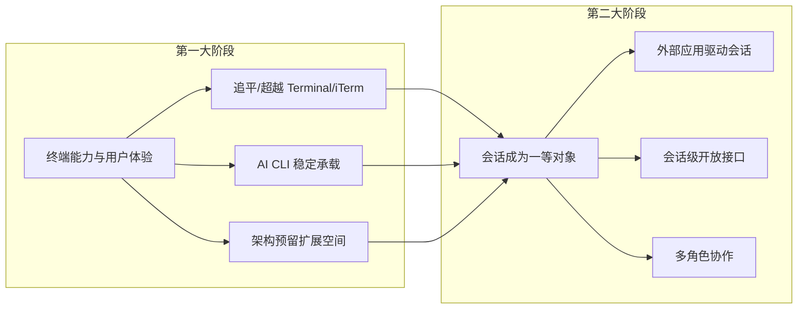
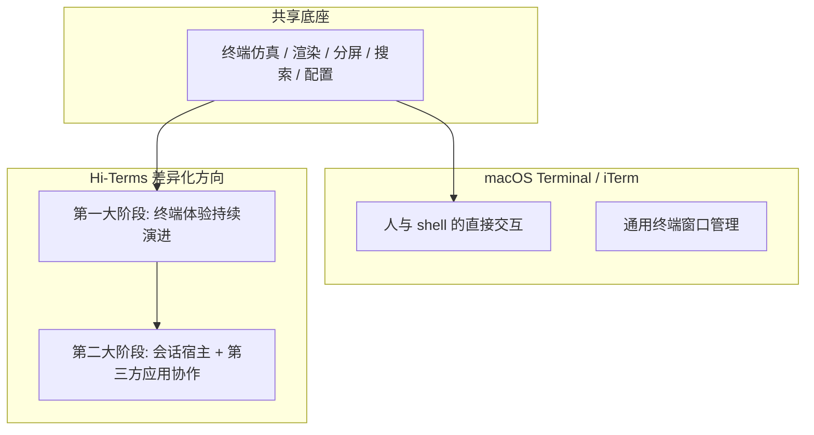

# Hi-Terms 愿景文档

**文档类型:** 愿景文档
**产品名称:** Hi-Terms
**语言:** 中文
**关联文档:**
- [需求文档](hi-terms-requirements.md)
- [Roadmap 文档](hi-terms-roadmap.md)
- [产品定位与需求决策](../decisions/hi-terms-product-and-requirements-decisions.md)

## 1. 产品愿景

Hi-Terms 的愿景，不是做一个只强调 AI 场景的轻量壳层，也不是只做一个单纯对标 iTerm 的通用终端模拟器。

它要成为一个面向 macOS 的终端产品，并在此基础上进一步将命令行工具会话构建为核心差异化能力。

这意味着 Hi-Terms 是一个产品的两个递进大阶段：

- **第一大阶段**：聚焦终端能力和用户体验，通过多个版本持续迭代，逐步做到与 macOS Terminal / iTerm 持平，并在部分场景超越
- **第二大阶段**：在终端产品基础上，把命令行工具会话，尤其是 AI CLI 会话，做成可观察、可控制、可协作的一等对象

两个阶段是递进关系：第一大阶段为第二大阶段奠定产品基础和用户基础，第一大阶段的架构设计也应为第二大阶段的会话能力预留扩展空间。

对于像 Claude Code、Codex CLI 这样的 AI CLI，会话化承载会在第二大阶段进一步放大价值，因为这类工具本身具有长期会话、多轮协作和状态感知需求。

Hi-Terms 希望解决的问题是：

> 先让用户拥有一个高质量的 macOS 终端体验，再进一步让人、外部应用以及运行在终端中的命令行工具，能够围绕同一个会话进行稳定协作。

## 2. 产品主张

Hi-Terms 的核心产品主张是：

> 在 macOS 上先做好持续演进的高质量终端体验，再在此基础上把命令行工具会话，尤其是 AI CLI 会话，变成可被外部应用稳定驱动和协作的对象。

### 第一大阶段核心主张

成为一个在终端能力和用户体验上持续进步、值得日常使用的 macOS 终端产品。

### 第二大阶段核心主张

让外部应用能围绕会话对象进行协作式交互。这里的"协作式交互"不是简单模拟键盘输入，也不是通过脆弱的方式去截取终端文本，而是让系统真正理解某个工具会话的身份、生命周期和输入输出边界。

第二大阶段意味着外部应用应当能够围绕会话进行启动、连接、读取、写入和控制等操作。具体能力定义参见[需求文档 §1.2](hi-terms-requirements.md#12-第二大阶段核心能力)。

## 3. 竞品定位

Hi-Terms 与 macOS Terminal / iTerm 的关系，不是"完全不在一个赛道"，而是"共享终端产品底座，但在不同阶段逐步拉开差异"。

### macOS Terminal / iTerm 更偏向

- 人和 shell 的直接交互
- 通用终端窗口的管理和体验
- 终端仿真、渲染、分屏、搜索、配置、性能和稳定性

### Hi-Terms 的阶段性定位

**第一大阶段**：在终端能力上直接对标 macOS Terminal / iTerm，逐步追平并在部分场景超越，成为用户日常可用的终端产品。

**第二大阶段**：在终端产品基础上进一步强调命令行工具会话的承载与托管、AI CLI 的会话级开放接口、外部应用围绕会话的协作式接入、以及会话状态与多轮协同。

一句话概括：

> Hi-Terms 先要在终端体验上站稳脚跟，再通过会话能力形成与传统终端产品的差异化。

## 4. 产品理解

### 第一大阶段的产品理解

Hi-Terms 首先是一个面向 macOS 的高质量终端产品。用户选择 Hi-Terms 的理由，应当首先是终端能力和体验本身——稳定、快速、好用。

### 第二大阶段的产品理解

在终端产品基础之上，命令行工具不只是一个运行中的终端进程，而是一个有生命周期、有上下文、可被外部应用围绕操作的会话主体。

系统需要理解的内容不只是"终端里输出了什么"，还包括会话的身份、状态、上下文和交互边界。具体的会话状态识别需求参见[需求文档 §4](hi-terms-requirements.md#4-高层交互定义第二大阶段)和[需求文档 §6](hi-terms-requirements.md#6-详细需求)。

因此，Hi-Terms 的完整产品形态是：

> 第一大阶段：一个面向 macOS 的高质量终端产品。第二大阶段：在此基础上，进一步成为面向命令行工具会话的宿主层。

## 5. 初步判断

Hi-Terms 不是一个"只做 AI 壳层的终端"，也不是一个"只追求终端仿真的 iTerm 替代品"。

它的发展分为两个递进的大阶段：

- **第一大阶段**：成为一个在 macOS 上持续演进的高质量终端产品，让用户愿意将其作为日常终端使用
- **第二大阶段**：在终端产品基础上，进一步成为面向命令行工具会话的宿主层，以及可被第三方应用驱动的本地 AI CLI 会话执行环境

它的核心竞争力在于：

- 第一大阶段：能否持续把终端能力和用户体验做强
- 第二大阶段：能否把命令行工具会话托管好、能否让外部应用稳定接入同一个会话、能否建立清晰的会话状态和协作模型、能否对 Claude Code 等高价值工具提供更好的承载和交互体验

如果这些能力逐步成立，Hi-Terms 就会从一个高质量的 macOS 终端产品，进化为一条与传统终端产品明显不同、但又不脱离终端产品本体的独特路线。

## 6. 一句话总结

> Hi-Terms 是一个面向 macOS 的终端产品，它将先通过持续迭代在终端能力与体验上达到甚至超越 Terminal / iTerm，再在此基础上把 AI CLI 会话做成可被外部应用稳定驱动和协作的一等对象。
